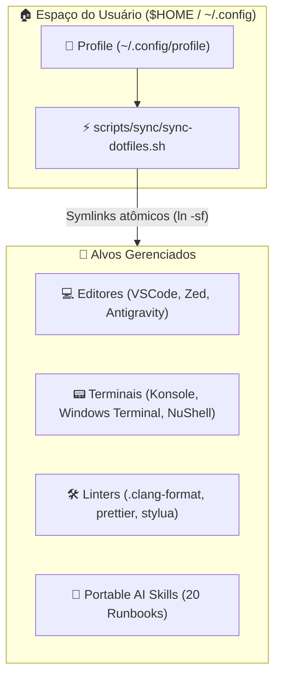

# 🎨 Universal Profile Environment

> Repositório central de dotfiles declarativos de softwares, configurações de editores, perfis de emuladores de terminal, linters globais e catálogo de habilidades portáteis para agentes de IA. Componente de identidade do desenvolvedor do **Quarteto de Produtividade**.

---

### 🏛️ O Quarteto de Produtividade

[](https://github.com/GabrielFrigo4/setup)
[](https://github.com/GabrielFrigo4/shell)
[](https://github.com/GabrielFrigo4/vault)
[](https://github.com/GabrielFrigo4/profile)

> 📖 **Arquitetura Unificada do Ecossistema:** Conheça a matriz completa de responsabilidades, ciclo de boot e segregação de privilégios em [ENVIRONMENT.md](ENVIRONMENT.md).
> 📜 **Princípios de Engenharia & Dotfiles:** Conheça os 18 princípios e diretrizes Clean Code em [PRINCIPLES.md](PRINCIPLES.md).

---

### 🖥️ Ambientes & Sistemas Homologados


### 🎨 Editores, Terminais & IA




---

## 🧠 Filosofia: A Identidade Residente & Zero-Sudo

Diferente do **Setup** (que exige `sudo`/`root` para instalar pacotes no sistema operacional) ou do **Vault** (que guarda segredos criptografados privados), o **Profile** é a sua **identidade de trabalho pública e residente no `$HOME`**:

1. **Zero Privilégios Administrativos (Zero-Sudo):** Todos os arquivos e scripts operam estritamente no espaço do usuário comum (`$HOME` / `~/.config/`).
2. **Formatos Declarativos Puros:** Configurações escritas em formatos universais e legíveis (`.json`, `.toml`, `.yaml`, `.el`, `.vim`), fáceis de inspecionar, auditar e versionar.
3. **Dual-Mode de Sincronização:**
    - **Modo Residente (Recomendado):** Clone o repositório em `~/.config/profile` e execute `./scripts/sync/sync-dotfiles.sh` para criar links simbólicos atômicos (`ln -sf`). Qualquer `git pull` futuro atualiza seus editores instantaneamente!
    - **Modo Estático / RAW:** Copie arquivos avulsos diretamente pela interface do GitHub para máquinas temporárias.

---

## 📂 Estrutura do Repositório

- **[`editors/`](editors/README.md)** — **Configurações de Editores & IDEs Modernos:** Antigravity, VS Code, VSCodium e Zed (os editores modais Emacs, NeoVim, Vim e Helix operam como repositórios autônomos independentes).
- **[`terminals/`](terminals/README.md)** — **Perfis de Terminal:** Konsole (KDE), Windows Terminal, CMD (Clink), PowerShell e NuShell.
- **[`tools/`](tools/README.md)** — **Formatadores & Linters Globais:** `.clang-format`, `.prettierrc`, `.stylua.toml`, `clangd.yaml`.
- **[`browsers/`](browsers/README.md)** — **Navegadores:** Ajustes e perfis de navegadores (Firefox).
- **[`skills/`](skills/README.md)** — **Habilidades & Runbooks Portáteis para IA:** Catálogo de skills cognitivas para Google Antigravity/Gemini com ativação contínua via link de diretório unificado.
- **[`scripts/`](scripts/README.md)** — Utilitários de sincronização (`sync/`) e validação estática (`audit/`).
- **[`docs/`](docs/README.md)** — Documentação técnica completa da estação de trabalho e arquitetura.

---

## 🚀 Instalação & Sincronização Rápida

### 🐧 Unix (Linux, FreeBSD, macOS)

```sh
git clone "https://github.com/GabrielFrigo4/profile" "${HOME}/.config/profile"
sh "${HOME}/.config/profile/install.sh"
```

### 🪟 Windows (PowerShell)

```powershell
git clone "https://github.com/GabrielFrigo4/profile" "$HOME\.config\profile"
& "$HOME\.config\profile\install.ps1"
```

---

## 🧪 Quality Gates & Ganchos Git (.githooks)

Para habilitar a validação de dotfiles, Markdown e linters antes de cada commit:

```sh
chmod 0755 .githooks/pre-commit
git config core.hooksPath .githooks
```

Para executar a validação estática de formatos e links manualmente:

```sh
python3 scripts/audit/all.py
```

---

## 🔗 Integração com o Quarteto de Produtividade

- 📦 **[Setup](https://github.com/GabrielFrigo4/setup)**: Provisiona a máquina hospedeira e pacotes base com privilégios de sistema.
- 🐚 **[Shell](https://github.com/GabrielFrigo4/shell)**: Fornece prompts rápidos e o motor da linha de comando.
- 🔐 **[Vault](https://github.com/GabrielFrigo4/vault)**: Fornece chaves SSH e segredos privados.
- 🎨 **[Profile](https://github.com/GabrielFrigo4/profile)**: Personaliza os aplicativos gráficos, linters e inteligência artificial no `$HOME`.
