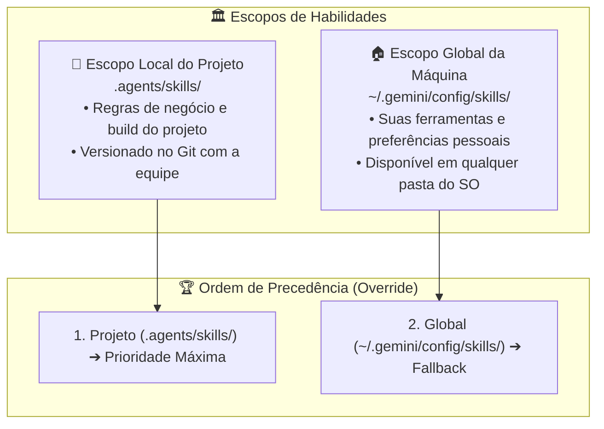
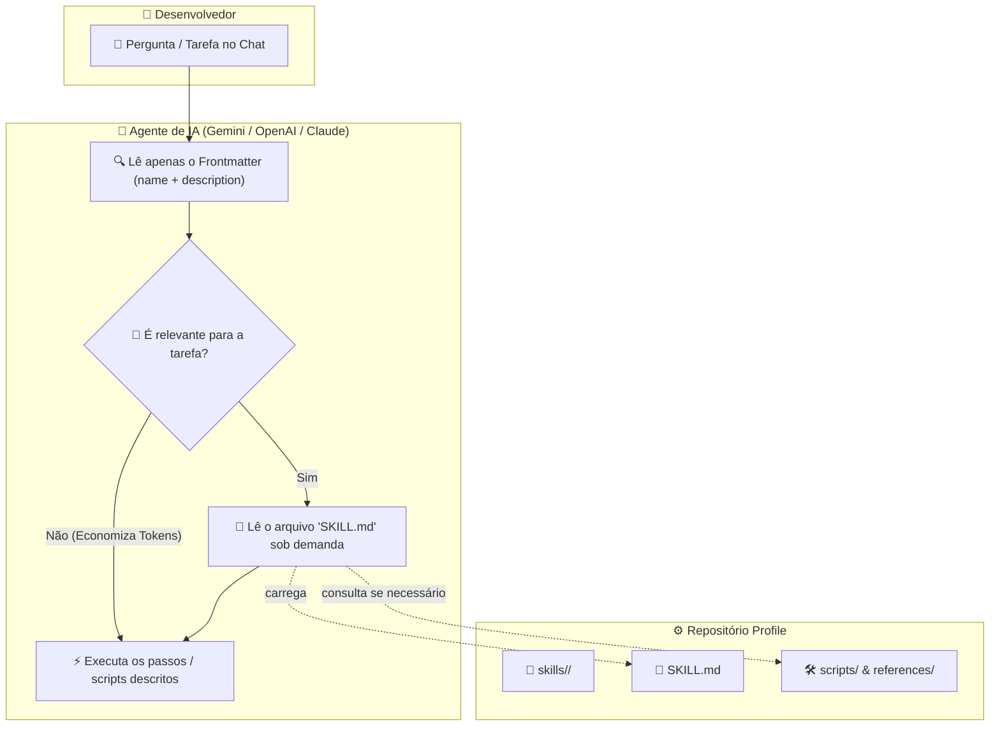

# 🧠 Portable AI Agents (Habilidades & Regras Globais para IA)

> Hub central de habilidades portáteis, procedimentos, regras cognitivas e runbooks para agentes de inteligência artificial (Google Antigravity / Gemini, OpenAI / ChatGPT, Claude e assistentes autônomos de código).

---

### 🤖 Compatibilidade de Agentes & Modelos


-orange?logo=yaml&logoColor=white>)

---

## 🎯 Arquitetura de IA no Profile (`agents/`)

No ecossistema do **Quarteto de Produtividade**, o diretório **`agents/`** centraliza a inteligência e os guardrails cognitivos universais da estação de trabalho:

1. **`rules/` (Regras Globais da Estação):** Guardrails cognitivos universais aplicados a todas as sessões e repositórios (tom técnico, economia de contexto, matriz de shells e escapes ANSI).
2. **`skills/` (Habilidades & Runbooks sob Demanda):** Procedimentos procedimentais, fluxos de engenharia e runbooks carregados sob demanda via progressive disclosure.

| Camada                                                                                                         | Papel Central                           | Tipo de Conteúdo                                                                    | Destinatário / Consumidor                                                                   |
| :------------------------------------------------------------------------------------------------------------- | :-------------------------------------- | :---------------------------------------------------------------------------------- | :------------------------------------------------------------------------------------------ |
| **[Setup](https://github.com/GabrielFrigo4/setup)**                                                            | **O "COMO" (Provisionamento Ativo)**    | Receitas atômicas de automação e scripts de sistema (`.sh`, `.cmd`, `.ps1`).        | **Sistema Operacional** (com privilégios de administrador / root).                          |
| **[`editors/`](../editors/README.md), [`terminals/`](../terminals/README.md), [`tools/`](../tools/README.md)** | **O "O QUÊ" (Estado Declarativo)**      | Arquivos estáticos puros (`.json`, `.toml`, `.yaml`, `.el`, `.vim`, `.profile`).    | **Usuário & Aplicações** (espaço do `$HOME`, zero sudo).                                    |
| **`agents/`** _(esta pasta)_                                                                                   | **Inteligência de IA (Rules & Skills)** | Regras globais (`rules/`) e pacotes modulares de procedimentos guiados (`skills/`). | **Agentes de IA** (Antigravity, Gemini, OpenAI, Claude) para execução assistida e autônoma. |
| **[`.scripts/audit/`](../.scripts/audit/README.md)**                                                           | **Auditoria & Quality Gates**           | Validação estática de integridade, links e formatos (`audit/`).                     | **Desenvolvedor** (execução pontual em linha de comando).                                   |
| **[`docs/`](../docs/README.md)**                                                                               | **Documentação Humana**                 | Filosofia, arquitetura, manuais de SO e guias técnicos.                             | **Desenvolvedor** (leitura técnica e arquitetural).                                         |

---

## 🎯 Regras Globais da Estação (`rules/`)

| Regra                                                | Finalidade                                                                                                                              | Escopo / Aplicação                                                 |
| :--------------------------------------------------- | :-------------------------------------------------------------------------------------------------------------------------------------- | :----------------------------------------------------------------- |
| [`tone-and-economy.md`](./rules/tone-and-economy.md) | Tom técnico sóbrio, densidade de sinal por token, matriz real de shells (`zsh`, `bash`, FreeBSD `sh`, OpenBSD `ksh`) e escapes `$'\e'`. | Universal em todas as sessões e projetos na máquina (`always_on`). |

---

## 📚 Catálogo Canônico de Skills Portáteis (24 Runbooks em `skills/`)

O ecossistema disponibiliza 24 habilidades cognitivas universais organizadas por domínio de especialidade:

| Categoria                     | Skill                                                                            | Descrição e Escopo de Ativação                                                                                                              | Gatilhos de Ativação / Cenários de Uso                                                                                               |
| :---------------------------- | :------------------------------------------------------------------------------- | :------------------------------------------------------------------------------------------------------------------------------------------ | :----------------------------------------------------------------------------------------------------------------------------------- |
| **GNU Emacs 31+ & Elisp**     | [`emacs-engineering`](./skills/emacs-engineering/SKILL.md)                       | Engenharia em GNU Emacs 31+, Tree-sitter nativo (ABI ≥ 14), compilação nativa (libgccjit), Elpaca assíncrono e Eglot LSP.                   | Desenvolvimento e depuração de configurações Elisp, compilação de gramáticas Tree-sitter, testes batch e otimização de boot.         |
| **C Moderno & POSIX**         | [`c-engineering`](./skills/c-engineering/SKILL.md)                               | Engenharia em C Moderno (C23) e sistemas POSIX.1-2024 / FreeBSD / Linux, aritmética com `<stdckdint.h>`, `[[nodiscard]]`, sanitizers e I/O. | Desenvolvimento e refatoração em C23, daemons Unix, kqueue/poll, sockets, pthreads, manipulação defensiva de descritores de arquivo. |
| **C++23 & RAII de Sistemas**  | [`cpp-engineering`](./skills/cpp-engineering/SKILL.md)                           | Engenharia em C++23 Moderno, erros monádicos (`std::expected`), `std::print`, ranges, concepts e wrappers RAII de SO.                       | Desenvolvimento de sistemas de alta performance em C++23, abstrações RAII de descritores e memória, I/O tipado sem exceções.         |
| **Engenharia de Testes**      | [`ironclad-testing`](./skills/ironclad-testing/SKILL.md)                         | Engenharia de testes rigorosos, invariantes defensivas, mindset adversarial (Advogado do Diabo) e barreiras anti-regressão.                 | Criação de testes unitários e de integração, testes negativos, barreiras pre-commit, sanitizers em C23/C++23 e suites POSIX sh.      |
| **Arquitetura & Filosofia**   | [`unix-philosophy-auditor`](./skills/unix-philosophy-auditor/SKILL.md)           | Auditoria e conformidade com os 17 Princípios UNIX de Eric S. Raymond + Soberania do Usuário.                                               | Criação de novas CLI, revisão de arquitetura, validação de regras de silêncio e transparência.                                       |
| **Engenharia Antifrágil**     | [`antifragile-engineering`](./skills/antifragile-engineering/SKILL.md)           | Engenharia de sistemas antifrágeis, auto-cura em tempo de execução, cascata ativa de descoberta e resiliência sob desordem.                 | Arquitetura adaptativa, resolução dinâmica de caminhos/chaves, auto-cura de permissões POSIX, eliminação de falhas cegas.            |
| **Redação & Design Técnico**  | [`technical-writing-standards`](./skills/technical-writing-standards/SKILL.md)   | Padrões canônicos para redação técnica, arquitetura de READMEs (Shields.io, Mermaid), tipografia Reader-First e formatação via Prettier.    | Criação e refatoração de READMEs, especificações de design, documentação institucional e manuais conceituais.                        |
| **Soberania & Cloud-Exit**    | [`cloud-sovereignty`](./skills/cloud-sovereignty/SKILL.md)                       | Repatriação de nuvem para bare-metal com FreeBSD (Jails/Sylve), Linux (Proxmox/Incus), illumos (Oxide/Zones) e OpenBSD.                     | Migração para infraestrutura própria, redução de custos de nuvem pública, soberania digital e orquestração de servidores bare-metal. |
| **Aplicações Anti-Inchaço**   | [`svelte-pocketbase-go`](./skills/svelte-pocketbase-go/SKILL.md)                 | Arquitetura minimalista fullstack em SvelteKit, PocketBase e Go, entrega em binário único, SQLite WAL e custo quase zero.                   | Criação de sistemas web ágeis, microsserviços sem node_modules em produção, painéis reativos leves.                                  |
| **Governança & Padrões AI**   | [`agentic-governance-standards`](./skills/agentic-governance-standards/SKILL.md) | Governança unificada da tríade AGENTS.md, .agents/rules/ e Arquitetura em 2 Tiers de skills (Lean vs Extended).                             | Concepção de AGENTS.md, criação/auditoria de skills, modularização em 2 tiers e orçamento unificado de linhas.                       |
| **Curadoria Cognitiva**       | [`local-skills-curator`](./skills/local-skills-curator/SKILL.md)                 | Curadoria do ciclo de vida (C.A.R.P.) e extração de conhecimento tácito perene em skills locais (`.agents/skills/`).                        | Descoberta de regras tácitas, manutenção ou expurgo de runbooks locais e preservação do hermetismo (`rm -rf .agents`).               |
| **Controle de Versão (VCS)**  | [`vcs-git-got`](./skills/vcs-git-got/SKILL.md)                                   | Gestão soberana de repositórios Git e Game of Trees (Got/tog), coexistência no `.git`, commits atômicos e inspeção no terminal.             | Uso de Git ou Got/tog, padronização de commits, visualização de histórico com `tog`, branchless dev e hooks POSIX.                   |
| **Engenharia de CI/CD & VCS** | [`git-flow-github-actions`](./skills/git-flow-github-actions/SKILL.md)           | Ciclo completo Git e GitHub: quality gates locais (.githooks), commits atômicos, pipelines resilientes no Actions e gh CLI.                 | Criação de hooks (.githooks/), elaboração de workflows CI/CD (.github/workflows/), depuração de falhas com gh CLI, pushs seguros.    |
| **Editoração Científica**     | [`latex-typesetting`](./skills/latex-typesetting/SKILL.md)                       | Editoração científica em LaTeX/TeX, compilação isolada com -outdir=build, listagens e Makefiles silenciosos.                                | Redação de papers, relatórios técnicos, compilação de monografias e eliminação de arquivos temporários.                              |
| **Governança & Repositórios** | [`repo-governance-bootstrap`](./skills/repo-governance-bootstrap/SKILL.md)       | Scaffolding e auditoria da tríade de governança (`.agents/`, `.githooks/`, `.github/`, `AGENTS.md`, `PRINCIPLES.md`).                       | Inicialização de repositórios, padronização de hooks de commit, alinhamento de briefings de IA.                                      |
| **Templates & Scaffolding**   | [`repo-template-generator`](./skills/repo-template-generator/SKILL.md)           | Gerador de repositórios completos e padronizados por stack (C/POSIX, Shell, C++23, Go, LaTeX).                                              | Início de novos projetos, expansão do ecossistema, criação de bibliotecas e ferramentas.                                             |
| **Padrões de Shell**          | [`posix-shell-standards`](./skills/posix-shell-standards/SKILL.md)               | Manual e validador de Shell POSIX estrito com baseline no FreeBSD `/bin/sh`, taxonomia de saída e permissões octais.                        | Escrita e revisão de scripts `.sh`, eliminação de bashismos, padronização de sequências ANSI e quoting.                              |
| **Makefiles Universais**      | [`posix-makefile-architect`](./skills/posix-makefile-architect/SKILL.md)         | Construção de Makefiles silenciosos e portáteis entre BSD Make (`bmake`) e GNU Make (`gmake`).                                              | Criação de Makefiles, migração para `.POSIX: .SILENT:`, suporte à exceção `$(MAKE) -C`, remoção de `@`.                              |
| **Repositórios Multi-OS**     | [`system-crossplatforms`](./skills/system-crossplatforms/SKILL.md)               | Guia para design e manutenção de repositórios multiplataforma (FreeBSD 14/15/16, Linux, macOS, OpenBSD, Windows e illumos).                 | Criação e teste de projetos multiplataforma, caminhos defensivos, compilação cruzada e paridade.                                     |
| **Padrões XDG & FHS**         | [`xdg-fhs-standards`](./skills/xdg-fhs-standards/SKILL.md)                       | Governança XDG Base Directory e FHS, resolução de caminhos (Data vs Config), segregação de privilégios e isolamento rootless.               | Definição e auditoria de caminhos de arquivos, segregação de segredos do usuário e resolução de runtimes de terminal.                |
| **Pesquisa Ativa & Versões**  | [`deep-version-researcher`](./skills/deep-version-researcher/SKILL.md)           | Investigação ativa na web por versões atuais, notas de lançamento (_release notes_) e breaking changes.                                     | Seleção de dependências, novas stacks, apuração de documentação oficial recente, anti-alucinação.                                    |
| **Refatoração & Clean Code**  | [`clean-code-refactor`](./skills/clean-code-refactor/SKILL.md)                   | Auditoria de código POSIX, scripts de shell e dotfiles conforme os 22 princípios de engenharia UNIX + Clean Code do ecossistema.            | Limpeza de código legado, redução de complexidade ciclomática, eliminação de comentários narrativos.                                 |
| **Integridade de Dotfiles**   | [`dotfiles-doctor`](./skills/dotfiles-doctor/SKILL.md)                           | Verificação de integridade de links simbólicos, sintaxe de configurações (JSON, YAML, TOML) e permissões.                                   | Teste de integridade de dotfiles após sincronização, validação de arquivos de configuração em `$HOME`.                               |
| **Diagnóstico de Sistema**    | [`system-diagnostics`](./skills/system-diagnostics/SKILL.md)                     | Diagnóstico completo de saúde de estações Linux e FreeBSD (Wayland, VA-API, PipeWire, logs e conectividade).                                | Investigação de falhas de hardware, aceleração gráfica, servidores de áudio e rede.                                                  |

---

## 🌐 Escopos de Atuação: Global (Home) vs. Local (Projeto)

O Antigravity e os agentes modernos suportam dois níveis de alcance para as skills:



### 1. Escopo Global (`~/.gemini/config/skills/`)

- **Onde fica:** Na pasta de configuração do usuário no `$HOME`.
- **Como funciona:** O agente carrega essas skills em **qualquer projeto ou pasta** aberta no seu computador.
- **Uso ideal:** Suas automações pessoais, rotinas universais de auditoria, formatação e preferências que você quer disponíveis em todo lugar.

### 2. Escopo Local do Projeto (`.agents/skills/`)

- **Onde fica:** Na raiz do projeto específico (ex: `meu-projeto/.agents/skills/<skill>/SKILL.md`).
- **Como funciona:** Carregada exclusivamente quando você estiver trabalhando naquele repositório.
- **Vantagem de Equipe:** Você pode commitar a pasta `.agents/` no Git. Assim, toda a equipe ou outros ambientes de CI/CD terão acesso imediato aos mesmos runbooks autônomos.

### 3. Regra de Precedência (Sobrescrita Inteligente)

Se existir uma skill com o **mesmo nome** na sua Home global e na pasta do Projeto:

$$\text{Skill do Projeto (.agents/skills/)} \quad \mathbf{> \text{ (sobrescreve)}} \quad \text{Skill Global da Home (~/.gemini/config/skills/)}$$

---

## 🔄 Fluxo de Descoberta & Progressive Disclosure

Para evitar o consumo desnecessário da janela de contexto (_Context Window_) dos modelos de linguagem, as skills utilizam o padrão de **Divulgação Progressiva (_Progressive Disclosure_)**:



---

## 🏗️ Anatomia Canônica de uma Skill Portátil

Cada skill é um módulo **isolado e autocontido** em uma subpasta com seu respectivo nome:

```text
skills/<nome_da_skill>/
├── SKILL.md          # [OBRIGATÓRIO] Ponto de entrada com YAML Frontmatter e passo a passo
├── scripts/          # [OPCIONAL] Scripts auxiliares que o modelo pode invocar
├── references/       # [OPCIONAL] Documentações densas ou manuais de API lidos sob demanda
├── examples/         # [OPCIONAL] Exemplos práticos de código ou saídas esperadas
└── resources/        # [OPCIONAL] Templates, snippets, boilerplates ou schemas
```

### Cabeçalho Obrigatório (`YAML Frontmatter`)

Todo arquivo `SKILL.md` inicia com o cabeçalho YAML delimitado por `---`:

```markdown
---
name: nome-da-skill
description: >-
    Explicação em terceira pessoa indicando O QUE a skill faz e EM QUAIS SITUAÇÕES
    o agente de IA deve ativá-la automaticamente.
---

# Título da Skill

Instruções claras e objetivas para o agente executar a tarefa.

## 🎯 Procedimentos

1. Verifique os pré-requisitos.
2. Execute o script auxiliar: [setup.sh](./scripts/setup.sh)
3. Valide a saída esperada.
```

- **`name`**: Identificador único em minúsculas com hífens (`kebab-case`).
- **`description`**: O gatilho de ativação da IA. O agente lê esta descrição para decidir se precisa ler o restante do arquivo.

---

## 🚀 Como Usar: O Modelo "Cookbook" de Portabilidade

As skills deste repositório podem ser consumidas tanto pontualmente quanto vinculadas automaticamente ao seu ambiente de IA:

### 1. Instalação Dinâmica via Symlink (Recomendado para Repositório Clonado)

Se você clonou este repositório no seu computador, crie **links simbólicos** (`ln -sf`). A grande vantagem é que qualquer melhoria que você fizer ou baixar via `git pull` estará **instantaneamente atualizada** para seus agentes:

Instalação global (disponível em qualquer workspace):

```sh
mkdir -p "${HOME}/.gemini/config/skills"
ln -sf "${HOME}/.local/share/profile/skills"/* "${HOME}/.gemini/config/skills/"
```

Instalação em um projeto específico:

```sh
mkdir -p .agents/skills
ln -sf "${HOME}/.local/share/profile/skills/minha-skill" .agents/skills/minha-skill
```

### 2. Instalação Estática (Cópia Isolada ou Zero-Clone / RAW)

Se você prefere cópias congeladas (isoladas de futuras alterações) ou está em uma máquina onde não clonou o repositório completo:

Cópia estática local:

```sh
mkdir -p "${HOME}/.gemini/config/skills"
cp -r "${HOME}/.local/share/profile/skills"/* "${HOME}/.gemini/config/skills/"
```

Cópia para projeto local compartilhável no Git:

```sh
mkdir -p .agents/skills
cp -r "${HOME}/.local/share/profile/skills/minha-skill" .agents/skills/
```

### 3. Em Outros Ecossistemas (OpenAI / Claude / Copilot)

Como o formato segue o padrão aberto Markdown + YAML Frontmatter:

- **Copie a pasta da skill** para a pasta de prompts/instruções do seu projeto (ex: `.cursor/rules/`, `.github/copilot-instructions.md` ou `.agent/`).
- Ou **anexe o `SKILL.md`** diretamente no contexto de ferramentas que suportam custom instructions ou GPTs com arquivos de conhecimento.

---

## 📜 Princípios e Padrões da Camada de Skills

Conforme estabelecido em [`../PRINCIPLES.md`](../PRINCIPLES.md):

1. **Progressive Disclosure (Regra da Economia):** Mantenha o `SKILL.md` conciso (focado no workflow). Manuais extensos devem ficar em `references/`, permitindo que o modelo só consuma tokens quando estritamente necessário.
2. **Permissões Canônicas em 4 Dígitos:** Documentos (`.md`, `.yaml`, `.json`) utilizam `chmod 0644`. Scripts executáveis em `.scripts/` utilizam `chmod 0755`.
3. **Idempotência & Verificação:** Toda skill deve instruir a IA a validar o estado atual antes de aplicar alterações e verificar o resultado após a conclusão.
4. **Desacoplamento Absoluto:** Cada skill deve ser autocontida, sem dependências ocultas de outras skills.
5. **Orçamento de Linhas (Regra 17 – 128 – 256):** Toda skill deve ter $\ge 17$ linhas, mirar no _sweet spot_ executivo de $17\text{ a } 128$ linhas, admitir $129\text{ a } 256$ linhas apenas para matrizes densas e respeitar o limite máximo fatal de 256 linhas (monólito).
6. **Invariante do Hermetismo (`rm -rf .agents`):** Código de produção NUNCA consome ou depende de skills. Se `.agents/` for sumariamente deletado, 100% do projeto continua compilando, testando e operando com perfeição.
