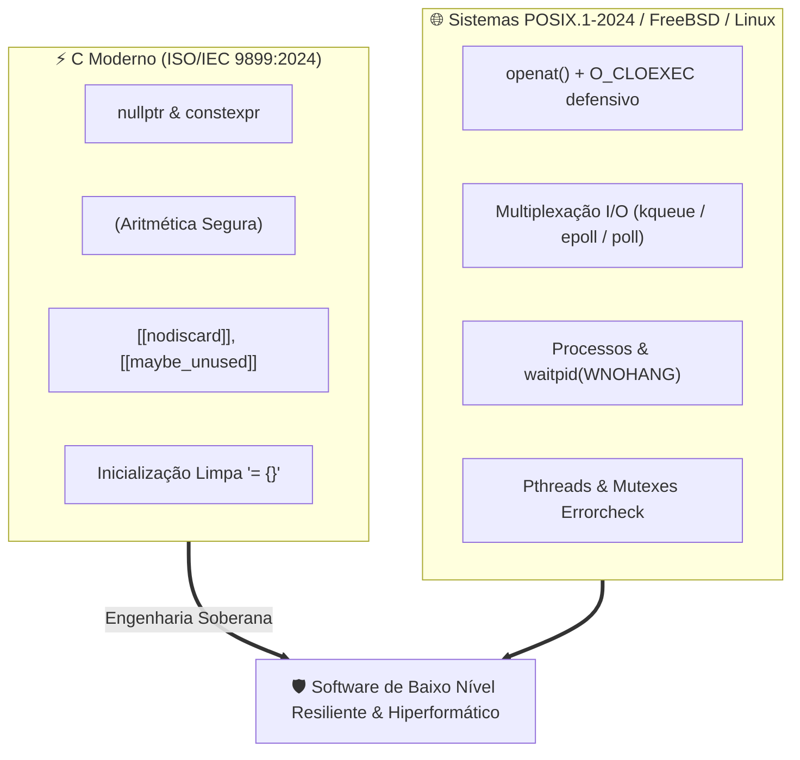

# ⚙️ Engenharia de Software em C Moderno (C23) & Sistemas POSIX

Esta habilidade orienta o desenvolvedor e o agente de IA na concepção, escrita, refatoração e auditoria de código em **C Contemporâneo (C23 - ISO/IEC 9899:2024)** integrado à programação de sistemas **POSIX.1-2024 / FreeBSD / Linux**.

---

## 🏛️ Manifesto: C Moderno Não É C Legado

Durante décadas, o C foi associado a práticas inseguras herdadas do C89/C99: macros opacas, casts inseguros, ausência de aritmética verificada e tratamento ingênuo de erros. O **C Moderno (C23)** redefine a linguagem trazendo garantias estáticas de compilação, tipos seguros e controle determinístico:



---

## 🗂️ Matriz Simétrica de Referências (Tier 2 Extended)

Para consultar especificações detalhadas, implementações de referência e snippets de baixo nível, acerte o subdomínio correspondente:

| Subdomínio Técnico              | Arquivo de Referência                                            | Conteúdo Coberto                                                                                                   |
| :------------------------------ | :--------------------------------------------------------------- | :----------------------------------------------------------------------------------------------------------------- |
| **Recursos Modernos C23**       | [`references/language-modern.md`](references/language-modern.md) | `nullptr`, `constexpr`, `typeof`, `<stdckdint.h>`, `[[nodiscard]]`, `= {}`, `static_assert`, `<stdbit.h>`.         |
| **Sistemas Operacionais POSIX** | [`references/systems-os.md`](references/systems-os.md)           | Descritores defensivos, `openat`, `O_CLOEXEC`, `sigaction`, colheita de zumbis, `__attribute__((cleanup))`.        |
| **Multiplexação de I/O**        | [`references/io-multiplexing.md`](references/io-multiplexing.md) | Loops de eventos de alta performance com `kqueue(2)` no FreeBSD/macOS, `epoll(7)` no Linux e `poll(2)` portátil.   |
| **Concorrência & Threads**      | [`references/concurrency.md`](references/concurrency.md)         | Pthreads defensivo com `PTHREAD_MUTEX_ERRORCHECK`, atômicos padronizados `<stdatomic.h>` e prevenção de deadlocks. |

---

## 🔨 Flags Canônicas de Compilação & Sanitizers

Todo projeto em C Moderno deve compilar sem nenhum aviso com Clang 19+ ou GCC 14+:

```makefile
# Makefile Canônico para C23
CC       ?= clang
CFLAGS   += -std=c23 \
            -Wall -Wextra -Wpedantic \
            -Werror \
            -Wshadow \
            -Wconversion \
            -Wformat=2 \
            -Wundef \
            -D_POSIX_C_SOURCE=202405L

# Flags de Debug com Sanitizers:
DEBUG_FLAGS = -g3 -O0 -fsanitize=address,undefined -fno-omit-frame-pointer
```

---

## 📚 Obras de Referência Canônicas

1. **Modern C (2nd Edition - C23)** — _Jens Gustedt_ (2024, Manning).
2. **Advanced Programming in the UNIX Environment (APUE)** — _W. Richard Stevens & Stephen A. Rago_ (3ª ed., Addison-Wesley).
3. **The Design and Implementation of the FreeBSD Operating System** — _Marshall Kirk McKusick et al._ (2ª ed., Addison-Wesley).
4. **The Open Group Base Specifications Issue 8 (POSIX.1-2024)** — _IEEE Std 1003.1-2024_.
