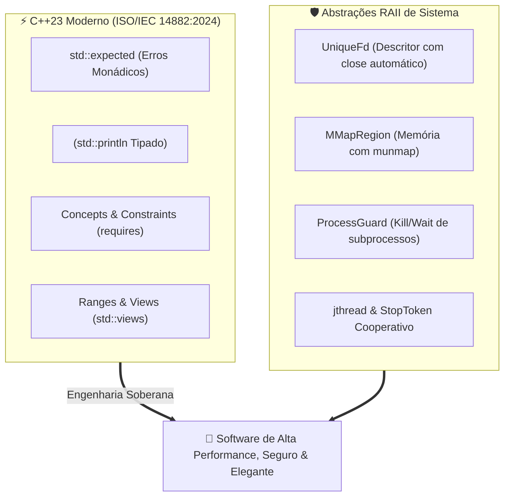

# 🚀 Engenharia de Software em C++ Moderno (C++23) & Abstrações de Sistemas

Esta habilidade orienta o desenvolvedor e o agente de IA na concepção, escrita, refatoração e auditoria de código em **C++ Contemporâneo (C++23 / C++20 - ISO/IEC 14882:2024)** integrado à programação de sistemas **POSIX.1-2024 / FreeBSD / Linux**.

---

## 🏛️ Manifesto: C++23 Não É "C com Classes"

O C++ Moderno repudia a escrita de código procedural com vazamento de memória e ponteiros desprotegidos. O modelo contemporâneo se apoia no princípio fundamental de **RAII (Resource Acquisition Is Initialization)**: nenhum recurso (memória, sockets, mutexes, subprocessos) existe solto sem um objeto proprietário responsável pelo seu ciclo de vida:



---

## 🗂️ Matriz Simétrica de Referências (Tier 2 Extended)

Para consultar especificações detalhadas, implementações de referência e snippets de baixo nível, acerte o subdomínio correspondente:

| Subdomínio Técnico             | Arquivo de Referência                                            | Conteúdo Coberto                                                                                        |
| :----------------------------- | :--------------------------------------------------------------- | :------------------------------------------------------------------------------------------------------ |
| **Recursos Modernos C++23**    | [`references/language-modern.md`](references/language-modern.md) | `std::expected`, `<print>`, `std::println`, Concepts, Ranges/Views, `consteval`, `constexpr`.           |
| **Sistemas Operacionais RAII** | [`references/systems-os.md`](references/systems-os.md)           | Wrappers move-only `UniqueFd`, mapeamentos de memória `MMapRegion` e controle seguro `ProcessGuard`.    |
| **Multiplexação de I/O**       | [`references/io-multiplexing.md`](references/io-multiplexing.md) | Loops de eventos de alta performance encapsulados em C++ com `kqueue(2)` e `epoll(7)`.                  |
| **Concorrência & Threads**     | [`references/concurrency.md`](references/concurrency.md)         | Threads com join automático (`std::jthread`), cancelamento `std::stop_token`, `std::latch` e `barrier`. |

---

## 🔨 Flags Canônicas de Compilação & Sanitizers

Todo projeto em C++ Moderno deve ser compilado com o mais alto nível de rigor estático com Clang++ 19+ ou G++ 14+:

```makefile
# Makefile Canônico para C++23
CXX       ?= clang++
CXXFLAGS  += -std=c++23 \
             -Wall -Wextra -Wpedantic \
             -Werror \
             -Wshadow \
             -Wconversion \
             -Wnon-virtual-dtor \
             -Wold-style-cast \
             -Woverloaded-virtual \
             -Wnull-dereference \
             -D_POSIX_C_SOURCE=202405L

# Flags de Debug com Sanitizers:
DEBUG_FLAGS = -g3 -O0 -fsanitize=address,undefined -fno-omit-frame-pointer
```

---

## 📚 Obras de Referência Canônicas

1. **A Tour of C++ (3rd Edition - C++20/C++23)** — _Bjarne Stroustrup_ (2022, Addison-Wesley).
2. **Effective Modern C++** — _Scott Meyers_ (O'Reilly).
3. **C++ Core Guidelines** — _Bjarne Stroustrup & Herb Sutter_.
4. **Embracing Modern C++ Safely** — _John Lakos et al._ (2022, Addison-Wesley).
5. **ISO/IEC 14882:2024 (Programming Languages — C++)** — _ISO Standard_.
