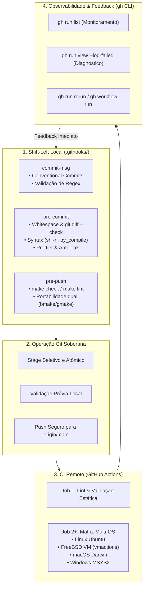
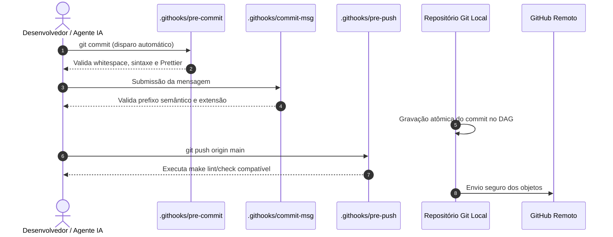

# 🚀 Git Flow, Quality Gates & GitHub Actions

Esta habilidade orienta o desenvolvedor e o agente de IA na operação, padronização e orquestração do **ciclo completo de entrega contínua soberana**. Ela une os quality gates locais (_shift-left_ em `.githooks/`), os protocolos de commits atômicos semânticos, a engenharia de pipelines multiplataforma no **GitHub Actions** e o diagnóstico cirúrgico em linha de comando via **GitHub CLI (`gh`)**.

---

## 🎯 Arquitetura em Quatro Camadas da Entrega Soberana

A integridade do software no ecossistema é garantida por uma esteira determinística em quatro estágios complementares:



### O Contrato de Responsabilidade entre as Camadas:

| Camada                     | Escopo                     | Tempo de Execução | Propósito Central                                                                                       |
| :------------------------- | :------------------------- | :---------------- | :------------------------------------------------------------------------------------------------------ |
| **`.githooks/pre-commit`** | Local (staged files)       | Milissegundos     | Bloquear whitespace, segredos, arquivos intermediários e erros de sintaxe antes de gerar o commit hash. |
| **`.githooks/commit-msg`** | Local (mensagem de commit) | Instantâneo       | Forçar padrão Conventional Commits legível por humanos e ferramentas de release semântica.              |
| **`.githooks/pre-push`**   | Local (árvore de trabalho) | Segundos          | Executar suíte de testes rápida ou linters globais antes de consumir banda e recursos do remote.        |
| **GitHub Actions CI/CD**   | Nuvem Remota (runners)     | Minutos           | Compilação real em matriz cross-platform (Linux, FreeBSD, macOS, Windows) e validações pesadas.         |
| **GitHub CLI (`gh`)**      | Local / Terminal           | Sob demanda       | Inspeção de logs de falha, acionamento manual e resolução de incidentes sem sair do terminal.           |

---

## 🪝 1. Engenharia Rigorosa de Git Hooks Locais (`.githooks/`)

Todo repositório no ecossistema deve adotar githooks versionados no diretório canônico `.githooks/`:



### Regras Mandatórias de Implementação:

1. **Hermeticidade e Autonomia Estrita:**
    - Hooks locais **NUNCA** devem depender de ferramentas ou scripts de IA externos (como pastas em `~/.gemini/` ou `.agents/skills/`).
    - Toda lógica deve ser expressa em shell POSIX puro (`/bin/sh`) ou chamar utilitários presentes dentro do próprio repositório.
2. **Portabilidade Dual FreeBSD e Linux:**
    - Shebang obrigatório: `#!/usr/bin/env sh`.
    - Evite utilizar flags GNU-específicas diretamente em ferramentas executadas no FreeBSD. Em Makefiles de hooks, detecte `gmake` e `bmake` defensivamente.
3. **Ativação e Permissões:**
    - Permissões em 4 dígitos: `chmod 0755 .githooks/*`.
    - Registro local no Git: `git config core.hooksPath .githooks`.

### Recursos e Modelos Canônicos de Hooks (`resources/hooks/`):

- **Validador de Mensagem Semântica:** [`resources/hooks/commit-msg`](./resources/hooks/commit-msg) (assegura formato Conventional Commits, mínimo 8 caracteres, sem mensagens vazias).
- **Quality Gates de Pre-Commit:** [`resources/hooks/pre-commit`](./resources/hooks/pre-commit) (valida whitespace via `git diff --check`, bloqueia arquivos sensíveis `.env`/`.key`, valida sintaxe com `sh -n` e formatação Prettier).

---

## 🐙 2. Protocolo de Git Flow & Commits Atômicos

Ao realizar alterações no repositório, siga sempre o fluxo determinístico em quatro passos:

```sh
# 1. Inspecionar o status conciso e as diferenças preparadas
git status -s
git diff

# 2. Adicionar arquivos explicitamente (evitar 'git add .' indiscriminado)
git add caminho/para/arquivo.ext

# 3. Testar localmente a formatação antes de commitar
git diff --check --cached

# 4. Gravar commit semântico com Conventional Commits
git commit -m "docs(readme): update architecture diagram and install instructions"

# 5. Enviar para a branch principal
git push origin main
```

---

## ⚙️ 3. Engenharia de Pipelines GitHub Actions Modernos

Workflows de CI/CD devem ser definidos em `.github/workflows/ci.yml`.

### Padrões Canônicos de Resiliência e Desempenho:

1. **Cancelamento em Progresso (`concurrency`):**
   Cancela automaticamente execuções anteriores no mesmo branch ao receber um novo push:
    ```yaml
    concurrency:
        group: ${{ github.workflow }}-${{ github.ref }}
        cancel-in-progress: true
    ```
2. **Forçar Ações JavaScript para Node24:**
    ```yaml
    env:
        FORCE_JAVASCRIPT_ACTIONS_TO_NODE24: true
    ```
3. **Checkout com Histórico Completo:**
    ```yaml
    - name: Checkout Code
      uses: actions/checkout@v7
      with:
          fetch-depth: 0
    ```
4. **Matriz Multiplataforma Segura:**
    - **Linux:** `runs-on: ubuntu-latest`.
    - **FreeBSD VM Oficial:** `uses: vmactions/freebsd-vm@v1` com `release: "15"`, `usesh: true`.
    - **Windows MSYS2:** `uses: msys2/setup-msys2@v2` com subsistema `UCRT64`.
    - **macOS:** `runs-on: macos-latest`.

---

## 🔍 4. Observabilidade & Diagnóstico Cirúrgico com GitHub CLI (`gh`)

O `gh` CLI elimina a necessidade de alternar para o navegador, permitindo diagnóstico direto no terminal:

```sh
# 1. Verificar autenticação e permissões do token
gh auth status

# 2. Listar as últimas execuções de workflow do repositório atual
gh run list -L 5

# 3. Observar uma execução em tempo real até o término
gh run watch <run-id>

# 4. Inspecionar diretamente os logs com erro de uma execução que falhou
gh run view <run-id> --log-failed

# 5. Re-executar apenas os jobs que falharam
gh run rerun <run-id> --failed

# 6. Disparar manualmente um workflow que possui trigger 'workflow_dispatch'
gh workflow run ci.yml --ref main

# 7. Listar e inspecionar status de Pull Requests
gh pr list
gh pr checks <pr-number>
```

---

## 📚 Referências Oficiais & Literatura Recomendada

- **Git SCM — Documentação Oficial de Hooks:** <https://git-scm.com/docs/githooks>
- **Manual Oficial do GitHub CLI (`gh`):** <https://cli.github.com/manual/>
- **GitHub Actions — Documentação Canônica:** <https://docs.github.com/en/actions>
- **Especificação Conventional Commits (v1.0.0):** <https://www.conventionalcommits.org/>
- **Pro Git Book (Scott Chacon & Ben Straub):** <https://git-scm.com/book/en/v2>
- **Prettier Code Formatter:** <https://prettier.io/>
