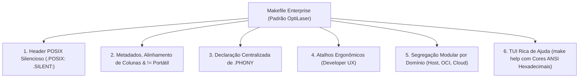

# 🛠️ POSIX Makefile Architect Skill

Esta habilidade orienta o agente de IA na construção, auditoria e modernização de Makefiles em todo o ecossistema. O objetivo é garantir **portabilidade universal** entre **BSD Make (`bmake`)** (padrão no FreeBSD, OpenBSD e NetBSD) e **GNU Make (`gmake`)** (padrão em distribuições Linux), sem ruído visual no terminal e com estrutura rigorosamente padronizada.

---

## 🎯 O Cabeçalho Universal Mandatório

Todo Makefile no ecossistema DEVE iniciar rigorosamente com o seguinte cabeçalho canônico:

```makefile
.POSIX:
.SILENT:

MAKEFLAGS += --no-print-directory -s
```

### Justificativas Técnicas:

1. **`.POSIX:`**: Força o Make a operar em conformidade com as especificações POSIX, desativando comportamentos proprietários arriscados e padronizando a execução de comandos via `/bin/sh`.
2. **`.SILENT:`**: Suprime a exibição padrão de linhas de comando antes da execução. Permite que o Makefile opere sob a **Regra do Silêncio** do UNIX, emitindo saída apenas quando houver erro ou quando explicitamente solicitado.
3. **`MAKEFLAGS += --no-print-directory -s`**: Garante que o GNU Make não polua o terminal com avisos de troca de diretório (`Entering/Leaving directory`) e força a execução silenciosa em subprocessos aninhados.

---

## ⚡ A Exceção Pragmática: `$(MAKE) -C subdir target`

> [!IMPORTANT]
> **Exceção Deliberada ao POSIX Estrito:**
> Embora a flag `-C` não esteja formalmente no padrão POSIX IEEE 1003.1 para o comando `make`, ela é **nativamente suportada por ambos os motores principais: `bmake` (BSD) e `gmake` (GNU)**.
>
> Portanto, o ecossistema **EXIGE** o uso de:
>
> ```makefile
> $(MAKE) -C subdir target
> ```
>
> em vez da forma burocrática em subshell `(cd subdir && $(MAKE) target)`. IAs e ferramentas automatizadas **NÃO DEVEM** "refatorar" chamadas `-C` para `cd && make`.

---

## 🚫 Eliminação de `@` Redundante

Com a diretiva `.SILENT:` declarada no topo do arquivo, **TODAS as receitas de comandos já são executadas silenciosamente por padrão**.

- **Anti-padrão (Redundância Visual):**

```makefile
build:
	@rm -rf bin
	@mkdir -p bin
	@$(CC) $(CFLAGS) -o bin/app src/main.c
```

- **Padrão Canônico Limpo:**

```makefile
build:
	rm -rf bin
	mkdir -p bin
	$(CC) $(CFLAGS) -o bin/app src/main.c
```

---

## ⚙️ Execução de Comandos de Shell em Variáveis (`!=` vs `$(shell)`)

No GNU Make, comandos dinâmicos frequentemente usam `$(shell cmd)`. No entanto, **o `bmake` do FreeBSD NÃO reconhece a função `$(shell ...)` por padrão**, resultando em falha crítica de sintaxe.

Ambos os motores modernos (`bmake` e `gmake 4.0+`) suportam o operador padrão POSIX de atribuição de shell: **`!=`**.

- **Incorreto (Incompatível com `bmake`):** `SOURCES = $(shell find src -name '*.c')`
- **Correto (Universal e Portátil):** `SOURCES != find src -name '*.c'`

---

## 🛡️ Compiladores e Flags Defensivas

Sempre utilize atribuições condicionais (`?=`) para permitir sobrescrita por variáveis de ambiente ou pelo empacotamento de distribuições:

```makefile
CC ?= cc
CXX ?= c++
CFLAGS ?= -O2 -Wall -Wextra -pedantic -std=c23
CXXFLAGS ?= -O2 -Wall -Wextra -pedantic -std=c++23
PREFIX ?= /usr/local
BINDIR ?= $(PREFIX)/bin
MANDIR ?= $(PREFIX)/share/man
```

- NUNCA force `gcc` ou `g++` diretamente, pois no FreeBSD, macOS e OpenBSD o compilador padrão do sistema é o Clang (`cc` e `c++`).

---

## 🏗️ Estrutura de Banners em Makefiles

Makefiles complexos devem seguir o padrão estrutural de comentários em 2 camadas:

```makefile
# ----------------------------------------------------------------
# COMPILER CONFIGURATION & FLAGS
# ----------------------------------------------------------------

CC ?= cc
CFLAGS ?= -O2 -Wall

### ================================
### BUILD TARGETS
### ================================

all: build

build:
	mkdir -p bin
	$(CC) $(CFLAGS) -o bin/app src/main.c

### ================================
### CLEANUP
### ================================

clean:
	rm -rf bin
```

---

## 🏛️ A Estrutura Canônica Enterprise / "Hype" (O Padrão OptiLaser)

Para projetos e repositórios de alta complexidade, o Makefile atua como a **Interface de Linha de Comando (CLI) Principal do Projeto**. A implementação de referência completa está disponível em [`examples/optilaser-enterprise-makefile.mk`](./examples/optilaser-enterprise-makefile.mk).



### Pilares da Arquitetura:

1. **Alinhamento Rigoroso de Colunas:** Atribuições `=`, `!=` e `?=` alinhadas na mesma coluna visual.
2. **Atalhos Ergonômicos (UX):** Fachadas curtas (`make dev`, `make run`, `make test`, `make logs`, `make clean`).
3. **Segregação Modular por Domínio:** Banners delimitando OCI/Containers, Host Nativo e Quality Gates.
4. **Ajuda Interativa Rica (`make help`):** Mini-funções inline (`cmd()`, `sec()`, `sub()`, `var()`) com escapes ANSI canônicos hexadecimais (`\x1b`), sem dependências externas.
5. **Escape de Parâmetros Shell:** No corpo de receitas, parâmetros de shell são escapados como `$$1`, `$$2`.

---

## 🧪 Validação de Portabilidade Obrigatória

Antes de finalizar qualquer alteração em um Makefile, execute a simulação de execução (_dry-run_) em ambos os motores:

```sh
# 1. Testar no GNU Make
make -n

# 2. Testar no BSD Make (quando bmake estiver instalado)
bmake -n
```

Nenhum aviso, erro de sintaxe ou ruído de diretório pode ser emitido.

---

## 📚 Literatura de Referência & Especificações Oficiais

- **The Open Group Base Specifications (POSIX IEEE 1003.1):** <https://pubs.opengroup.org/onlinepubs/9699919799/> | Make (`make`): <https://pubs.opengroup.org/onlinepubs/9699919799/utilities/make.html>
- **The FreeBSD Project:** <https://www.freebsd.org/> | Manual Pages: <https://man.freebsd.org/> | `bmake`: <https://man.freebsd.org/bmake>
- **Linux man-pages (Michael Kerrisk):** <https://man7.org/> | GNU Make (`make`): <https://man7.org/linux/man-pages/man1/make.1.html>
- **Obra de Referência:** _Managing Projects with GNU Make_ (Robert Mecklenburg, 3ª edição, O'Reilly Media).
