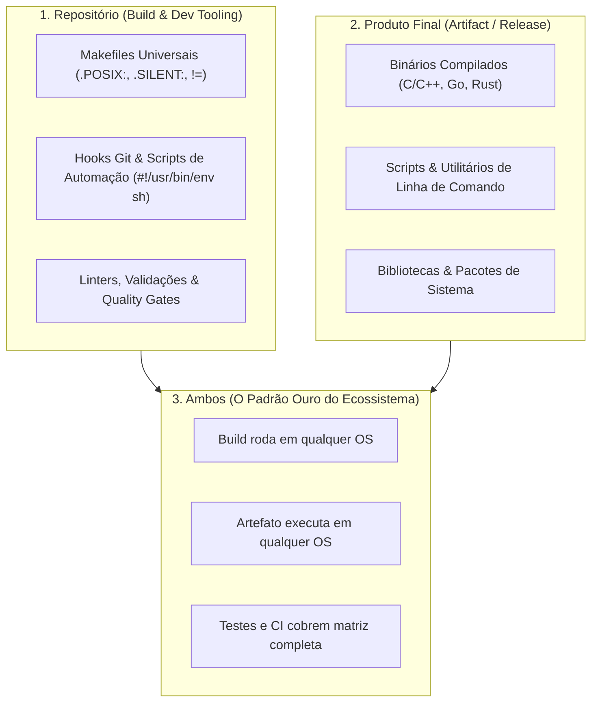

# 🌐 System Cross-Platforms & Multi-OS Repository Architecture

Esta habilidade orienta o agente de IA no design, construção, automação e auditoria de **repositórios e softwares estritamente multiplataforma**.

---

## 🎯 As Três Dimensões da Portabilidade

Ao arquitetar ou auditar projetos multiplataforma, distinga claramente o escopo de portabilidade necessário:



1. **Repositório Multiplataforma (Build & Dev Tooling):** Makefiles, githooks e scripts de setup executam de forma transparente em qualquer sistema suportado sem exigir utilitários proprietários.
2. **Produto Final Multiplataforma (Artifact / Release):** O artefato (binário executável, biblioteca `.a`/`.so`/`.dylib`/`.dll` ou script) roda com estabilidade nos sistemas de destino.
3. **Ambos Multiplataforma (O Padrão Ouro do Ecossistema):** Tanto a compilação quanto a execução dos artefatos são estritamente universais e agnósticas de plataforma.

---

## 📜 A Regra Universal do Shebang (`#!/usr/bin/env sh`)

> [!CAUTION]
> **Proibição de Shebangs Hardcoded:**
> NUNCA escreva `#!/bin/sh`, `#!/bin/bash` ou `#!/usr/bin/sh` diretamente. Todo script de shell no ecossistema DEVE iniciar estritamente com `#!/usr/bin/env sh`.

O caminho de executáveis varia entre Linux (`/usr/bin`), FreeBSD (`/usr/local/bin` para pacotes), macOS, illumos e Windows (`sh.exe`). Invocar via `env` garante resolução correta pelo `PATH` em qualquer ambiente UNIX/POSIX soberano.

---

## 🏛️ FreeBSD como Régua Máxima de Portabilidade

Assistentes de IA frequentemente sofrem de _Linux-centric bias_, presumindo caminhos fixos (`/usr/bin`), dependência de `systemd`, bashismos e flags GNU exclusivas.

- **A Coesão do Sistema Base:** No FreeBSD, Kernel e Userland formam um produto único e coeso. O que existe na base é garantido em qualquer instalação daquela versão no mundo. No Linux, há fragmentação profunda de distribuições, gerenciadores de pacotes e glibc vs musl.
- **Régua de Corte:** Se o código, Makefile ou script roda perfeitamente no FreeBSD, ele respeita os mais altos padrões POSIX/BSD, tornando trivial sua adaptação para Linux, macOS, Windows e illumos.
- **Referência Aprofundada:** Para arquitetura do FreeBSD base, releases (CURRENT, STABLE, RELEASE), utilitário `flua` nativo, containers OCI (`runj`) e plataforma Sylve, consulte [`references/freebsd-architecture.md`](./references/freebsd-architecture.md).

---

## 🌍 Panorama Estratégico por Sistema Operacional

### 🐧 1. Linux (Distribuições e Abstração Limpa)

- Privilegie interfaces padronizadas: POSIX `#!/usr/bin/env sh`, compiladores padrão (`cc`/`gcc`), Makefiles neutros.
- Cuidado com _usrmerge_ (`/bin -> /usr/bin`) que não ocorre nos BSDs; evite extensões proprietárias GNU quando funções POSIX padrão bastam.

### 🍎 2. macOS (Darwin / Mach / BSD Userland)

- Compilador padrão é o Apple Clang. Shell interativo padrão é o `zsh`.
- Utilitários da base (`sed`, `grep`, `tar`) derivam do BSD clássico e não suportam flags GNU (ex: `sed -i` exige sufixo de backup). Prefixos: Homebrew Apple Silicon (`/opt/homebrew`), Intel (`/usr/local`), MacPorts (`/opt/local`).

### 🪟 3. Windows & MSYS2

- No subsistema MSYS2, prefira compilar com toolchain `UCRT64` (moderno, biblioteca UCRT da Microsoft).
- Garanta finais de linha estritamente UNIX (`LF`) via `.gitattributes` (`* text eol=lf`). No Windows nativo, forneça scripts em PowerShell (`.ps1`) ou chamadas via `sh.exe`.

### 🐡 4. OpenBSD (Segurança Pragmática e Minimalismo)

- Suporte a `pledge(2)` e `unveil(2)`. Shell base é o `/bin/ksh` (PD-KSH): não possui `$''`, exigindo captura dinâmica `_esc="$(printf '\x1b' 2>"/dev/null" || echo -n $'\x1b')"` e delimitação `\x01` para sequências invisíveis de prompt no `PS1`. Elevação canônica via `doas`.

### ☀️ 5. illumos (SmartOS, OmniOS, OpenIndiana & Solaris Zones)

- Herança corporativa System V / OpenSolaris. Recursos de kernel: Solaris Zones (nativas e `lx-brand`), virtualização de rede Crossbow (VNICs sem bridges pesadas), SMF, ZFS e DTrace. Validação em CI via testes estáticos de sintaxe e mock em memória.

### 🚩 6. NetBSD (Portabilidade Extrema e Berço da `libedit`)

- Criador da biblioteca `libedit` (alternativa BSD à Readline, importada pelo FreeBSD e macOS). Gerenciador `pkgsrc` multiplataforma com empacotamento versionado (`python312`). Shells interativos: `bash` e `zsh`.

---

## 🚦 TTY & CI Headless: O Padrão PTY (`script -q /dev/null`)

Em runners headless de CI/CD (GitHub Actions, SSH sem PTY), shells interativos (`-i`) acionam `tcsetpgrp()`. Enquanto no Linux a syscall retorna erro inofensivo, **no kernel do FreeBSD ela dispara `SIGTTIN` (sinal 21), congelando o processo em `SIGSTOP`**.

- **Solução Canônica:** Aloque um pseudo-terminal sob demanda:
    ```sh
    script -q /dev/null bash -i -c 'echo "Prompt OK: ${PS1}"'
    ```
- Para a análise técnica aprofundada de drivers TTY, consulte [`references/tty-ci-traps.md`](./references/tty-ci-traps.md).

---

## 🛠️ As Cinco Regras de Ouro Multiplataforma

1. **Makefiles Universais (Paridade bmake & gmake):** Cabeçalho `.POSIX: .SILENT:`, `MAKEFLAGS += --no-print-directory -s`, `CC ?= cc`, `$(MAKE) -C` e atribuições dinâmicas com `!=`.
2. **Shebangs Portáveis:** Invariavelmente `#!/usr/bin/env sh` para shell e `#!/usr/bin/env python3` para Python.
3. **Programação Defensiva:** Checagem via `command -v`, redirecionamentos cotados `> "/dev/null" 2>&1`, taxonomia `echo` / `[ -t 1 ] && echo -n $'\e...'` / `printf`.
4. **Permissões em 4 Dígitos:** `chmod 0755` para executáveis, `chmod 0644` para arquivos regulares, `chmod 0700`/`0600` para segredos.
5. **Arquitetura de Provisionamento (Despachante Multi-OS Universal):** Em repositórios de provisionamento (`Setup`), scripts em `common/` atuam como despachantes dinâmicos de pacotes (`pkg` → `dnf` → `apt` → `pacman` [MSYS2/Arch] → `winget.exe`). Todo pacote suportado em múltiplos sistemas operacionais DEVE residir em `common/`, reservando pastas de SO (`linux/`, `freebsd/`, `windows/`) estritamente para recursos exclusivos daquela plataforma (dconf, Jails, udev, registro).

---

## 🔗 Links Oficiais de Referência

- **The FreeBSD Project:** <https://www.freebsd.org/> | Releases: <https://www.freebsd.org/releases/>
- **OpenBSD Project:** <https://www.openbsd.org/> | FAQ PF: <https://www.openbsd.org/faq/pf/>
- **illumos Project:** <https://illumos.org/> | Docs: <https://illumos.org/docs/>
- **NetBSD Project:** <https://pkgsrc.se/> | Pkgsrc: <https://cdn.netbsd.org/pub/pkgsrc/current/pkgsrc/>
- **The Open Group (POSIX):** <https://www.opengroup.org/> | Specs: <https://pubs.opengroup.org/onlinepubs/9799919799/>
