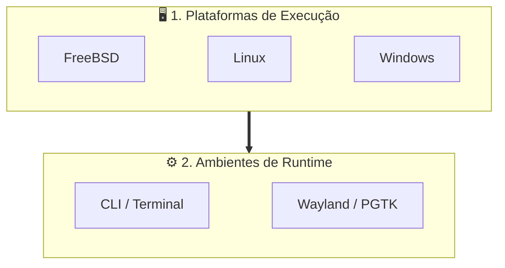
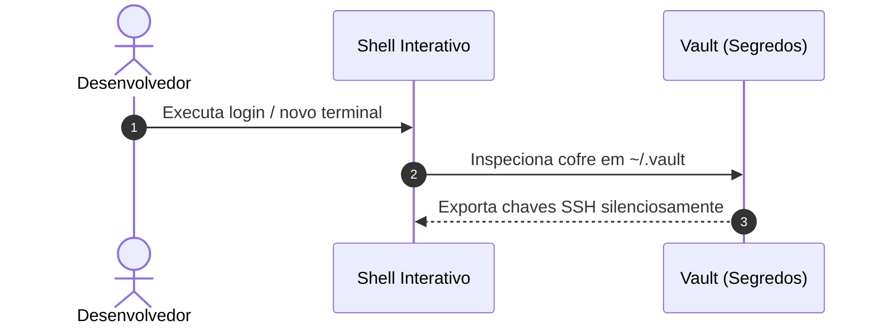

# 📊 Diagramação Visual com Mermaid

Markdown moderno no ecossistema deve priorizar diagramas Mermaid dinâmicos em cercaduras `mermaid` em vez de imagens rasterizadas (PNG/JPG), permitindo versionamento por texto e rastreamento claro em `git diff`.

---

## 🏛️ Arquitetura Hierárquica Híbrida (`flowchart TD` + Cards Horizontais)

Para evitar grafos excessivamente longos verticalmente ou largos horizontalmente, combine um fluxo macro top-down com subgrafos contendo elos invisíveis (`~~~`):

---

## 🔄 Diagramas de Sequência (`sequenceDiagram`)

Para documentar ciclos de inicialização, sourcing de variáveis e handshakes de segurança:

---

## ⚠️ Prevenção de Erros de Sintaxe no Mermaid

1. **Aspas em Rótulos:** Sempre coloque aspas em rótulos que contenham caracteres especiais como parênteses ou colchetes: `id["Nodo (Detalhe)"]`.
2. **Sem Tags HTML:** Evite tags HTML (` `, `<b>`) dentro dos nós; utilize Markdown Strings nativas (`["`...`"]`) para quebras (`\n`) e formatação rica nos nós.
3. **Tipos Suportados:** Utilize `flowchart TD/LR`, `sequenceDiagram`, `stateDiagram-v2`, `classDiagram` ou tabelas Markdown nativas. Evite diagramas de Gantt ou tipos não-universais.
4. **Títulos de Subgrafos em Linha Única Sem Crases:** Títulos de `subgraph` DEVEM utilizar aspas convencionais em linha única (`subgraph ID["Título"]`), nunca Markdown Strings com crases (`["`...`"]`). O Mermaid limita clusters a 200px na renderização markdown, gerando quebras artificiais de linha com desalinhamento à esquerda no PDF.
5. **Contenção Geométrica de Títulos de Subgrafos:** O motor Dagre calcula a largura da caixa do subgrafo exclusivamente pelos nós filhos. O título nunca deve exceder visualmente a largura dos nós internos para não vazar a borda da caixa. Reduza o título ou alargue os nós filhos (em 2 linhas descritivas).
6. **Setas com Rótulos de Comprimento 3:** Sempre use `--->|"Rótulo"|`, `-..->`, `===>` ou `<--->` para arestas com texto, reservando espaço no rank para o badge branco protetor.
7. **Padronização de Cartões (Título em Negrito + Conteúdo em Bullets `•`):** Em nós com estrutura hierárquica (título/identificador acompanhado de descrição, atributos ou especificações técnicas), o título DEVE estar estritamente em negrito (`**Título**`) e cada linha subsequente DEVE iniciar obrigatoriamente com o marcador bullet (`• `). Nós conceituais simples/atômicos (sem lista descritiva) não devem utilizar bullets. Toda quebra e formatação deve utilizar Markdown Strings (`["`...`"]`).
8. **Taxonomia Semântica de Operadores de Arestas:** Use setas grossas (`===>` / `==>`) **ESTRITAMENTE E EXCLUSIVAMENTE** para conexões entre contêineres/subgrafos (`SUBGRAPH1 ===> SUBGRAPH2`). É categoricamente proibido utilizar setas grossas entre nós normais. Use setas sólidas padrão (`--->` / `-->`) para conexões sequenciais ordinárias entre nós. Use setas tracejadas (`-..->` / `-.->`) para dependências fracas, fluxos opcionais, canais assíncronos ou fallbacks.
