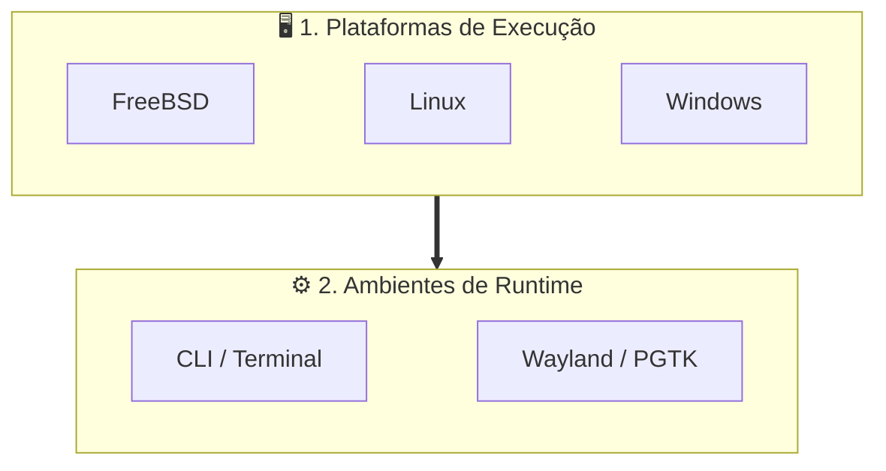
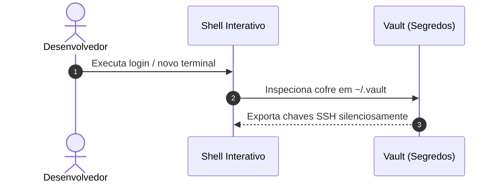

# 📊 Diagramação Visual com Mermaid

Markdown moderno no ecossistema deve priorizar diagramas Mermaid dinâmicos em cercaduras `mermaid` em vez de imagens rasterizadas (PNG/JPG), permitindo versionamento por texto e rastreamento claro em `git diff`.

---

## 🏛️ Arquitetura Hierárquica Híbrida (`flowchart TD` + Cards Horizontais)

Para evitar grafos excessivamente longos verticalmente ou largos horizontalmente, combine um fluxo macro top-down com subgrafos contendo elos invisíveis (`~~~`):

---

## 🔄 Diagramas de Sequência (`sequenceDiagram`)

Para documentar ciclos de inicialização, sourcing de variáveis e handshakes de segurança:

---

## ⚠️ Prevenção de Erros de Sintaxe no Mermaid

1. **Aspas em Rótulos:** Sempre coloque aspas em rótulos que contenham caracteres especiais como parênteses ou colchetes: `id["Nodo (Detalhe)"]`.
2. **Sem Tags HTML:** Evite tags HTML (` `, `<b>`) dentro dos nós; prefira quebras limpas ou texto contínuo.
3. **Tipos Suportados:** Utilize `flowchart TD/LR`, `sequenceDiagram`, `stateDiagram-v2`, `classDiagram` ou tabelas Markdown nativas. Evite diagramas de Gantt ou tipos não-universais.
