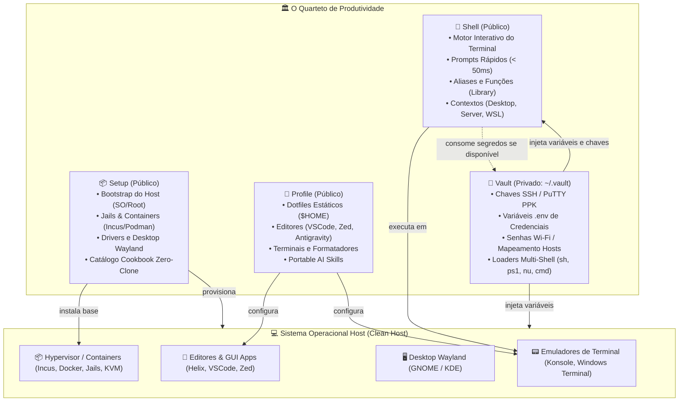

# 🏛️ A Arquitetura do Quarteto de Produtividade

Este documento formaliza a arquitetura e as fronteiras de responsabilidade entre os 4 repositórios que compõem o ambiente de trabalho e desenvolvimento unificado.

---

## 🎯 A Divisão de Responsabilidades

---

## 📋 Matriz de Responsabilidades

| Aspecto                 | `Setup`                            | `Profile`                          | `Shell`                           | `Vault`                             |
| :---------------------- | :--------------------------------- | :--------------------------------- | :-------------------------------- | :---------------------------------- |
| **Visibilidade**        | Público (GitHub)                   | Público (GitHub)                   | Público (GitHub)                  | **Privado** (Local/GitHub)          |
| **Natureza**            | Provisionamento Ativo de SO (Root) | Dotfiles Declarativos e IA ($HOME) | Motor Dinâmico de Terminal        | Cofre Criptográfico de Segredos     |
| **Local Canônico**      | Efêmero / Zero-Clone               | `~/.config/profile`                | `/usr/local/share/shell`          | `${HOME}/.vault`                    |
| **Privilégios**         | `root` / `sudo` / `ELEVATE`        | Zero-Sudo (Usuário comum)          | Sessão do usuário / terminal      | Permissões estritas `0700` / `0600` |
| **Tolerância a Falhas** | Receitas atômicas e idempotentes   | Symlinks atômicos reversíveis      | Degrada graciosamente sem o Vault | Audita permissões e protege chaves  |

---

## 🔄 Fluxo de Boot e Integração

1. **Provisionamento do Host (`Setup`):**
    - Execução da receita de sistema (`curl | sh` ou via clone efêmero).
    - O sistema ganha utilitários essenciais, drivers, ZFS, interface gráfica e containers.
2. **Sincronização dos Dotfiles e IA (`Profile`):**
    - Clonagem do repositório em `~/.config/profile` e execução de `./scripts/sync/sync-dotfiles.sh`.
    - Editores, formatadores e skills de IA são linkados atômica e instantaneamente.
3. **Ativação da Linha de Comando (`Shell`):**
    - O `Shell` é clonado para `/usr/local/share/shell` e instalado via `sh install.sh --context desktop`.
4. **Cofre Seguro (`Vault`):**
    - O `Vault` é clonado em `~/.vault` e protegido com permissões restritas `0700`/`0600`.
5. **Sessão Interativa:**
    - O terminal inicia carregando `Shell/core/environment.sh`, que detecta `~/.vault/vault.sh` e exporta variáveis em silêncio absoluto.
