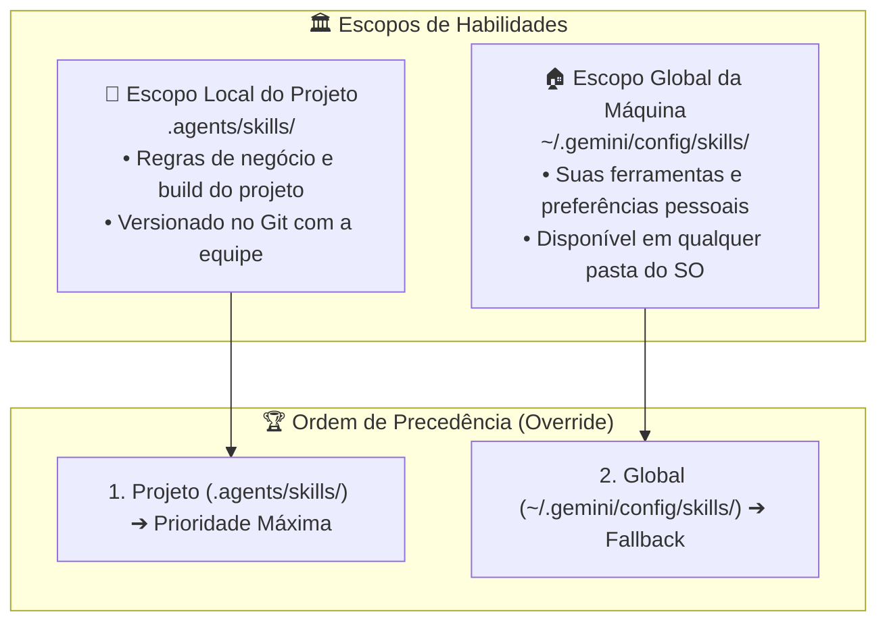
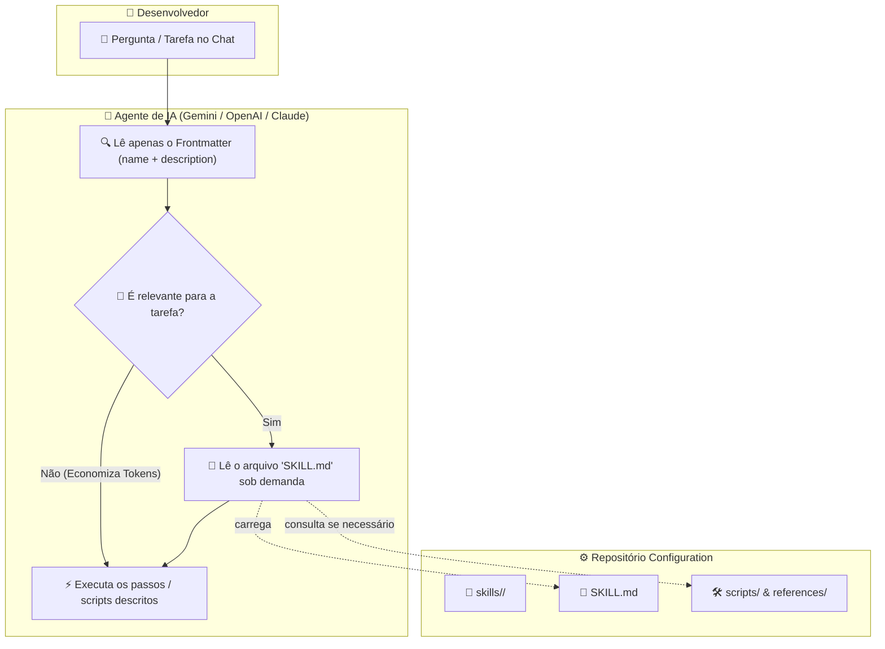

# 🧠 Portable AI Skills (Habilidades & Runbooks Portáteis para IA)

> Hub central de habilidades portáteis, procedimentos e runbooks cognitivos para agentes de inteligência artificial (Google Antigravity / Gemini, OpenAI / ChatGPT, Claude e assistentes autônomos de código).

---

### 🤖 Compatibilidade de Agentes & Modelos


---

## 🎯 A Fronteira: O Papel de `skills/` na Arquitetura

No ecossistema do **Quarteto de Produtividade**, enquanto o repositório **Setup** provê receitas atômicas de provisionamento do SO e o repositório **Profile** mantém dotfiles declarativos em editores, terminais e ferramentas, a pasta **`skills/`** serve como o **Catálogo de Habilidades Portáteis** que você pode levar para qualquer máquina ou projeto:

| Camada                                                                                                         | Papel Central                        | Tipo de Conteúdo                                                                    | Destinatário / Consumidor                                                                   |
| :------------------------------------------------------------------------------------------------------------- | :----------------------------------- | :---------------------------------------------------------------------------------- | :------------------------------------------------------------------------------------------ |
| **[Setup](https://github.com/GabrielFrigo4/setup)**                                                            | **O "COMO" (Provisionamento Ativo)** | Receitas atômicas de automação e scripts de sistema (`.sh`, `.cmd`, `.ps1`).        | **Sistema Operacional** (com privilégios de administrador / root).                          |
| **[`editors/`](../editors/README.md), [`terminals/`](../terminals/README.md), [`tools/`](../tools/README.md)** | **O "O QUÊ" (Estado Declarativo)**   | Arquivos estáticos puros (`.json`, `.toml`, `.yaml`, `.el`, `.vim`, `.profile`).    | **Usuário & Aplicações** (espaço do `$HOME`, zero sudo).                                    |
| **`skills/`** _(esta pasta)_                                                                                   | **O "COMO OPERAR" (Runbooks de IA)** | Pacotes modulares de procedimentos guiados (`SKILL.md`, scripts, templates, guias). | **Agentes de IA** (Antigravity, Gemini, OpenAI, Claude) para execução assistida e autônoma. |
| **[`scripts/`](../scripts/README.md)**                                                                         | **Utilitários & Auditoria**          | Compilação local, conversores e auditoria estática (`scripts/audit/`).              | **Desenvolvedor** (execução pontual em linha de comando).                                   |
| **[`docs/`](../docs/README.md)**                                                                               | **Documentação Humana**              | Filosofia, arquitetura, manuais de SO e guias técnicos.                             | **Desenvolvedor** (leitura técnica e arquitetural).                                         |

---

## 📚 Catálogo Canônico de Skills Portáteis (17 Runbooks)

O ecossistema disponibiliza 17 habilidades cognitivas universais organizadas por domínio de especialidade:

| Categoria                     | Skill                                                               | Descrição e Escopo de Ativação                                                                                                  | Gatilhos de Ativação / Cenários de Uso                                                                             |
| :---------------------------- | :------------------------------------------------------------------ | :------------------------------------------------------------------------------------------------------------------------------ | :----------------------------------------------------------------------------------------------------------------- |
| **Arquitetura & Filosofia**   | [`unix-philosophy-auditor`](./unix-philosophy-auditor/SKILL.md)     | Auditoria e conformidade com os 17 Princípios UNIX de Eric S. Raymond + Soberania do Usuário.                                   | Criação de novas CLI, revisão de arquitetura, validação de regras de silêncio e transparência.                     |
| **Soberania & Cloud-Exit**    | [`cloud-exit`](./cloud-exit/SKILL.md)                               | Repatriação de nuvem para bare-metal com FreeBSD, Linux, illumos, OpenBSD e Windows (Sylve, Proxmox, Oxide, ZFS e pf).          | Migração para infraestrutura própria, redução de custos de nuvem pública, soberania digital.                       |
| **Aplicações Anti-Inchaço**   | [`svelte-pocketbase-go`](./svelte-pocketbase-go/SKILL.md)           | Arquitetura minimalista fullstack em SvelteKit, PocketBase e Go, entrega em binário único, SQLite WAL e custo quase zero.       | Criação de sistemas web ágeis, microsserviços sem node_modules em produção, painéis reativos leves.                |
| **Metodologia & Meta-Skills** | [`skill-authoring-standards`](./skill-authoring-standards/SKILL.md) | Padrões canônicos para especificação, redação, citações oficiais e manutenção de Portable AI Skills no ecossistema.             | Criação de novas skills, auditoria de runbooks, inclusão de referências bibliográficas e links.                    |
| **Controle de Versão (VCS)**  | [`vcs-git-got`](./vcs-git-got/SKILL.md)                             | Gestão soberana de repositórios Git e Game of Trees (Got/tog), coexistência no `.git`, commits atômicos e inspeção no terminal. | Uso de Git ou Got/tog, padronização de commits, visualização de histórico com `tog`, branchless dev e hooks POSIX. |
| **Governança & Repositórios** | [`repo-governance-bootstrap`](./repo-governance-bootstrap/SKILL.md) | Scaffolding e auditoria da tríade de governança (`.agents/`, `.githooks/`, `.github/`, `AGENTS.md`, `PRINCIPLES.md`).           | Inicialização de repositórios, padronização de hooks de commit, alinhamento de briefings de IA.                    |
| **Templates & Scaffolding**   | [`repo-template-generator`](./repo-template-generator/SKILL.md)     | Gerador de repositórios completos e padronizados por stack (C/POSIX, Shell, C++23, Go, LaTeX).                                  | Início de novos projetos, expansão do ecossistema, criação de bibliotecas e ferramentas.                           |
| **Padrões de Shell**          | [`posix-shell-standards`](./posix-shell-standards/SKILL.md)         | Manual e validador de Shell POSIX estrito com baseline no FreeBSD `/bin/sh`, taxonomia de saída e permissões octais.            | Escrita e revisão de scripts `.sh`, eliminação de bashismos, padronização de sequências ANSI e quoting.            |
| **Makefiles Universais**      | [`posix-makefile-architect`](./posix-makefile-architect/SKILL.md)   | Construção de Makefiles silenciosos e portáteis entre BSD Make (`bmake`) e GNU Make (`gmake`).                                  | Criação de Makefiles, migração para `.POSIX: .SILENT:`, suporte à exceção `$(MAKE) -C`, remoção de `@`.            |
| **Repositórios Multi-OS**     | [`system-crossplatforms`](./system-crossplatforms/SKILL.md)         | Guia para design e manutenção de repositórios multiplataforma (FreeBSD 14/15/16, Linux, macOS, OpenBSD, Windows e illumos).     | Criação e teste de projetos multiplataforma, caminhos defensivos, compilação cruzada e paridade.                   |
| **Cloud no FreeBSD**          | [`freebsd-cloud`](./freebsd-cloud/SKILL.md)                         | Arquitetura e operação em nuvem FreeBSD moderna (Jails, Bastille, Sylve, Podman nativo com runj, imagens OCI, bhyve e ZFS).     | Desenvolvimento de serviços para FreeBSD, conteinerização OCI com Podman, Jails VNET e ZFS storage.                |
| **Cloud no Linux**            | [`linux-cloud`](./linux-cloud/SKILL.md)                             | Arquitetura e microsserviços em nuvem Linux moderna (Proxmox VE, Podman rootless/Quadlet, Incus/LXC, systemd-nspawn, eBPF).     | Implantação de microsserviços, containers rootless, Proxmox VE, servidores e infraestrutura Linux.                 |
| **Cloud no illumos**          | [`illumos-cloud`](./illumos-cloud/SKILL.md)                         | Arquitetura de infraestrutura corporativa illumos (SmartOS, OmniOS, Oxide, Zones nativas/lx-brand, Crossbow, ZFS e DTrace).     | Projetos de alta densidade, virtualização de rede com Crossbow, auditoria com DTrace e SMF.                        |
| **Pesquisa Ativa & Versões**  | [`deep-version-researcher`](./deep-version-researcher/SKILL.md)     | Investigação ativa na web por versões atuais, notas de lançamento (_release notes_) e breaking changes.                         | Seleção de dependências, novas stacks, apuração de documentação oficial recente, anti-alucinação.                  |
| **Refatoração & Clean Code**  | [`clean-code-refactor`](./clean-code-refactor/SKILL.md)             | Auditoria de código POSIX, scripts de shell e dotfiles conforme os 18 princípios Clean Code do ecossistema.                     | Limpeza de código legado, redução de complexidade ciclomática, eliminação de comentários narrativos.               |
| **Integridade de Dotfiles**   | [`dotfiles-doctor`](./dotfiles-doctor/SKILL.md)                     | Verificação de integridade de links simbólicos, sintaxe de configurações (JSON, YAML, TOML) e permissões.                       | Teste de integridade de dotfiles após sincronização, validação de arquivos de configuração em `$HOME`.             |
| **Diagnóstico de Sistema**    | [`system-diagnostics`](./system-diagnostics/SKILL.md)               | Diagnóstico completo de saúde de estações Linux e FreeBSD (Wayland, VA-API, PipeWire, logs e conectividade).                    | Investigação de falhas de hardware, aceleração gráfica, servidores de áudio e rede.                                |

---

## 🌐 Escopos de Atuação: Global (Home) vs. Local (Projeto)

O Antigravity e os agentes modernos suportam dois níveis de alcance para as skills:



### 1. Escopo Global (`~/.gemini/config/skills/`)

- **Onde fica:** Na pasta de configuração do usuário no `$HOME`.
- **Como funciona:** O agente carrega essas skills em **qualquer projeto ou pasta** aberta no seu computador.
- **Uso ideal:** Suas automações pessoais, rotinas universais de auditoria, formatação e preferências que você quer disponíveis em todo lugar.

### 2. Escopo Local do Projeto (`.agents/skills/`)

- **Onde fica:** Na raiz do projeto específico (ex: `meu-projeto/.agents/skills/<skill>/SKILL.md`).
- **Como funciona:** Carregada exclusivamente quando você estiver trabalhando naquele repositório.
- **Vantagem de Equipe:** Você pode commitar a pasta `.agents/` no Git. Assim, toda a equipe ou outros ambientes de CI/CD terão acesso imediato aos mesmos runbooks autônomos.

### 3. Regra de Precedência (Sobrescrita Inteligente)

Se existir uma skill com o **mesmo nome** na sua Home global e na pasta do Projeto:

$$\text{Skill do Projeto (.agents/skills/)} \quad \mathbf{> \text{ (sobrescreve)}} \quad \text{Skill Global da Home (~/.gemini/config/skills/)}$$

---

## 🔄 Fluxo de Descoberta & Progressive Disclosure

Para evitar o consumo desnecessário da janela de contexto (_Context Window_) dos modelos de linguagem, as skills utilizam o padrão de **Divulgação Progressiva (_Progressive Disclosure_)**:



---

## 🏗️ Anatomia Canônica de uma Skill Portátil

Cada skill é um módulo **isolado e autocontido** em uma subpasta com seu respectivo nome:

```text
skills/<nome_da_skill>/
├── SKILL.md          # [OBRIGATÓRIO] Ponto de entrada com YAML Frontmatter e passo a passo
├── scripts/          # [OPCIONAL] Scripts auxiliares que o modelo pode invocar
├── references/       # [OPCIONAL] Documentações densas ou manuais de API lidos sob demanda
├── examples/         # [OPCIONAL] Exemplos práticos de código ou saídas esperadas
└── resources/        # [OPCIONAL] Templates, snippets, boilerplates ou schemas
```

### Cabeçalho Obrigatório (`YAML Frontmatter`)

Todo arquivo `SKILL.md` inicia com o cabeçalho YAML delimitado por `---`:

```markdown
---
name: nome-da-skill
description: >-
    Explicação em terceira pessoa indicando O QUE a skill faz e EM QUAIS SITUAÇÕES
    o agente de IA deve ativá-la automaticamente.
---

# Título da Skill

Instruções claras e objetivas para o agente executar a tarefa.

## 🎯 Procedimentos

1. Verifique os pré-requisitos.
2. Execute o script auxiliar: [setup.sh](./scripts/setup.sh)
3. Valide a saída esperada.
```

- **`name`**: Identificador único em minúsculas com hífens (`kebab-case`).
- **`description`**: O gatilho de ativação da IA. O agente lê esta descrição para decidir se precisa ler o restante do arquivo.

---

## 🚀 Como Usar: O Modelo "Cookbook" de Portabilidade

As skills deste repositório podem ser consumidas tanto pontualmente quanto vinculadas automaticamente ao seu ambiente de IA:

### 1. Instalação Dinâmica via Symlink (Recomendado para Repositório Clonado)

Se você clonou este repositório no seu computador, crie **links simbólicos** (`ln -sf`). A grande vantagem é que qualquer melhoria que você fizer ou baixar via `git pull` estará **instantaneamente atualizada** para seus agentes:

```sh
# 🏠 Instalação Global (Disponível em qualquer workspace):
mkdir -p "${HOME}/.gemini/config/skills"
ln -sf /caminho/para/Configuration/skills/* "${HOME}/.gemini/config/skills/"

# 📂 Instalação em um Projeto Específico:
mkdir -p .agents/skills
ln -sf /caminho/para/Configuration/skills/minha-skill .agents/skills/minha-skill
```

### 2. Instalação Estática (Cópia Isolada ou Zero-Clone / RAW)

Se você prefere cópias congeladas (isoladas de futuras alterações) ou está em uma máquina onde não clonou o repositório completo:

```sh
# Cópia estática local:
mkdir -p "${HOME}/.gemini/config/skills"
cp -r /caminho/para/Configuration/skills/* "${HOME}/.gemini/config/skills/"

# Ou cópia para projeto local compartilhável no Git:
mkdir -p .agents/skills
cp -r /caminho/para/Configuration/skills/minha-skill .agents/skills/
```

### 3. Em Outros Ecossistemas (OpenAI / Claude / Copilot)

Como o formato segue o padrão aberto Markdown + YAML Frontmatter:

- **Copie a pasta da skill** para a pasta de prompts/instruções do seu projeto (ex: `.cursor/rules/`, `.github/copilot-instructions.md` ou `.agent/`).
- Ou **anexe o `SKILL.md`** diretamente no contexto de ferramentas que suportam custom instructions ou GPTs com arquivos de conhecimento.

---

## 📜 Princípios e Padrões da Camada de Skills

Conforme estabelecido em [`../PRINCIPLES.md`](../PRINCIPLES.md):

1. **Progressive Disclosure (Regra da Economia):** Mantenha o `SKILL.md` conciso (focado no workflow). Manuais extensos devem ficar em `references/`, permitindo que o modelo só consuma tokens quando estritamente necessário.
2. **Permissões Canônicas em 4 Dígitos:** Documentos (`.md`, `.yaml`, `.json`) utilizam `chmod 0644`. Scripts executáveis em `scripts/` utilizam `chmod 0755`.
3. **Idempotência & Verificação:** Toda skill deve instruir a IA a validar o estado atual antes de aplicar alterações e verificar o resultado após a conclusão.
4. **Desacoplamento Absoluto:** Cada skill deve ser autocontida, sem dependências ocultas de outras skills.
