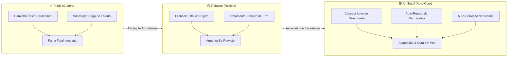

# 🛡️ Antifragile Engineering — Sistemas Resilientes e Auto-Cura

> _"Some things benefit from shocks; they thrive and grow when exposed to volatility, randomness, disorder, and stressors and love adventure, risk, and uncertainty. [...] Let us call what is non-fragile and gains from disorder 'antifragile'."_<br>
> — Nassim Nicholas Taleb, _Antifragile: Things That Gain from Disorder_ (2012)

Esta skill estabelece os princípios arquiteturais, padrões de implementação e contratos defensivos para a concepção de softwares, ferramentas de terminal, scripts de infraestrutura, loaders multi-shell e configurações que não apenas resistem a mudanças e desordem, mas **auto-descobrem caminhos, corrigem seu próprio estado em tempo de voo e adaptam-se continuamente ao ecossistema hospedeiro**.

---

## 🏛️ O Espectro da Resiliência Sistêmica

Em engenharia de sistemas e ambientes operacionais heterogêneos, a resposta a anomalias (como migração de diretórios, ausência de variáveis de ambiente ou permissões POSIX corrompidas) categoriza o design em três estados:



| Dimensão                   | 🔴 Frágil                                            | 🟡 Robusto                                  | 🟢 Antifrágil (Canônico)                                                    |
| :------------------------- | :--------------------------------------------------- | :------------------------------------------ | :-------------------------------------------------------------------------- |
| **Localização de Arquivo** | Caminho estático fixo (`~/.app/data`)                | Se não estiver em A, tenta B                | Cascata dinâmica de inspeção (Env $\rightarrow$ Contexto $\rightarrow$ XDG) |
| **Permissões POSIX**       | Rejeitado pelo comando (`ssh: permissions too open`) | Exibe mensagem de erro orientando o usuário | **Auto-cura silenciosa** (`chmod 0600`) antes de disparar o comando         |
| **Variáveis de Sessão**    | Variável nula quebra o script (`nil pointer`)        | Usa default estático                        | Descobre o recurso real e **atualiza a variável na sessão ativa**           |
| **Execução de Comandos**   | Alias estático (`alias cmd='run -i key'`)            | Função básica sem repasse de flags          | **Função com argument forwarding completo** (`"$@"`) e delegação            |
| **Falha de Recurso**       | Aborta com stacktrace ou `No such file`              | Retorna código de erro limpo                | Tenta vias alternativas (ex: `ssh-agent`) antes de desistir graciosamente   |

---

## 📐 Os 4 Pilares da Engenharia Antifrágil

### 1. Cascata Ativa de Descoberta (_Active Discovery Cascade_)

Nenhum script, loader ou utilitário deve presumir que um arquivo vive em uma única localização predeterminada. A descoberta inspeciona ativamente múltiplos níveis hierárquicos em ordem de especificidade:

1. **Variável Explícita de Ambiente:** Se definida pelo usuário **E** o arquivo referenciado existir fisicamente no disco (`[ -f "${VAR}" ]`).
2. **Diretório Ativo do Componente:** Diretório raiz injetado pelo orquestrador (`${VAULT_DIR}/...`, `${SHELL_REPO_DIR}/...`).
3. **Padrão Canônico XDG Data:** `${XDG_DATA_HOME:-${HOME}/.local/share}/<app>/...` (preferencial para dados do usuário e runtimes).
4. **Padrão Canônico XDG Config:** `${XDG_CONFIG_HOME:-${HOME}/.config}/<app>/...` (preferencial para dotfiles e configurações).
5. **Fallback Tradicional de Usuário:** `${HOME}/.<app>/...` (compatibilidade com UNIX clássico e Windows MSYS2).
6. **Espaço Global do Sistema (FHS):** `/usr/local/share/<app>/...` ou `/etc/<app>/...`.

### 2. Auto-Cura em Tempo de Voo (_In-Flight Permission Self-Healing_)

Sistemas operacionais e ferramentas de segurança (como OpenSSH, GnuPG e certificados SSL) recusam arquivos sensíveis cujas permissões sejam permissivas demais.

Em vez de quebrar a execução com advertências crípticas, o utilitário antifrágil **cura o metadado na hora da chamada**:

```sh
if [ -n "${_found_key}" ] && [ -f "${_found_key}" ]; then
	chmod 0600 "${_found_key}" 2> "/dev/null" || true
fi
```

### 3. Auto-Correção do Ambiente da Sessão (_Session Environment Self-Correction_)

Quando uma função descobre a localização real de um recurso após uma falha de caminho estático ou variável desatualizada, ela não guarda essa descoberta para si. Ela **repara o ambiente da sessão corrente**:

```sh
export FRIGO_SERVER_KEY="${_resolved_key}"
```

Isso garante que subprocessos, ferramentas subordinadas (editores, Git, IDEs) e chamadas subsequentes aproveitem o estado curado sem novo overhead de busca.

### 4. Zero Falha Cega & Encaminhamento Total (_Zero Blind Failure & Argument Forwarding_)

- Se a chave privada física não for encontrada no disco, o utilitário não injeta `-i ""` ou caminhos inexistentes que garantem falha no `ssh`. Ele verifica se há chaves carregadas no agente (`ssh-add -l`) ou invoca o comando sem a flag restritiva, permitindo que chaves de hardware (FIDO2/YubiKey) ou autenticações alternativas funcionem.
- Sempre preserve argumentos variáveis (`"$@"` no Shell, `$args` no PowerShell, `...rest` no NuShell), transformando aliases estáticos em comandos utilitários flexíveis.

---

## 🛠️ Padrões Canônicos por Interpretador

### 1. Padrão Universal POSIX `/bin/sh`

```sh
_resolve_vault_key() {
	_explicit="${1:-}"
	_filename="${2:-}"

	if [ -n "${_explicit}" ] && [ -f "${_explicit}" ]; then
		chmod 0600 "${_explicit}" 2> "/dev/null" || true
		echo "${_explicit}"
		return 0
	fi

	for _cand in \
		"${VAULT_DIR:-}/keys/${_filename}" \
		"${XDG_DATA_HOME:-${HOME}/.local/share}/vault/keys/${_filename}" \
		"${XDG_CONFIG_HOME:-${HOME}/.config}/vault/keys/${_filename}" \
		"${HOME}/.vault/keys/${_filename}" \
		"/usr/local/share/vault/keys/${_filename}"; do
		if [ -n "${_cand}" ] && [ -f "${_cand}" ]; then
			chmod 0600 "${_cand}" 2> "/dev/null" || true
			echo "${_cand}"
			return 0
		fi
	done

	return 1
}

connect_server() {
	_ip="${SERVER_IP:-127.0.0.1}"
	_user="${SERVER_USER:-root}"
	_key="$(_resolve_vault_key "${SERVER_KEY:-}" "id_ed25519")"

	if [ -n "${_key}" ]; then
		export SERVER_KEY="${_key}"
		ssh -i "${_key}" "${_user}@${_ip}" "$@"
	else
		ssh "${_user}@${_ip}" "$@"
	fi
}
```

### 2. Padrão NuShell

```nu
def --wrapped server-connect [...rest] {
	let ip = ($env.SERVER_IP? | default "127.0.0.1")
	let user = ($env.SERVER_USER? | default "root")
	let key = ($env.SERVER_KEY? | default "")
	if ($key | is-not-empty) and ($key | path exists) {
		ssh -i $key $"($user)@($ip)" ...$rest
	} else {
		ssh $"($user)@($ip)" ...$rest
	}
}
```

### 3. Padrão PowerShell

```powershell
function Resolve-Asset([string]$explicitPath, [string]$relativeSubpath) {
	if ($explicitPath -and (Test-Path $explicitPath)) { return $explicitPath }
	$homeDir = if ($env:USERPROFILE) { $env:USERPROFILE } elseif ($env:HOME) { $env:HOME } else { "~" }
	$candidates = @(
		if ($env:VAULT_DIR) { Join-Path $env:VAULT_DIR $relativeSubpath },
		(Join-Path $homeDir ".local\share\vault\$relativeSubpath"),
		(Join-Path $homeDir ".config\vault\$relativeSubpath"),
		(Join-Path $homeDir ".vault\$relativeSubpath")
	) | Where-Object { $_ -and (Test-Path $_) }
	if ($candidates) { return $candidates[0] }
	return $null
}
```

---

## ⚠️ Anti-Patterns da Fragilidade

### ❌ Anti-Pattern 1: Caminho Falso-Soberano Hardcoded

```sh
# FRÁGIL: Quebra se o cofre estiver em ~/.local/share/vault ou se o usuário mudar de máquina
KEY="${HOME}/.vault/keys/server.key"
ssh -i "${KEY}" user@host
```

**Consequência:** `Warning: Identity file ... not accessible. Permission denied (publickey).`

### ❌ Anti-Pattern 2: Concatenação Cega de Nil em Runtimes Modernos

```lua
-- FRÁGIL: Se a variável de ambiente não estiver exportada, lança exceção fatal
["my-server"] = "ssh -i " .. os.getenv("SERVER_KEY") .. " user@host"
```

**Consequência:** `attempt to concatenate a nil value (local 'SERVER_KEY')` que impede o loader inteiro de carregar.

### ❌ Anti-Pattern 3: Parse-Time Static Sourcing em NuShell

```nu
# FRÁGIL: NuShell valida existência no tempo de parse. Se o arquivo não existir, o terminal fecha!
source ~/.vault/vault.nu
```

**Consequência:** `nu::shell::file_not_found` impede a inicialização de qualquer sessão interativa.

---

## 🔗 Obras de Referência & Fontes Canônicas

- **Taleb, Nassim Nicholas.** _Antifragile: Things That Gain from Disorder_. Random House, 2012.
- **Raymond, Eric S.** _The Art of UNIX Programming_. Addison-Wesley, 2003.
- **The Open Group Base Specifications Issue 8 (POSIX.1-2024):** <https://pubs.opengroup.org/onlinepubs/9799919799/>
- **OpenSSH Client Configuration Manual (`ssh_config(5)`):** <https://man.openbsd.org/ssh_config.5>
- **XDG Base Directory Specification:** <https://specifications.freedesktop.org/basedir-spec/basedir-spec-latest.html>
