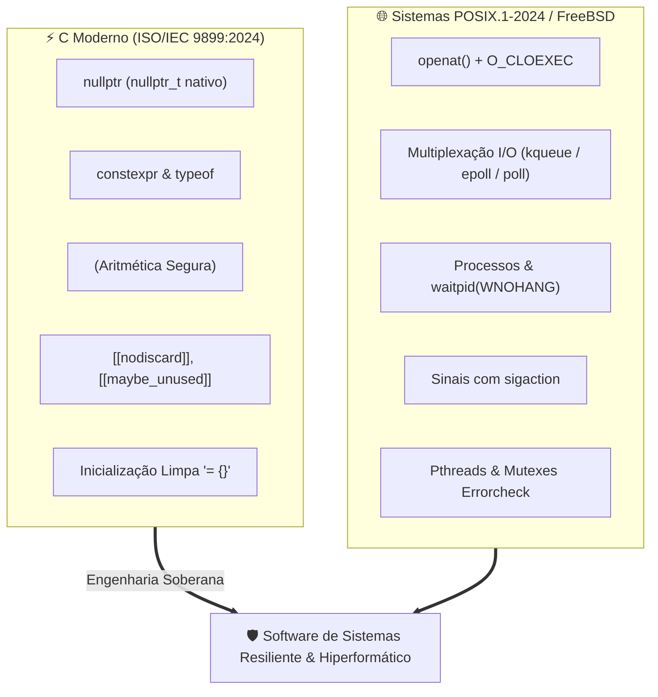

# ⚙️ Engenharia de Software em C Moderno (C23) & Sistemas POSIX

Esta habilidade orienta o desenvolvedor e o assistente autônomo na concepção, escrita, refatoração e auditoria de código em **C Contemporâneo (C23 - ISO/IEC 9899:2024)** integrado à programação de sistemas **POSIX.1-2024 / FreeBSD / Linux**.

---

## 🏛️ Manifesto: C Moderno Não É C Legado

Durante décadas, o C foi associado a práticas inseguras herdadas do C89/C99: macros opacas, casts inseguros, ausência de aritmética verificada e tratamento ingênuo de erros. O **C Moderno (C23)** redefine a linguagem trazendo recursos modernos de segurança, clareza e controle estático:



---

## 💎 Os 7 Pilares do C Moderno (C23)

### 1. Tipagem e Ponteiros: `nullptr` Nativo

Substitua terminantemente a macro fraca `NULL` ou `0` por `nullptr` (tipo `nullptr_t` do C23). Ele é fortemente tipado e previne confusões em sobrecargas de ponteiro ou contextos aritméticos:

```c
// [PROIBIDO - Legado]
void *ptr = NULL;
int *buf = 0;

// [OBRIGATÓRIO - C23]
void *ptr = nullptr;
int *buf = nullptr;
```

### 2. Constantes de Verdade: `constexpr` e `typeof`

Substitua macros `#define` por `constexpr` para valores numéricos e arrays imutáveis em tempo de compilação. Use `typeof` para inferência segura de tipos:

```c
// [PROIBIDO - Legado]
#define BUFFER_CAPACITY 4096

// [OBRIGATÓRIO - C23]
constexpr size_t buffer_capacity = 4096;
typeof(buffer_capacity) dynamic_size = 0;
```

### 3. Aritmética Segura Contra Overflow: `<stdckdint.h>`

No C23, qualquer operação aritmética com risco de estourar a capacidade do tipo inteiro deve ser protegida por `<stdckdint.h>`, que utiliza instruções de CPU para detectar overflow com **zero undefined behavior**:

```c
#include <stdckdint.h>
#include <stdint.h>

[[nodiscard]] bool safe_buffer_grow(size_t current, size_t added, size_t *out_total) {
    if (ckd_add(out_total, current, added)) {
        // Overflow detectado com segurança!
        return false;
    }
    return true;
}
```

### 4. Atributos Padronizados: `[[nodiscard]]` e `[[maybe_unused]]`

Exija que retornos de funções críticas (alocação, checagem de erros, descritores) sejam inspecionados:

```c
[[nodiscard]] int initialize_subsystem(void);
[[nodiscard]] void *safe_allocate(size_t count, size_t elem_size);

void handle_signal([[maybe_unused]] int sig) {
    // Parâmetro intencionalmente não utilizado
}
```

### 5. Inicialização Limpa e Segura: `= {}`

No C23, estruturas e arrays podem ser inicializados com todos os bytes em zero usando `{}` vazio, sem necessidade de sintaxes verbosas `{0}` ou chamadas manuais a `memset`:

```c
struct sockaddr_storage addr = {};
int counters[64] = {};
```

### 6. Asserções Estáticas Nativas: `static_assert`

Garanta alinhamentos de memória e tamanhos de tipos em tempo de compilação:

```c
static_assert(sizeof(uint64_t) == 8, "uint64_t deve possuir exatamente 64 bits");
static_assert(sizeof(size_t) >= 4, "Arquitetura com espaço de endereçamento incompatível");
```

### 7. Booleanos e Inteiros Precisos

Utilize `bool`, `true` e `false` diretamente (palavras-chave nativas no C23, sem exigir `<stdbool.h>`). Use `<stdint.h>` (`uint32_t`, `int64_t`, `size_t`, `ssize_t`) em vez de tipos ambíguos como `long` ou `unsigned short`.

---

## 🛡️ Engenharia de Sistemas POSIX.1-2024 / FreeBSD / Linux

### 1. Descritores de Arquivo Defensivos (`O_CLOEXEC`)

Em sistemas multithread, descritores de arquivo devem **sempre** ser abertos com `O_CLOEXEC` para impedir que processos filhos criados via `fork()` herdem descritores sensíveis de forma não intencional:

```c
#include <fcntl.h>
#include <unistd.h>

[[nodiscard]] int safe_open_config(const char *path) {
    if (path == nullptr) return -1;

    // O_NOFOLLOW impede ataques de symlink race
    int fd = open(path, O_RDONLY | O_CLOEXEC | O_NOFOLLOW);
    return fd;
}
```

### 2. Multiplexação Escalável de I/O: `kqueue` e `poll`

No FreeBSD (e sistemas BSD/macOS/illumos), a interface canônica de eventos escaláveis é o `kqueue(2)`:

```c
#if defined(__FreeBSD__) || defined(__OpenBSD__) || defined(__APPLE__)
#include <sys/types.h>
#include <sys/event.h>
#include <sys/time.h>

[[nodiscard]] int monitor_sockets(int kq, int listen_fd) {
    struct kevent change = {};
    EV_SET(&change, (uintptr_t)listen_fd, EVFILT_READ, EV_ADD | EV_ENABLE, 0, 0, nullptr);

    if (kevent(kq, &change, 1, nullptr, 0, nullptr) == -1) {
        return -1;
    }
    return 0;
}
#endif
```

Para código estritamente portátil entre Linux, FreeBSD e illumos sem dependências específicas, utilize `poll(2)`:

```c
#include <poll.h>

[[nodiscard]] int wait_readable(int fd, int timeout_ms) {
    struct pollfd pfd = {
        .fd = fd,
        .events = POLLIN,
        .revents = 0
    };
    return poll(&pfd, 1, timeout_ms);
}
```

### 3. Gerenciamento Seguro de Processos e Zumbis

Sempre trate processos filhos e utilize `sigaction` para impedir a proliferação de zumbis:

```c
#include <signal.h>
#include <sys/wait.h>

void setup_reaper(void) {
    struct sigaction sa = {};
    sa.sa_handler = [](int sig) {
        [[maybe_unused]] int status;
        while (waitpid(-1, &status, WNOHANG) > 0) {}
    };
    sigemptyset(&sa.sa_mask);
    sa.sa_flags = SA_RESTART | SA_NOCLDSTOP;
    sigaction(SIGCHLD, &sa, nullptr);
}
```

### 4. Proibição de Funções Inseguras da libc

É **terminantemente proibido** utilizar:

- `gets()` (Removida da especificação C)
- `strcpy()` e `strcat()` (Sem controle de limites -> buffer overflow)
- `sprintf()` (Use `snprintf` com validação estrita de retorno)

```c
// [OBRIGATÓRIO - Seguro e defensivo]
char buffer[256] = {};
int written = snprintf(buffer, sizeof(buffer), "User: %s, UID: %d", username, uid);
if (written < 0 || (size_t)written >= sizeof(buffer)) {
    // Tratar truncamento ou erro de formatação
}
```

---

## 🔨 Flags Canônicas de Compilação & Sanitizers

Todo projeto em C Moderno deve compilar sem nenhum aviso com Clang 19+ ou GCC 14+:

```makefile
# Makefile Canônico para C23
CC       ?= clang
CFLAGS   += -std=c23 \
            -Wall -Wextra -Wpedantic \
            -Werror \
            -Wshadow \
            -Wconversion \
            -Wformat=2 \
            -Wundef \
            -D_POSIX_C_SOURCE=202405L

# Flags de Debug com Sanitizers:
DEBUG_FLAGS = -g3 -O0 -fsanitize=address,undefined -fno-omit-frame-pointer
```

---

## 📚 Obras de Referência Canônicas

1. **Modern C (2nd Edition - C23)** — _Jens Gustedt_
2. **Advanced Programming in the UNIX Environment (APUE)** — _W. Richard Stevens & Stephen A. Rago_
3. **The Design and Implementation of the FreeBSD Operating System** — _Marshall Kirk McKusick, George V. Neville-Neil & Robert N.M. Watson_
4. **Linux System Programming** — _Robert Love_
5. **The Open Group Base Specifications Issue 8 (POSIX.1-2024)** — _IEEE Std 1003.1-2024_
