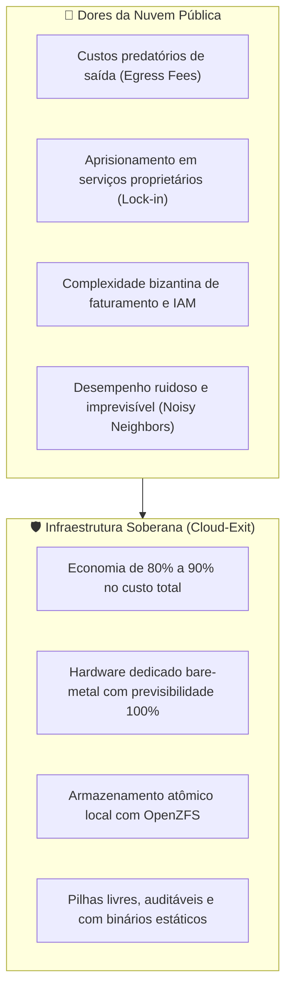

# 🚪 Cloud-Exit & Soberania de Infraestrutura

Esta habilidade orienta o agente de IA na arquitetura, planejamento, migração e operação de sistemas no paradigma do **Cloud-Exit** — a repatriação estratégica de cargas de trabalho de nuvens públicas monopolistas (AWS, GCP, Azure) para infraestruturas soberanas baseadas em servidores dedicados (_bare-metal_), provedores independentes (Hetzner, OVH) ou data centers próprios.

---

## 🎯 Por que Cloud-Exit? (A Justificativa Econômica e Técnica)

O movimento de repatriação de nuvem é impulsionado por realidades operacionais concretas:

1. **Economia Radical:** Provedores de hardware dedicado entregam de 5x a 10x mais CPU, RAM e armazenamento por uma fração do preço de instâncias virtuais equivalentes em hiperescaladores.
2. **Eliminação do Aprisionamento Tecnológico:** Serviços fechados (como DynamoDB, BigQuery, AWS Lambda proprietário) geram dependência tóxica. O Cloud-Exit restaura arquiteturas desacopladas baseadas em padrões abertos, POSIX e binários nativos.
3. **Desempenho Determinístico:** Eliminação de vizinhos ruidosos (_noisy neighbors_), CPUs compartilhadas com _steal time_ e limites artificiais de IOPS em discos de rede.

---

## 🧭 Matriz Multi-OS de Soberania: Papéis, Vantagens e Limites

Nenhum sistema operacional é a resposta para tudo. Uma infraestrutura soberana de excelência utiliza cada sistema onde sua arquitetura brilha:

| Sistema Operacional | Papel Estratégico no Cloud-Exit                                  | Tecnologias Canônicas de Destaque                                                                                                                                 | Limites e Advertências Técnicas                                                                         |
| :------------------ | :--------------------------------------------------------------- | :---------------------------------------------------------------------------------------------------------------------------------------------------------------- | :------------------------------------------------------------------------------------------------------ |
| **FreeBSD**         | **Maestro de Armazenamento e Containers Leves**                  | OpenZFS de raiz, Jails VNET com Bastille, **Sylve** (<https://sylve.io/>), Podman nativo com `runj`, `pf` multithread e bhyve.                                    | Menor suporte a GPUs de última geração para treinamento de IA profunda; hardware desktop ultrarrecente. |
| **Linux**           | **Cavalo de Batalha para Cargas Heterogêneas & GPUs**            | **Proxmox VE** (<https://proxmox.com/en/>), Incus/LXC (<https://linuxcontainers.org/incus/>), Podman Quadlets, Ceph e Kubernetes bare-metal (k3s/Talos).          | Fragmentação contínua entre distribuições, complexidade crescente do kernel/systemd e glibc vs musl.    |
| **illumos**         | **Referência Máxima de Isolamento Multitenant & Missão Crítica** | Solaris Zones nativas e `lx-brand`, Crossbow (VNICs e switches em kernel), ZFS de raiz, DTrace dinâmico e **Oxide Computer Company** (<https://oxide.computer/>). | Catálogo mais restrito de hardware homologado; comunidade menor de desenvolvedores de drivers.          |
| **OpenBSD**         | **Escudo de Borda, Roteamento Soberano e Firewalls**             | Firewall `pf` estrito, roteamento BGP/OSPF (`bgpd`, `ospfd`), terminação TLS (`relayd`), WireGuard e isolamento com `pledge`/`unveil`.                            | Não projetado para virtualização densa de alta escala ou concorrência multithread massiva.              |
| **Windows Server**  | **Contenção Estrita de Cargas Legadas Obrigatórias**             | Execução estritamente confinada em VMs isoladas sobre KVM (Proxmox) ou bhyve (FreeBSD/Sylve).                                                                     | Alto custo de licenciamento, sistema fechado e telemetria invasiva; deve ficar isolado da borda.        |

---

## 🏛️ Detalhamento dos Componentes Soberanos

### 1. FreeBSD: Armazenamento Impecável & Orquestração Leve

- **OpenZFS como Fundação de Dados:** Datasets dedicados por serviço, snapshots atômicos programados sem parada de serviço e replicação remota via `zfs send | ssh backup-server zfs receive`.
- **Jails VNET com `pf` Moderno:** Isolamento completo de processos e pilha de rede virtual sem a sobrecarga de virtualização de hardware.
- **Sylve (<https://sylve.io/>):** Alternativa web moderna (SvelteKit + Go) para gerenciar Bhyve, Jails, ZFS e redes em um painel unificado.

### 2. Linux & Proxmox VE: A Força Bruta para Virtualização Corporativa

- **Proxmox Virtual Environment (<https://proxmox.com/en/>):** Hipervisor consolidado baseado em Debian para rodar VMs KVM completas e containers LXC leves.
- Suporte a Ceph distribuído e clusters de alta disponibilidade (HA) com Corosync para ambientes que demandam múltiplos nós físicos.

### 3. illumos & Oxide: O Estado da Arte em Computadores de Nuvem Privada

- O modelo da **Oxide Computer Company** (<https://oxide.computer/>) demonstra o ápice do Cloud-Exit em escala de rack: hardware aberto governado por um plano de controle em **illumos**, VMM em Rust (**Propolis**) e rede virtualizada de ponta a ponta com **Crossbow**.

### 4. OpenBSD: O Perímetro Inviolável

- Utilize OpenBSD em nós de borda dedicados (bastions, roteadores de entrada de data center, concentradores de VPN e balanceadores de carga). O confinamento com `pledge(2)` e `unveil(2)` garante que vulnerabilidades em serviços de rede não comprometam o sistema operacional.

---

## 📋 Roteiro Canônico de Execução do Cloud-Exit

Ao planejar a saída da nuvem para um projeto:

1. **Auditoria de Dependências Fechadas:** Identifique e substitua serviços proprietários por alternativas livres (ex: DynamoDB -> SQLite/PocketBase/PostgreSQL; S3 proprietário -> MinIO ou armazenamento local em ZFS; AWS Lambda -> microsserviços em Go/C compilados).
2. **Padronização em Binários ou OCI Neutro:** Adote a pilha minimalista (ex: **Svelte + PocketBase + Go**) gerando binários únicos independentes ou imagens OCI compatíveis com Podman.
3. **Seleção de Provedores Soberanos:** Opte por provedores de servidores dedicados bare-metal (Hetzner, OVH, Leaseweb) ou aquisição de hardware próprio com colocation.
4. **Governança Automatizada:** Gerencie o host bare-metal com scripts portáteis (`#!/usr/bin/env sh`), Makefiles silenciosos (`.POSIX: .SILENT:`) e controle de versão via Git soberano.

---

## 🔗 Links Oficiais de Referência & Leitura Recomendada

Recomenda-se enfaticamente ao agente de IA e aos operadores o estudo das fontes oficiais:

- **Sylve Infrastructure Platform:** <https://sylve.io/> | GitHub: <https://github.com/AlchemillaHQ/Sylve>
- **Proxmox Virtual Environment:** <https://proxmox.com/en/> | Documentação: <https://pve.proxmox.com/pve-docs/>
- **Oxide Computer Company:** <https://oxide.computer/> | RFDs: <https://rfd.shared.oxide.computer/>
- **The FreeBSD Project:** <https://www.freebsd.org/> | Releases: <https://www.freebsd.org/where/>
- **OpenBSD Packet Filter (PF):** <https://www.openbsd.org/faq/pf/>
- **Incus System Containers:** <https://linuxcontainers.org/incus/>
- **Literatura de Referência:**
    - _The Art of UNIX Programming_ (Eric S. Raymond) — leitura indispensável sobre modularidade, simplicidade e economia de software: <http://www.catb.org/~esr/writings/taoup/html/>.
