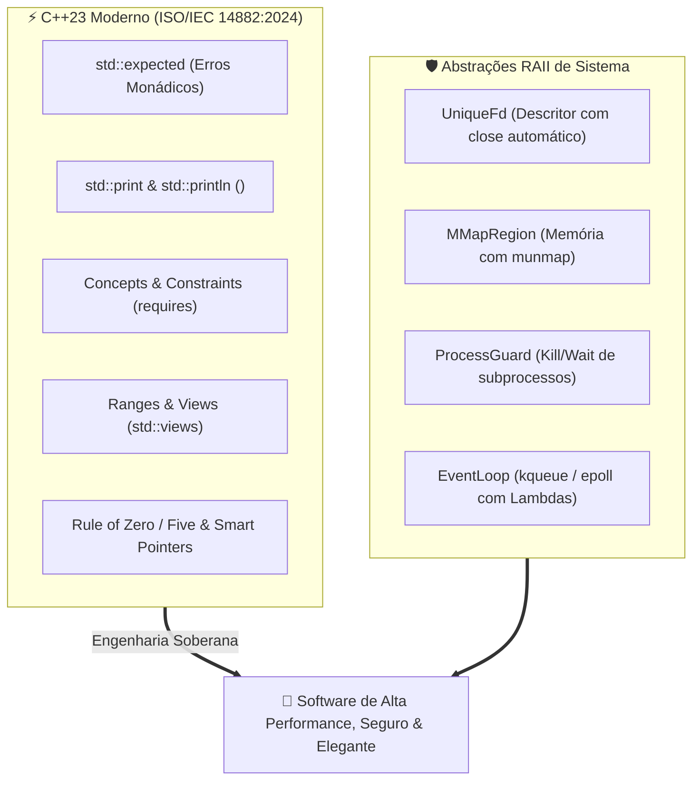

# 🚀 Engenharia de Software em C++ Moderno (C++23) & Abstrações de Sistemas

Esta habilidade orienta o desenvolvedor e o assistente autônomo na concepção, escrita, refatoração e auditoria de código em **C++ Contemporâneo (C++23 / C++20 - ISO/IEC 14882:2024)**, combinando segurança de tipos, expressividade funcional e abstrações de custo zero com interfaces de baixo nível de sistemas operacionais (POSIX / FreeBSD / Linux).

---

## 🏛️ Manifesto: C++23 Não É "C com Classes"

O C++ Moderno repudia a escrita de código procedural com vazamento de memória e ponteiros desprotegidos. O modelo contemporâneo se apoia no princípio fundamental de **RAII (Resource Acquisition Is Initialization)**: nenhum recurso (memória, sockets, mutexes, arquivos) deve existir solto sem um objeto proprietário responsável pelo seu ciclo de vida.



---

## 💎 Os 7 Pilares do C++23

### 1. Tratamento Monádico de Erros: `std::expected<T, E>`

Abandone o uso de exceções lentas para fluxos operacionais previstos e abandone códigos de erro inteiros passados por ponteiro. Com `std::expected`, o retorno expressa sucesso com valor ou falha com tipo de erro explícito:

```cpp
#include <expected>
#include <string>
#include <string_view>
#include <system_error>

enum class FileError {
    NotFound,
    AccessDenied,
    Corrupted
};

[[nodiscard]] auto read_configuration(std::string_view path)
    -> std::expected<std::string, FileError> {
    if (path.empty()) {
        return std::unexpected(FileError::NotFound);
    }
    // Sucesso:
    return std::string("config_content");
}

// Composição Monádica (.and_then / .or_else):
auto parsed = read_configuration("settings.json")
    .and_then([](const std::string &content) {
        return parse_json(content);
    });
```

### 2. Saída e Formatação Ultra-Rápida: `std::print` e `std::println`

Substitua terminantemente o arcaico `printf` (inseguro quanto a tipos) e o lento `std::cout << ... << std::endl` (que força flushes desnecessários). O C++23 introduz `<print>`, compilado com verificação estática de tipos e formatação otimizada:

```cpp
#include <print>

int main() {
    std::string user = "Gabriel";
    int iterations = 42;

    // Rápido, tipado e com quebra de linha nativa:
    std::println("Olá, {}! Executando {} iterações...", user, iterations);
    return 0;
}
```

### 3. Concepts e Constraints: Restrições Formais de Tipos

Substitua SFINAE e `std::enable_if` obscuros por `concepts` limpos e autodocumentados:

```cpp
#include <concepts>
#include <ranges>

template <typename T>
concept Numeric = std::integral<T> || std::floating_point<T>;

template <Numeric T>
[[nodiscard]] constexpr auto clamp_value(T val, T min, T max) -> T {
    return (val < min) ? min : (val > max) ? max : val;
}
```

### 4. Ranges e Pipelines Funcionais: `std::views`

Processe sequências e coleções de forma preguiçosa (lazy evaluation) e sem alocação de buffers intermediários:

```cpp
#include <vector>
#include <ranges>
#include <print>

void process_metrics(const std::vector<int> &metrics) {
    auto filtered = metrics
        | std::views::filter([](int n) { return n > 0; })
        | std::views::transform([](int n) { return n * 2; });

    for (int val : filtered) {
        std::println("Métrica Processada: {}", val);
    }
}
```

### 5. Ponteiros Inteligentes & Rule of Zero

- **`std::unique_ptr`:** Posse exclusiva padrão. Zero overhead em relação a um ponteiro cru.
- **`std::shared_ptr` / `std::weak_ptr`:** Apenas quando houver posse compartilhada legítima e cíclica.
- **Rule of Zero:** Se sua classe é composta por tipos que gerenciam seus próprios recursos (`std::string`, `std::vector`, `std::unique_ptr`), **NÃO declare** destruidor, construtor de cópia ou operador de atribuição. O compilador gerará a versão ótima automaticamente.

### 6. Avaliação em Tempo de Compilação: `constexpr` e `consteval`

Tudo o que puder ser computado durante o build deve ser `constexpr` ou `consteval`:

```cpp
consteval auto compile_time_hash(std::string_view str) -> uint64_t {
    uint64_t hash = 14695981039346656037ULL;
    for (char c : str) {
        hash = (hash ^ static_cast<uint64_t>(c)) * 1099511628211ULL;
    }
    return hash;
}

constexpr auto target_id = compile_time_hash("network_packet_v1");
```

---

## 🛡️ Abstrações RAII para Sistemas Operacionais (POSIX)

### 1. `UniqueFd`: O Descritor de Arquivo Seguro

Nunca manipule inteiros brutos `int fd` diretamente em código C++. Use uma classe RAII que fecha o descritor automaticamente em qualquer caminho de saída:

```cpp
#include <unistd.h>
#include <utility>

class UniqueFd {
private:
    int m_fd = -1;

public:
    constexpr UniqueFd() noexcept = default;
    explicit UniqueFd(int fd) noexcept : m_fd(fd) {}

    ~UniqueFd() noexcept {
        reset();
    }

    // Move-only (Sem cópia acidental de descritores)
    UniqueFd(const UniqueFd &) = delete;
    UniqueFd &operator=(const UniqueFd &) = delete;

    UniqueFd(UniqueFd &&other) noexcept : m_fd(std::exchange(other.m_fd, -1)) {}
    UniqueFd &operator=(UniqueFd &&other) noexcept {
        if (this != &other) {
            reset();
            m_fd = std::exchange(other.m_fd, -1);
        }
        return *this;
    }

    [[nodiscard]] int get() const noexcept { return m_fd; }
    [[nodiscard]] bool is_valid() const noexcept { return m_fd >= 0; }

    void reset(int new_fd = -1) noexcept {
        if (m_fd >= 0) {
            ::close(m_fd);
        }
        m_fd = new_fd;
    }

    [[nodiscard]] int release() noexcept {
        return std::exchange(m_fd, -1);
    }
};
```

---

## 🔨 Flags Canônicas de Compilação & Clang-Tidy

Todo projeto em C++ Moderno deve ser compilado com o mais alto nível de rigor estático:

```makefile
# Makefile Canônico para C++23
CXX       ?= clang++
CXXFLAGS  += -std=c++23 \
             -Wall -Wextra -Wpedantic \
             -Werror \
             -Wshadow \
             -Wconversion \
             -Wnon-virtual-dtor \
             -Wold-style-cast \
             -Woverloaded-virtual \
             -Wnull-dereference \
             -D_POSIX_C_SOURCE=202405L

# Flags de Debug & Sanitizers
DEBUG_FLAGS = -g3 -O0 -fsanitize=address,undefined -fno-omit-frame-pointer
```

---

## 📚 Obras de Referência Canônicas

1. **A Tour of C++ (3rd Edition - C++20/C++23)** — _Bjarne Stroustrup_
2. **Effective Modern C++** — _Scott Meyers_
3. **C++ Core Guidelines** — _Bjarne Stroustrup & Herb Sutter_
4. **Embracing Modern C++ Safely** — _John Lakos, Vittorio Romeo, Rostislav Khlebnikov & Alisdair Meredith_
5. **ISO/IEC 14882:2024 (Programming Languages — C++)** — _ISO Standard_
