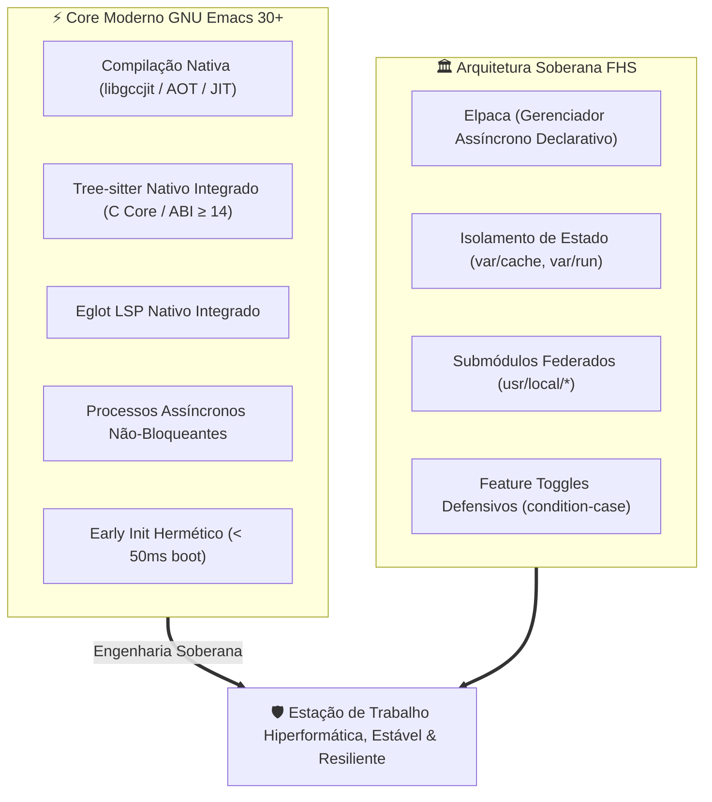

# 🔮 Engenharia de Software em GNU Emacs 30+ & Emacs Lisp (Elisp)

Esta habilidade orienta o desenvolvedor e o agente de inteligência artificial na concepção, escrita, refatoração, auditoria e manutenção de configurações e pacotes em **GNU Emacs Moderno (30+, preparado para 31+)** e **Emacs Lisp Contemporâneo**.

---

## 🏛️ Manifesto: O GNU Emacs Moderno Não É o Emacs Legado

Por décadas, o GNU Emacs acumulou estigmas do século passado: inicialização lenta, congelamentos de interface gráfica por I/O síncrono, complexidade desregulada e dependência de parsing via regex arcaico.

O **GNU Emacs Contemporâneo (30+)** redefiniu completamente a plataforma como um ambiente de desenvolvimento de alta fidelidade e performance bruta:



---

## 💎 Os 9 Pilares da Engenharia em GNU Emacs Moderno

### 1. Baseline Estrito: GNU Emacs 30+

Configurações e pacotes modernos devem exigir formalmente o **GNU Emacs 30.1+** (com vistas ao 31+). Toda configuração de nível profissional deve falhar rápido e de forma legível caso executada em runtimes obsoletos:

```elisp
;; early-init.el ou init.el
(when (< emacs-major-version 30)
  (error "Este ambiente requer GNU Emacs 30+ (versao detectada: %s)" emacs-version))
```

### 2. Compilação Nativa Ahead-of-Time & JIT (`libgccjit`)

No Emacs 30+, bytecode legado (`.elc`) é suplementado por código nativo compilado por máquina (`.eln`).

- O cache de compilação nativa **NUNCA** deve poluir o diretório raiz.
- O redirecionamento DEVE ocorrer no `early-init.el` antes de carregar qualquer pacote:

```elisp
;; early-init.el
(let ((eln-cache-dir (expand-file-name "var/cache/eln-cache/" user-emacs-directory)))
  (unless (file-exists-p eln-cache-dir)
    (make-directory eln-cache-dir t))
  (when (boundp 'startup-redirect-eln-cache)
    (startup-redirect-eln-cache eln-cache-dir))
  (when (boundp 'native-comp-eln-load-path)
    (setq native-comp-eln-load-path
          (cons eln-cache-dir
                (delete (expand-file-name "eln-cache/" user-emacs-directory)
                        native-comp-eln-load-path)))))
```

### 3. Tree-sitter Nativo Integrado (ABI ≥ 14)

O Emacs 30+ possui integração nativa em nível de core C com a biblioteca Tree-sitter (`treesit-available-p`).

- **PROIBIDO:** Usar o pacote legado de terceiros `tree-sitter.el` com regex fallbacks.
- **OBRIGATÓRIO:** Utilizar os modos nativos `*-ts-mode` (ex: `c-ts-mode`, `rust-ts-mode`, `bash-ts-mode`, `emacs-lisp-ts-mode`).
- As bibliotecas de gramática (`.so` / `.dylib` / `.dll`) devem ser mantidas em `tree-sitter/` dentro de `user-emacs-directory`:

```elisp
(when (and (fboundp 'treesit-available-p) (treesit-available-p))
  ;; Remapear modos clássicos para árvores sintáticas nativas
  (setq major-mode-remap-alist
        '((c-mode          . c-ts-mode)
          (c++-mode        . c++-ts-mode)
          (python-mode     . python-ts-mode)
          (bash-mode       . bash-ts-mode)
          (sh-mode         . bash-ts-mode)
          (json-mode       . json-ts-mode))))
```

### 4. Gestão Assíncrona & Declarativa de Pacotes: Elpaca

O gerenciador embutido `package.el` é síncrono por design, bloqueando a interface durante downloads e compilações.

- O padrão canônico para o ecossistema é o **Elpaca**, que compila e instala pacotes em subprocessos assíncronos isolados.
- Desative o `package.el` logo no `early-init.el`:

```elisp
;; early-init.el
(setq package-enable-at-startup nil)
```

- No `init.el`, configure o bootstrap defensivo com controle estrito de fila:

```elisp
(elpaca-wait (elpaca-process-queues))
```

### 5. LSP Desacoplado & Hiperformático: Eglot Nativo

Em vez de suites monolíticas e lentas como `lsp-mode` clássico, o ecossistema adota **Eglot**, integrado nativamente ao GNU Emacs.

- Eglot utiliza os recursos nativos do Emacs (`xref`, `project.el`, `eldoc`, `flymake`).
- Zero overhead de processos em segundo plano quando nenhum buffer estiver conectado.

```elisp
(use-package eglot
  :ensure nil
  :hook ((c-ts-mode c++-ts-mode python-ts-mode rust-ts-mode) . eglot-ensure)
  :custom
  (eglot-autoshutdown t)
  (eglot-sync-connect nil))
```

### 6. Arquitetura FHS Soberana e Isolamento de Estado

Uma configuração limpa nunca espalha arquivos na raiz do `~/.emacs.d`:

- `etc/`: Configurações declarativas divididas por contexto (`init/`, `editor/`, `lang/`, `tools/`, `apps/`).
- `var/`: Estado mutável de runtime (`var/cache/`, `var/run/`, `var/lock/`, `var/backup/`). Deve estar no `.gitignore`.
- `usr/local/`: Submódulos Git de modos e extensões locais (`aweshell`, `aweww`, etc.).
- `lib/`: Macros centrais e rotinas puras (`lib/core.el`).

### 7. Programação Defensiva em Emacs Lisp

Todo módulo deve ser defensivo contra ambientes headless, sistemas bare-metal sem GUI e ausência de binários externos:

```elisp
;; [OBRIGATÓRIO] Todo arquivo .el DEVE iniciar estritamente com lexical-binding na Linha 1
;;; -*- lexical-binding: t -*-

;; [OBRIGATÓRIO] Falha graciosa e isolada com condition-case
(condition-case err
    (require 'meu-modulo)
  (error
   (message "Aviso: falha ao carregar meu-modulo: %s" (error-message-string err))))

;; [OBRIGATÓRIO] Verificação de binários antes de ativar ganchos
(when (executable-find "clangd")
  (add-hook 'c-ts-mode-hook #'eglot-ensure))
```

### 8. Testabilidade Hermética em Modo Batch

Antes de commitar qualquer alteração em arquivos `.el`, valide a integridade sintática e a inicialização limpa em modo batch no terminal:

```sh
emacs -Q --batch -l early-init.el -l init.el --eval '(message "Emacs batch OK")'
```

O comando DEVE retornar código de saída 0. Se houver `void-function`, sintaxe quebrada ou macro mal resolvida, a compilação falhará imediatamente.

### 9. Federação de Modos Pessoais via Submódulos Git

Modos pessoais de autoria do desenvolvedor (ex: `aweshell`, `aweww`, `emacs-lisp-ts-mode`) não devem ser copiados como código solto:

- Integre-os como submódulos Git em `usr/local/<modo>`.
- Adicione o diretório ao `load-path` dinamicamente:

```elisp
(let ((local-mode-dir (expand-file-name "usr/local/meu-modo" user-emacs-directory)))
  (when (file-directory-p local-mode-dir)
    (add-to-list 'load-path local-mode-dir)
    (require 'meu-modo nil t)))
```

---

## 🛠️ Comandos Canônicos de Operação & Diagnóstico

| Ação Operacional            | Comando Canônico                                                                                                    |
| :-------------------------- | :------------------------------------------------------------------------------------------------------------------ |
| **Teste de Boot em Batch**  | `emacs -Q --batch -l early-init.el -l init.el --eval '(message "Boot OK")'`                                         |
| **Compilar Tree-sitter**    | `make treesit` ou `./emacs.sh treesit`                                                                              |
| **Atualizar Submódulos**    | `make upmodes` ou `git submodule update --init --recursive --remote --merge`                                        |
| **Indentação Automática**   | `make indent` ou `sh bin/indent-all.sh`                                                                             |
| **Iniciar Eshell Dedicado** | `esh` (em terminal gráfico via `emacsclient --create-frame --alternate-editor ""` em background)                    |
| **Diagnóstico de Recursos** | `emacs -Q --batch --eval '(message "Treesit: %s, NativeComp: %s" (treesit-available-p) (native-comp-available-p))'` |

---

## 🔗 Links Oficiais de Referência & Manuais

- [GNU Emacs Official Homepage](https://www.gnu.org/software/emacs/)
- [GNU Emacs Manual (v30+)](https://www.gnu.org/software/emacs/manual/html_node/emacs/index.html)
- [GNU Emacs Lisp Reference Manual](https://www.gnu.org/software/emacs/manual/html_node/elisp/index.html)
- [Tree-sitter Starter Guide for Emacs Lisp](https://git.savannah.gnu.org/cgit/emacs.git/tree/admin/notes/tree-sitter/starter-guide?h=emacs-30)
- [Elpaca Asynchronous Package Manager](https://github.com/progfolio/elpaca)
- [Eglot: The Emacs LSP Client](https://www.gnu.org/software/emacs/manual/html_node/eglot/index.html)
