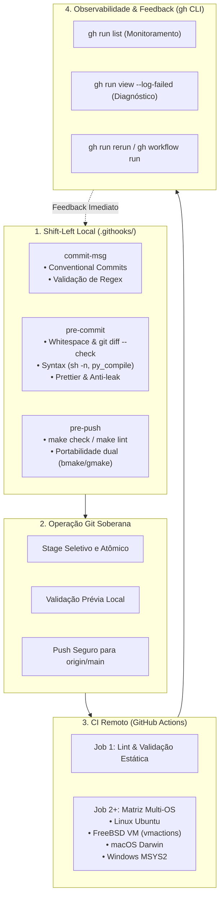
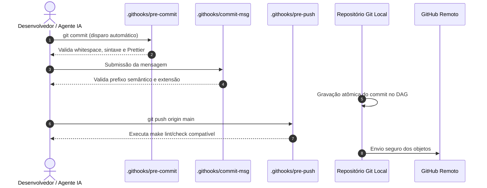

# 🚀 Git Flow, Quality Gates & GitHub Actions

Esta habilidade orienta o desenvolvedor e o agente de IA na operação, padronização e orquestração do **ciclo completo de entrega contínua soberana**. Ela une os quality gates locais (_shift-left_ em `.githooks/`), os protocolos de commits atômicos semânticos, a engenharia de pipelines multiplataforma no **GitHub Actions** e o diagnóstico cirúrgico em linha de comando via **GitHub CLI (`gh`)**.

---

## 🎯 Arquitetura em Quatro Camadas da Entrega Soberana

A integridade do software no ecossistema é garantida por uma esteira determinística em quatro estágios complementares:



### O Contrato de Responsabilidade entre as Camadas:

| Camada                     | Escopo                     | Tempo de Execução | Propósito Central                                                                                       |
| :------------------------- | :------------------------- | :---------------- | :------------------------------------------------------------------------------------------------------ |
| **`.githooks/pre-commit`** | Local (staged files)       | Milissegundos     | Bloquear whitespace, segredos, arquivos intermediários e erros de sintaxe antes de gerar o commit hash. |
| **`.githooks/commit-msg`** | Local (mensagem de commit) | Instantâneo       | Forçar padrão Conventional Commits legível por humanos e ferramentas de release semântica.              |
| **`.githooks/pre-push`**   | Local (árvore de trabalho) | Segundos          | Executar suíte de testes rápida ou linters globais antes de consumir banda e recursos do remote.        |
| **GitHub Actions CI/CD**   | Nuvem Remota (runners)     | Minutos           | Compilação real em matriz cross-platform (Linux, FreeBSD, macOS, Windows) e validações pesadas.         |
| **GitHub CLI (`gh`)**      | Local / Terminal           | Sob demanda       | Inspeção de logs de falha, acionamento manual e resolução de incidentes sem sair do terminal.           |

---

## 🪝 1. Engenharia Rigorosa de Git Hooks Locais (`.githooks/`)

Todo repositório no ecossistema deve adotar githooks versionados no diretório canônico `.githooks/`.



### Regras Mandatórias de Implementação:

1. **Hermeticidade e Autonomia Estrita:**
    - Hooks locais **NUNCA** devem depender de ferramentas ou scripts de IA externos (como pastas em `~/.gemini/` ou `.agents/skills/`).
    - Toda lógica deve ser expressa em shell POSIX puro (`/bin/sh`) ou chamar utilitários presentes dentro da pasta `scripts/` do próprio repositório.
2. **Portabilidade Dual FreeBSD e Linux:**
    - Shebang obrigatório: `#!/usr/bin/env sh` (ou `#!/bin/sh`).
    - É terminantemente proibido utilizar flags GNU-específicas diretamente em ferramentas que rodam no FreeBSD. Em Makefiles de hooks, detecte `gmake` e `bmake` defensivamente:
        ```sh
        if command -v gmake > "/dev/null" 2>&1; then
            gmake -C "${REPO_ROOT}" lint --no-print-directory
        elif make --version 2>&1 | grep -qi "gnu"; then
            make -C "${REPO_ROOT}" lint --no-print-directory
        else
            make -C "${REPO_ROOT}" lint -s
        fi
        ```
3. **Ativação e Permissões:**
    - Permissões em 4 dígitos: `chmod 0755 .githooks/*`.
    - Registro local no Git: `git config core.hooksPath .githooks`.

---

### Template Canônico de `commit-msg`:

```sh
#!/usr/bin/env sh
# ----------------------------------------------------------------
# Hook: Git Semantic Commit-Message Validator
# License: MIT (c) 2026 GabrielFrigo
# ----------------------------------------------------------------

set -e

_msg_file="${1:-}"
if [ -z "${_msg_file}" ] || [ ! -f "${_msg_file}" ]; then
	exit 0
fi

_clean_msg=$(grep -v '^[[:space:]]*#' "${_msg_file}" | tr '\n' ' ' | sed 's/^[[:space:]]*//;s/[[:space:]]*$//')

case "${_clean_msg}" in
	Merge*|Revert*|fixup!*|squash!*)
		exit 0
		;;
esac

if [ -z "${_clean_msg}" ]; then
	echo "❌ [commit-msg] A mensagem de commit não pode estar vazia!" >&2
	exit 1
fi

_char_count=$(printf "%s" "${_clean_msg}" | wc -m)
if [ "${_char_count}" -lt 8 ]; then
	echo "❌ [commit-msg] Mensagem muito curta (mínimo de 8 caracteres)." >&2
	exit 1
fi

_pattern='^(add|update|fix|docs|feat|chore|refactor|style|ci|test)(\([a-zA-Z0-9_-]+\))?:[[:space:]]+.+'
if ! echo "${_clean_msg}" | grep -E -q "${_pattern}"; then
	echo "❌ [commit-msg] Convenção semântica violada!" >&2
	echo "   Formatos aceitos:" >&2
	echo "     <tipo>: <descrição no imperativo>" >&2
	echo "     <tipo>(<escopo>): <descrição no imperativo>" >&2
	echo "   Tipos permitidos: add, update, fix, docs, feat, chore, refactor, style, ci, test" >&2
	exit 1
fi

exit 0
```

---

### Template Canônico de `pre-commit`:

```sh
#!/usr/bin/env sh
# ----------------------------------------------------------------
# Hook: Git Pre-Commit Quality Gate Runner
# License: MIT (c) 2026 GabrielFrigo
# ----------------------------------------------------------------

set -e

_repo_root="$(git rev-parse --show-toplevel 2> "/dev/null" || pwd)"
cd "${_repo_root}"

echo "🔍 [pre-commit] Executando quality gates locais..."

### --------------------------------
### Whitespace & Formatação
### --------------------------------
echo "  ↳ Verificando whitespaces e quebras de linha (git diff --check)..."
if ! git diff --check --cached; then
	echo "❌ [pre-commit] Erro de formatação ou whitespace detectado!" >&2
	exit 1
fi

### --------------------------------
### Anti-Vazamento de Arquivos Proibidos
### --------------------------------
echo "  ↳ Verificando ausência de arquivos temporários ou segredos..."
_leaked=$(git diff --cached --name-only | grep -E '(\.tmp|\.temp|\.bak|\.DS_Store|thumbs\.db|\.env$|\.key$)' 2> "/dev/null" || true)
if [ -n "${_leaked}" ]; then
	echo "❌ [pre-commit] Arquivo temporário ou sensível bloqueado: ${_leaked}" >&2
	exit 1
fi

### --------------------------------
### Sintaxe de Shell POSIX
### --------------------------------
if [ -d "scripts" ] || [ -f "install.sh" ]; then
	echo "  ↳ Validando sintaxe de scripts shell (sh -n)..."
	find . -name "*.sh" -not -path "*/.git/*" -exec sh -n {} +
fi

### --------------------------------
### Formatação Markdown com Prettier
### --------------------------------
if command -v prettier > "/dev/null" 2>&1; then
	echo "  ↳ Validating staged Markdown files with Prettier..."
	_unformatted=""
	for _md in $(git diff --cached --name-only --diff-filter=d | grep '\.md$' || true); do
		if [ -f "${_md}" ] && ! prettier --check "${_md}" > "/dev/null" 2>&1; then
			_unformatted="${_unformatted} ${_md}"
		fi
	done
	if [ -n "${_unformatted}" ]; then
		echo "❌ [pre-commit] Arquivos Markdown desformatados:${_unformatted}" >&2
		echo "   Execute 'prettier --write <arquivo>' antes de commitar." >&2
		exit 1
	fi
fi

echo "✅ [pre-commit] Todos os quality gates passaram com sucesso!"
exit 0
```

---

## 🐙 2. Protocolo de Git Flow & Commits Atômicos

Ao realizar alterações no repositório, siga sempre o fluxo determinístico em quatro passos:

```sh
# 1. Inspecionar o status conciso e as diferenças preparadas
git status -s
git diff

# 2. Adicionar arquivos explicitamente (evitar 'git add .' indiscriminado)
git add caminho/para/arquivo.ext

# 3. Testar localmente a formatação antes de commitar
git diff --check --cached

# 4. Gravar commit semântico com Conventional Commits
git commit -m "docs(readme): update architecture diagram and install instructions"

# 5. Enviar para a branch principal
git push origin main
```

---

## ⚙️ 3. Engenharia de Pipelines GitHub Actions Modernos

Workflows de CI/CD devem ser definidos em `.github/workflows/ci.yml`.

### Padrões Canônicos de Resiliência e Desempenho:

1. **Cancelamento em Progresso (`concurrency`):**
   Cancela automaticamente execuções anteriores no mesmo branch ao receber um novo push, economizando minutos de runner:
    ```yaml
    concurrency:
        group: ${{ github.workflow }}-${{ github.ref }}
        cancel-in-progress: true
    ```
2. **Forçar Ações JavaScript para Node24:**
   Evita avisos de depreciação e prepara os workflows para o futuro:
    ```yaml
    env:
        FORCE_JAVASCRIPT_ACTIONS_TO_NODE24: true
    ```
3. **Checkout com Histórico Completo:**
    ```yaml
    - name: Checkout Code
      uses: actions/checkout@v7
      with:
          fetch-depth: 0
    ```
4. **Matriz Multiplataforma Segura:**
    - **Linux:** `runs-on: ubuntu-latest`
    - **FreeBSD VM Oficial:**
        ```yaml
        - name: Test on FreeBSD 15.x
          uses: vmactions/freebsd-vm@v1
          with:
              release: "15"
              usesh: true
              envs: "CI GITHUB_ACTIONS"
              run: |
                  pkg install -y gmake git python3
                  make check
        ```
    - **Windows MSYS2:** `uses: msys2/setup-msys2@v2` com subsistema `UCRT64`.
    - **macOS:** `runs-on: macos-latest`. Em testes de benchmark de latência em macOS, configure limites com folga para oscilações temporárias de hypervisor (`warn` em vez de `fail` estrito quando sob carga externa).

---

## 🔍 4. Observabilidade & Diagnóstico Cirúrgico com GitHub CLI (`gh`)

O `gh` CLI elimina a necessidade de alternar para o navegador para inspecionar pipelines, permitindo diagnóstico direto no terminal.

### Comandos de Alta Frequência:

```sh
# 1. Verificar autenticação e permissões do token
gh auth status

# 2. Listar as últimas execuções de workflow do repositório atual
gh run list -L 5

# 3. Observar uma execução em tempo real até o término
gh run watch <run-id>

# 4. Inspecionar diretamente os logs com erro de uma execução que falhou
gh run view <run-id> --log-failed

# 5. Re-executar apenas os jobs que falharam
gh run rerun <run-id> --failed

# 6. Disparar manualmente um workflow que possui trigger 'workflow_dispatch'
gh workflow run ci.yml --ref main

# 7. Listar e inspecionar status de Pull Requests
gh pr list
gh pr checks <pr-number>
```

---

## 📚 Referências Oficiais & Literatura Recomendada

- **Git SCM — Documentação Oficial de Hooks:** <https://git-scm.com/docs/githooks>
- **Manual Oficial do GitHub CLI (`gh`):** <https://cli.github.com/manual/>
- **GitHub Actions — Documentação Canônica:** <https://docs.github.com/en/actions>
- **Especificação Conventional Commits (v1.0.0):** <https://www.conventionalcommits.org/>
- **Pro Git Book (Scott Chacon & Ben Straub):** <https://git-scm.com/book/en/v2>
- **Prettier Code Formatter:** <https://prettier.io/>
