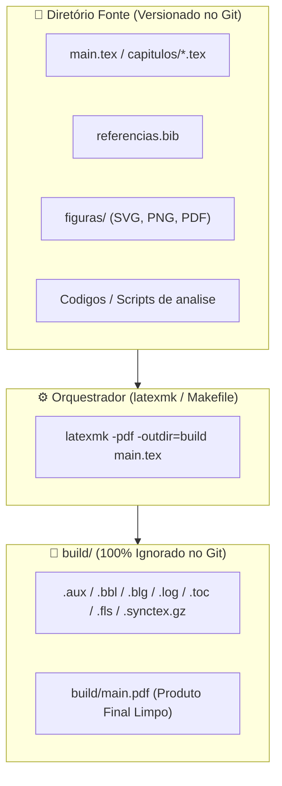

# 📄 Editoração Científica Soberana: LaTeX & TeX Limpo

Esta habilidade orienta o pesquisador, desenvolvedor e agente de IA na produção de documentos científicos, relatórios técnicos e monografias com **LaTeX/TeX**, aplicando os princípios canônicos de **isolamento de artefatos temporários**, automação silenciosa e histórico de controle de versão (Git/Got) estritamente limpo.

---

## 🎯 1. A Filosofia da Compilação Limpa (Clean Outdir)

Compiladores LaTeX (`pdflatex`, `xelatex`, `lualatex`, `bibtex`, `biber`) geram dezenas de arquivos auxiliares a cada execução (`.aux`, `.bbl`, `.blg`, `.log`, `.out`, `.toc`, `.fls`, `.fdb_latexmk`, `.synctex.gz`).

**A regra de ouro do ecossistema:** Arquivos intermediários de compilação NUNCA devem poluir o diretório do código-fonte `.tex`. Toda compilação deve ser canalizada para um diretório de saída isolado (`build/`).



---

## 🏗️ 2. Makefile Canônico para Documentos LaTeX

Todo projeto acadêmico ou relatório técnico deve dispor de um `Makefile` na raiz da pasta do documento, adotando o cabeçalho universal silencioso:

```makefile
.POSIX:
.SILENT:

MAKEFLAGS += --no-print-directory -s

# ----------------------------------------------------------------
# Makefile: LaTeX Document Suite
# ----------------------------------------------------------------

LATEXMK  = latexmk
OUTDIR   = build
TARGET   = relatorio

.PHONY: all clean distclean view check

all: $(OUTDIR)/$(TARGET).pdf
	printf "%s\n" "✅ [LaTeX]: Documento compilado com sucesso em $(OUTDIR)/$(TARGET).pdf"

$(OUTDIR)/$(TARGET).pdf: $(TARGET).tex
	mkdir -p $(OUTDIR)
	printf "%s" "-> Compilando $(TARGET).pdf... "
	if command -v $(LATEXMK) > "/dev/null" 2>&1; then \
		$(LATEXMK) -pdf -silent -interaction=nonstopmode -outdir=$(OUTDIR) $(TARGET).tex > "/dev/null" 2>&1; \
	else \
		pdflatex -interaction=batchmode -output-directory=$(OUTDIR) $(TARGET).tex > "/dev/null" 2>&1 || true; \
		bibtex $(OUTDIR)/$(TARGET) > "/dev/null" 2>&1 || true; \
		pdflatex -interaction=batchmode -output-directory=$(OUTDIR) $(TARGET).tex > "/dev/null" 2>&1 || true; \
		pdflatex -interaction=batchmode -output-directory=$(OUTDIR) $(TARGET).tex > "/dev/null" 2>&1 || true; \
	fi
	printf "%s\n" "[OK]"

clean:
	printf "%s\n" "🧹 Limpando artefatos intermediários..."
	if command -v $(LATEXMK) > "/dev/null" 2>&1; then \
		$(LATEXMK) -c -outdir=$(OUTDIR) > "/dev/null" 2>&1 || true; \
	fi
	rm -rf $(OUTDIR)/*.aux $(OUTDIR)/*.bbl $(OUTDIR)/*.blg $(OUTDIR)/*.log $(OUTDIR)/*.toc $(OUTDIR)/*.out

distclean: clean
	printf "%s\n" "🗑️  Removendo pasta build/ completa..."
	rm -rf $(OUTDIR)
```

---

## 🛡️ 3. Blindagem de Repositório (`.gitignore` Canônico)

Para garantir que nenhum desenvolvedor ou script suje o versionamento acidentalmente:

```gitignore
# Diretorio de compilacao isolado
build/
dist/

# Arquivos intermediarios LaTeX
*.aux
*.bbl
*.blg
*.log
*.out
*.toc
*.fls
*.fdb_latexmk
*.synctex.gz
*.bcf
*.run.xml
*.xdv
*.nav
*.snm
*.vrb

# PDFs compilados locais (exceto material de leitura/referencia)
*.pdf
!Material/**/*.pdf
```

---

## 🔄 4. Sincronização de Código com Listagens (`Listings` / `Minted`)

Em papers acadêmicos e monografias que apresentam implementações (em C++, Go, Python):

- **Princípio da Fonte Única da Verdade:** O código deve residir em seu arquivo de código-fonte real (`src/algoritmo.cpp`) onde pode ser compilado e testado.
- **Inclusão Dinâmica no TeX:** Utilize comandos como `\lstinputlisting[language=C++]{../src/algoritmo.cpp}` ou um script de automação (`sync_listings.py`) acionado por `make sync-code` antes da compilação.
- O pre-commit do repositório deve validar se os apêndices de código estão sincronizados com as pastas de implementação.

---

## ✍️ 5. Redação Acadêmica Rigorosa: Estilo Direto e Sem Floreios (No-Fluff & Math-First)

> **Regra de Ouro (O Teste do Leitor Não-Nativo):** Uma pessoa que não é nativa na língua em que o documento foi escrito (ou uma ferramenta de tradução acadêmica) deve conseguir ler o texto técnico diretamente sem se confundir. O assunto científico já é inerentemente complexo; o texto deve funcionar como uma lente transparente para os conceitos formais, eliminando ruídos estilísticos, regionalismos e analogias não convencionais.

A eficácia de um documento acadêmico ou relatório técnico reside na clareza conceitual e na precisão matemática, nunca em artifícios retóricos ou vocabulário rebuscado:

1. **Sintaxe Não Complexa:** Privilegie períodos curtos a médios na ordem direta (sujeito-verbo-objeto). Evite aninhamento convoluto de orações subordinadas.
2. **Tom Estritamente Acadêmico e Impessoal:** Empregue terceira pessoa ou voz passiva sintética ("demonstra-se", "analisa-se"). Evite coloquialismos e opiniões subjetivas.
3. **Sem Floreios nem Adjetivos Hiperbólicos:** Elimine adjetivação valorativa ("fantástico", "supremacia absoluta", "revolucionário", "fascinante") e metáforas literárias ou dramáticas.
4. **Pouco Rebuscada:** Utilize linguagem culta, simples e contemporânea. Rejeite termos arcaicos ou pretensiosos ("outrossim", "peremptório", "hodierno", "fulcral", "precípuo").
5. **Sem Palavras Extras (Economia Textual):** Elimine clichês e expressões de enchimento ("vale ressaltar que", "com o intuito de", "cabe enfatizar que"). Vá direto ao núcleo do argumento.
6. **Prioridade Matemática (Math-First):** Formalize ideias por meio de definições, proposições, equações explícitas e notação simbólica estrita em vez de longos parágrafos narrativos aproximados.
7. **Precisão Terminológica Estrita (Zero Anti-Jargão):** Nunca utilize termos matemáticos com definição formal profunda (como isomorfismo, topologia, canônico, geometria, convergência, invariante) como meros sinônimos estéticos ou analogias retóricas. Cada vocábulo deve ser empregado exclusivamente em seu significado técnico real.

---

## 📚 6. Literatura de Referência & Links Oficiais

Recomenda-se enfaticamente ao agente de IA e aos autores a consulta às referências seminais:

- **LaTeX Project Oficial:** <https://www.latex-project.org/>
- **CTAN (Comprehensive TeX Archive Network):** O repositório central de pacotes e documentações: <https://www.ctan.org/>
- **Livro Canônico de LaTeX:** _LaTeX: A Document Preparation System_ (Leslie Lamport, 2ª edição, Addison-Wesley) — O manual definitivo escrito pelo criador do LaTeX.
- **O TeXbook:** _The TeXbook_ (Donald E. Knuth, Addison-Wesley) — Fundamentos tipográficos e controle de macros do TeX original: <https://www-cs-faculty.stanford.edu/~knuth/abcde.html>
- **Overleaf:** <https://www.overleaf.com/> | Guia de Boas Práticas: <https://www.overleaf.com/learn>
