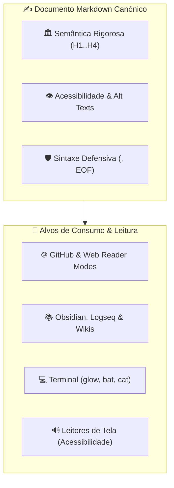

# ✍️ Padrões Canônicos de Redação e Engenharia de Markdown (Reader-First)

Esta habilidade orienta o desenvolvedor e os agentes de IA na escrita, estruturação e padronização de **documentos técnicos em Markdown de alta elegância, legibilidade e conformidade sintática**, projetados para uma experiência de leitura impecável em qualquer ambiente.

---

## 🧭 O Princípio Reader-First (Legibilidade Humana e Sintética)

Markdown não foi concebido apenas como sintaxe de conversão intermediária para HTML. Seu axioma fundacional é ser **imediatamente legível e agradável em texto plano**, sem que marcas estruturais poluam o fluxo cognitivo do leitor.



Todo documento técnico do ecossistema deve ser desenhado para brilhar simultaneamente em quatro ecossistemas de leitura:

1. **Modos de Leitura Web:** Firefox Reader View, Safari Reader, modo de leitura do navegador e renderizadores web do GitHub/GitLab.
2. **Bases de Conhecimento Locais:** Obsidian, Logseq, VS Code Markdown Preview e visualizadores WYSIWYG.
3. **Leitores de Linha de Comando (CLI):** `glow`, `bat`, `cat` ou visualizadores de manpages no terminal.
4. **Leitores de Tela e Acessibilidade (TTS/WCAG):** Sintetizadores de voz que navegam pela árvore de cabeçalhos sem tropeçar em excessos de caracteres de controle.

---

## 🏛️ 1. Hierarquia Estrutural & Semântica Tipográfica

A clareza visual depende de uma hierarquia estrita e previsível de seções. A violação dessa ordem desorienta índices automáticos (TOCs) e leitores de tela:

### 1.1. Regra do Título Único (H1)

Cada documento Markdown deve possuir **exatamente um único título de nível 1 (`#`)**, posicionado na primeira linha útil do arquivo, servindo como o título canônico da obra:

```markdown
# 📦 Universal Setup Environment
```

### 1.2. Progressão Não-Fragmentada de Níveis

Nunca pule níveis de cabeçalho (por exemplo, ir de `## H2` diretamente para `#### H4`):

- `# H1`: Título mestre do documento.
- `## H2`: Grandes divisões temáticas (sempre antecedidas por uma régua `---` para criar respiro visual).
- `### H3`: Subseções e tópicos específicos.
- `#### H4`: Tópicos operacionais granulares ou passos detalhados.

### 1.3. Réguas Divisórias (`---`)

Utilize linhas horizontais divisórias (`---`) para separar seções temáticas de nível `## H2`. Isso permite que leitores gráficos e navegadores no terminal (`glow`) criem pausas visuais naturais sem poluir o texto.

### 1.4. Semântica de Tipografia em Linha

- **Negrito (`**termo**`):** Para destacar conceitos centrais, comandos principais e invariantes de engenharia.
- **Itálico (`*termo*`):** Para estrangeirismos, menções a livros/obras, ou ênfases suaves no tom narrativo.
- **Código em linha (`` `identificador` ``):** Para variáveis de ambiente (`$PATH`), nomes de funções, arquivos (`init.lua`), diretórios (`/usr/local`), comandos executáveis e parâmetros (`--flag`).

---

## 💻 2. Blocos de Código & Ergonomia Técnica

Blocos de código devem ser herméticos, previsíveis e claros:

### 2.1. Linguagem Sempre Explícita

Nunca utilize cercaduras de código vazias (` ``` ` puro). Declare sempre o identificador canônico da linguagem para permitir realce de sintaxe (_syntax highlighting_):

````markdown
```sh
export SHELL_LATENCY_BUDGET=20
```
````

```lua
local opt = vim.opt
opt.number = true
```

```toml
[editor]
theme = "dark_plus"
```

`````

### 2.2. A Regra das Caixas de Código de Terminal (sh como Padrão Universal)

> [!IMPORTANT]
> **Padrão Canônico para Comandos de Terminal (`sh`):**
> Utilize **SEMPRE** o identificador `sh` (````sh ... ````) para qualquer bloco contendo comandos de terminal, instruções de clone (`git clone`), compilação (`make`), gerenciadores de pacotes (`pkg`, `apt`, `npm`), chamadas de CLI e rotinas de automação UNIX em geral.
>
> **Identificadores Específicos (`bash`, `zsh`, `ksh`, `fish`, `nu`):**
> Devem ser utilizados **exclusiva e estritamente** quando o código contido dentro da caixa depender de sintaxe, flags ou recursos privativos daquele interpretador específico (como testes avançados `[[ ... ]]` ou arrays associativos no Bash; expansões e flags globais no Zsh; pipelines orientados a dados no Nushell).
>
> **É terminantemente proibido** utilizar identificadores genéricos depreciados como `shell`, `console`, `terminal` ou `prompt`.

### 2.3. Tabela de Identificadores Canônicos Comuns

| Stack / Alvo | Identificador Canônico | Evitar / Proibido |
| :--- | :---: | :--- |
| **Comandos de Terminal / Shell UNIX** | `sh` | `shell`, `console`, `terminal`, `bash` (se genérico) |
| **Bash Específico (com bashismos)** | `bash` | `sh` (quando possuir sintaxe não-POSIX) |
| **Zsh Específico (com zshismos)** | `zsh` | `sh` (quando depender de recursos exclusivos do Zsh) |
| **Nushell / Scripts Nu** | `nu` | `nushell`, `sh` |
| **Lua / Neovim** | `lua` | `nvim` |
| **Emacs Lisp** | `elisp` ou `lisp` | `el` |
| **TOML / Configurações** | `toml` | `txt` |
| **JSON / Schemas** | `json` | `text` |
| **YAML / Frontmatter** | `yaml` | `yml` |
| **Makefiles** | `make` | `makefile` |
| **Diagramas** | `mermaid` | `diagram` |

---

## 📋 3. Tabelas Estruturadas & Alinhamento Visual

As tabelas em Markdown devem ser funcionais e prazerosas de ler mesmo quando abertas em modo texto plano com `cat` ou `vim`:

```markdown
| Componente  | Status  | Alinhamento | Papel Arquitetural                                   |
| :---------- | :-----: | ----------: | :--------------------------------------------------- |
| **Setup**   | 🟢 Ativo |        12ms | Provisionamento atômico do sistema operacional base  |
| **Shell**   | 🟢 Ativo |         8ms | Runtime interativo multi-shell de latência sub-20ms  |
| **Vault**   | 🔒 Cofre |         0ms | Gerenciamento de segredos, tokens e chaves privadas  |
| **Profile** | 🟢 Ativo |         5ms | Identidade residente do usuário, editores e dotfiles |
`````

### 3.1. Convenção Canônica de Alinhamento:

- `:---` (Alinhamento à esquerda): Textos longos, nomes de ferramentas, arquivos e descrições explicativas.
- `:---:` (Alinhamento central): Estados, emojis, ícones de status, versões curtas e flags booleanas.
- `---:` (Alinhamento à direita): Números, latências de benchmark, contagens de portas e tamanhos de bytes.

---

## 🚨 4. Admonitions & Alertas Semânticos (GFM)

Para destacar recomendações, restrições e notas de arquitetura, utilize exclusivamente os alertas nativos do GitHub Flavored Markdown. Eles são interpretados nativamente pelo GitHub, Obsidian e geradores estáticos modernos:

```markdown
> [!NOTE]
> Contexto adicional, notas históricas ou detalhes de implementação em baixo nível.

> [!TIP]
> Dicas de produtividade, atalhos de teclado recomendados e fluxos mais rápidos.

> [!IMPORTANT]
> Requisitos obrigatórios, invariantes de arquitetura e procedimentos essenciais.

> [!WARNING]
> Comportamentos depreciados, potenciais incompatibilidades de versão ou pré-requisitos ausentes.

> [!CAUTION]
> Operações de alto risco que podem causar perda de dados, exclusão de segredos ou danos ao sistema.
```

> [!IMPORTANT]
> **Anti-Pattern:** Nunca aninhe blocos de alerta (admonition dentro de admonition) nem use alertas consecutivos sem texto intermediário de respiro, pois isso degrada a renderização em leitores de tela e dispositivos móveis.

---

## 🛡️ 5. Regras Defensivas de Sintaxe para Parsers & Git

Pequenas falhas sintáticas podem quebrar pipelines de CI/CD ou formatadores estritos:

### 5.1. Proteção de URLs com Parênteses (`<...>`)

Quando uma URL contiver caracteres como parênteses (comum em badges de plataformas como `Windows_(MSYS2)` ou referências da Wikipedia), o parser do CommonMark encerra a tag do link prematuramente. **Sempre envolva a URL inteira em colchetes angulares `<>`**:

```markdown
<!-- Incorreto (quebra no primeiro fecha-parêntese): -->

[Windows](<https://img.shields.io/badge/Windows_(MSYS2)-Supported-purple>)

<!-- Canônico e defensivo: -->

[Windows](<https://img.shields.io/badge/Windows_(MSYS2)-Supported-purple>)
```

### 5.2. A Regra do Single Trailing Newline no EOF (`git diff --check`)

O padrão POSIX e os linters do Git exigem que todo arquivo de texto termine com uma quebra de linha (`\n`), mas **sem linhas vazias adicionais no final**:

- ❌ **Sem quebra no final:** Gera o warning `\ No newline at end of file`.
- ❌ **Duas ou mais linhas vazias no final:** Viola o quality gate do Git com `trailing blank line at EOF`.
- 🟢 **Canônico:** Exatamente um caractere `\n` na última linha do arquivo.

### 5.3. Acessibilidade em Links e Imagens

- Em imagens e diagramas, forneça sempre um texto alternativo (_alt text_) compreensível em vez de deixar colchetes vazios (``).
- Em links textuais, nunca utilize a palavra "clique aqui". Utilize textos descritivos do destino (ex: `Consulte o [manual de arquitetura em docs/ARCHITECTURE.md](../../docs/ARCHITECTURE.md)`).

---

## 🧪 6. Quality Gate Obrigatório: Prettier

Assim como o código C é formatado pelo `clang-format` e o código Lua pelo `stylua`, todo e qualquer arquivo Markdown do ecossistema DEVE ser validado e formatado com o **Prettier**:

```sh
# Formatação de um documento específico
prettier --write docs/ARCHITECTURE.md

# Formatação em lote de todos os Markdowns de um repositório
prettier --write "**/*.md"
```

### O que o Prettier garante automaticamente:

1. Alinhamento milimétrico de todas as colunas de tabelas Markdown.
2. Normalização de espaçamento entre listas não ordenadas (`-`) e blocos de texto.
3. Prevenção de quebras artificiais de linha no meio de palavras.
4. Remoção de espaços em branco inúteis no final das linhas (_trailing whitespace_).
5. Garantia da linha final única (EOF newline).

---

## ⚖️ 7. A Divisão de Papéis: `readme-crafting` vs. `markdown-crafting`

| Critério               | [`readme-crafting`](../readme-crafting/SKILL.md)                       | [`markdown-crafting`](SKILL.md) _(esta skill)_                         |
| :--------------------- | :--------------------------------------------------------------------- | :--------------------------------------------------------------------- |
| **Foco Principal**     | **Portais de Entrada & Repositórios**                                  | **Prosa Técnica & Documentação Geral**                                 |
| **Elementos Centrais** | Badges vetoriais (Simple Icons), CI/CD, Mermaid, matriz de plataformas | Hierarquia semântica, acessibilidade, legibilidade em readers          |
| **Público de Consumo** | Visitantes do GitHub, recrutadores, usuários do repositório            | Engenheiros lendo manuais, usuários em leitores de terminal, e-readers |
| **Arquivos Típicos**   | `README.md` raiz dos componentes                                       | Manuais em `docs/*.md`, `PRINCIPLES.md`, `ENVIRONMENT.md`, specs       |
| **Quality Gate Comum** | `prettier --write` e `git diff --check`                                | `prettier --write` e `git diff --check`                                |

---

## 🔗 Links Oficiais de Referência & Obras Recomendadas

- **CommonMark Specification:** <https://spec.commonmark.org/>
- **GitHub Flavored Markdown (GFM) Specification:** <https://github.github.com/gfm/>
- **Prettier Markdown Formatter:** <https://prettier.io/docs/en/options.html>
- **W3C Web Accessibility Guidelines (WCAG 2.2):** <https://www.w3.org/WAI/standards-guidelines/wcag/>
- **Mermaid-JS Documentation:** <https://mermaid.js.org/>
- **Literatura Técnica:**
    - _The Elements of Typographic Style_ (Robert Bringhurst, Hartley & Marks).
    - _The Art of UNIX Programming_ (Eric S. Raymond) — Capítulo 11: _Rule of Presentation_.
    - _Technical Writing Courses for Engineers_ (Google Tech Dev Guide).
