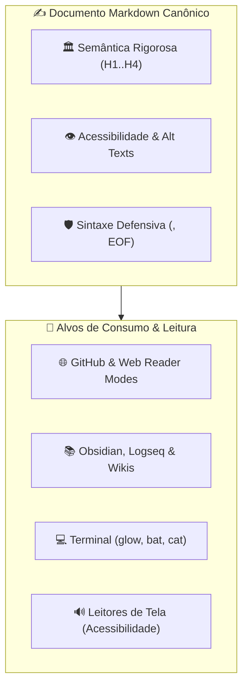

# ✍️ Padrões Canônicos de Redação e Engenharia de Markdown (Reader-First)

Esta habilidade orienta o desenvolvedor e os agentes de IA na escrita, estruturação e padronização de **documentos técnicos em Markdown de alta elegância, legibilidade e conformidade sintática**, projetados para uma experiência de leitura impecável em qualquer ambiente.

---

## 🧭 O Princípio Reader-First (Legibilidade Humana e Sintética)

Markdown não foi concebido apenas como sintaxe de conversão para HTML. Seu axioma fundacional é ser **imediatamente legível e agradável em texto plano**, sem que marcas estruturais poluam o fluxo cognitivo do leitor.


```mermaid
flowchart TD
    subgraph MD ["✍️ Documento Markdown Canônico"]
        SEM["🏛️ Semântica Rigorosa (H1..H4)"]
        ACC["👁️ Acessibilidade & Alt Texts"]
        DEF["🛡️ Sintaxe Defensiva (<URLs>, EOF)"]
    end

    subgraph READERS ["📖 Alvos de Consumo & Leitura"]
        WEB["🌐 GitHub & Web Reader Modes"]
        DOC["📚 Obsidian, Logseq & Wikis"]
        CLI["💻 Terminal (glow, bat, cat)"]
        TTS["🔊 Leitores de Tela (Acessibilidade)"]
    end

    MD --> READERS
```

Todo documento técnico do ecossistema deve brilhar simultaneamente em quatro ecossistemas:

1. **Modos de Leitura Web:** Firefox/Safari Reader View e renderizadores web do GitHub/GitLab.
2. **Bases Locais de Conhecimento:** Obsidian, Logseq, VS Code Markdown Preview e editores WYSIWYG.
3. **Leitores de Terminal (CLI):** `glow`, `bat`, `cat` ou visualizadores de manpages.
4. **Leitores de Tela e Acessibilidade (TTS/WCAG):** Sintetizadores de voz que navegam por árvores de cabeçalhos sem tropeçar em excessos de caracteres de controle.

---

## 🏛️ 1. Hierarquia Estrutural & Semântica Tipográfica

1. **Regra do Título Único (H1):** Exatamente um único título de nível 1 (`#`), posicionado na primeira linha útil do arquivo.
2. **Progressão Não-Fragmentada:** Nunca pule níveis (`# H1` $\rightarrow$ `## H2` $\rightarrow$ `### H3` $\rightarrow$ `#### H4`).
3. **Réguas Divisórias (`---`):** Utilize linhas horizontais divisórias antes de seções de nível `## H2` para respiro visual.
4. **Semântica Tipográfica:**
    - **Negrito (`**termo**`):** Para destacar conceitos centrais, comandos principais e invariantes de engenharia.
    - _Itálico (`*termo*`):_ Para estrangeirismos, menções a livros ou ênfases suaves.
    - `Código em linha (`identificador`)`: Para variáveis (`$PATH`), nomes de funções, arquivos, diretórios e flags (`--flag`).

---

## 💻 2. Blocos de Código & Ergonomia Técnica

1. **Linguagem Sempre Explícita:** Nunca use cercaduras sem linguagem (` ``` ` puro). Declare sempre o identificador canônico.
2. **A Regra das Caixas de Terminal (`sh` como Padrão Universal):**
    - Utilize **SEMPRE** o identificador `sh` (`sh ... `) para blocos contendo comandos de terminal, instruções de clone (`git clone`), compilação (`make`), gerenciadores de pacotes (`pkg`, `apt`) e chamadas de CLI.
    - Identificadores específicos (`zsh`, `bash`, `ksh`, `fish`, `nu`, `pwsh`) são reservados **exclusivamente** quando o código depender de sintaxe proprietária daquele shell.
    - Proibido usar identificadores genéricos depreciados como `shell`, `console`, `terminal` ou `prompt`.

### Tabela de Identificadores Canônicos:

| Stack / Alvo                          |             Identificador Canônico             | Evitar / Proibido                                              |
| :------------------------------------ | :--------------------------------------------: | :------------------------------------------------------------- |
| **Comandos de Terminal / Shell UNIX** |                      `sh`                      | `shell`, `console`, `terminal`, `bash` (se genérico)           |
| **Zsh / Bash Específico**             |                 `zsh` / `bash`                 | `sh` (quando depender de recursos exclusivos do interpretador) |
| **Korn / Fish / Nu / Pwsh**           |         `ksh` / `fish` / `nu` / `pwsh`         | `sh`, `posh`, `nushell`                                        |
| **Linguagens e Configurações**        | `lua`, `elisp`, `toml`, `json`, `yaml`, `make` | `nvim`, `el`, `txt`, `text`, `yml`, `makefile`                 |
| **Diagramas Estruturais**             |                   `mermaid`                    | `diagram`                                                      |

---

## 📋 3. Tabelas Estruturadas & Alinhamento Visual

- `:---` (Alinhamento à esquerda): Textos longos, nomes de ferramentas, arquivos e descrições.
- `:---:` (Alinhamento central): Estados, emojis, ícones de status, versões curtas e flags.
- `---:` (Alinhamento à direita): Números, latências de benchmark, contagens de portas e tamanhos.

---

## 🚨 4. Admonitions & Alertas Semânticos (GFM)

Utilize os alertas nativos do GitHub Flavored Markdown (`> [!NOTE]`, `> [!TIP]`, `> [!IMPORTANT]`, `> [!WARNING]`, `> [!CAUTION]`). Nunca aninhe blocos de alerta nem use alertas consecutivos sem texto intermediário de respiro.

---

## 🛡️ 5. Regras Defensivas de Sintaxe para Parsers & Git

1. **Proteção de URLs com Parênteses (`<...>`):** Quando uma URL contiver caracteres como parênteses (comum em badges como `Windows_(MSYS2)`), envolva a URL em colchetes angulares `<>`:
    ```markdown
    [Windows](<https://img.shields.io/badge/Windows_(MSYS2)-Supported-purple>)
    ```
2. **Single Trailing Newline no EOF:** Todo arquivo deve terminar com exatamente um `\n` na última linha, sem linhas em branco extras no final, prevenindo warnings do `git diff --check`.
3. **Acessibilidade em Links e Imagens:** Forneça texto alternativo descritivo em imagens (``), e evite textos genéricos como "clique aqui" em links.

---

## 🧪 6. Quality Gate Obrigatório: Prettier

Todo e qualquer arquivo Markdown do ecossistema DEVE ser validado e formatado com o **Prettier**:

```sh
# Formatação de um documento específico
prettier --write docs/ARCHITECTURE.md

# Formatação em lote do catálogo
prettier --write "**/*.md"
```

---

## ⚖️ 7. A Divisão de Papéis: `readme-crafting` vs. `markdown-crafting`

| Critério               | [`readme-crafting`](../readme-crafting/SKILL.md)                       | [`markdown-crafting`](SKILL.md) _(esta skill)_                   |
| :--------------------- | :--------------------------------------------------------------------- | :--------------------------------------------------------------- |
| **Foco Principal**     | **Portais de Entrada & Repositórios**                                  | **Prosa Técnica & Documentação Geral**                           |
| **Elementos Centrais** | Badges vetoriais (Simple Icons), CI/CD, Mermaid, matriz de plataformas | Hierarquia semântica, acessibilidade, legibilidade em readers    |
| **Público de Consumo** | Visitantes do GitHub, usuários do repositório                          | Engenheiros lendo manuais, leitores de terminal, e-readers       |
| **Arquivos Típicos**   | `README.md` raiz dos componentes                                       | Manuais em `docs/*.md`, `PRINCIPLES.md`, `ENVIRONMENT.md`, specs |

---

## 🔗 Links Oficiais de Referência & Obras Recomendadas

- **CommonMark Specification:** <https://spec.commonmark.org/>
- **GitHub Flavored Markdown (GFM) Specification:** <https://github.github.com/gfm/>
- **Prettier Markdown Formatter:** <https://prettier.io/docs/en/options.html>
- **W3C Web Accessibility Initiative (WAI):** <https://www.w3.org/WAI/>
- **Mermaid-JS Documentation:** <https://mermaid.js.org/>
- **Literatura Técnica:**
    - _The Elements of Typographic Style_ (Robert Bringhurst, Hartley & Marks).
    - _The Art of UNIX Programming_ (Eric S. Raymond) — Capítulo 11: _Rule of Presentation_.
