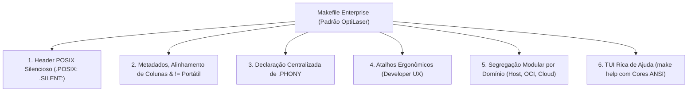

# 🛠️ POSIX Makefile Architect Skill

Esta habilidade orienta o agente de IA na construção, auditoria e modernização de Makefiles em todo o ecossistema. O objetivo é garantir **portabilidade universal** entre **BSD Make (`bmake`)** (padrão no FreeBSD, OpenBSD e NetBSD) e **GNU Make (`gmake`)** (padrão em distribuições Linux), sem ruído visual no terminal e com estrutura rigorosamente padronizada.

---

## 🎯 O Cabeçalho Universal Mandatório

Todo Makefile no ecossistema DEVE iniciar rigorosamente com o seguinte cabeçalho canônico:

```makefile
.POSIX:
.SILENT:

MAKEFLAGS += --no-print-directory -s
```

### Justificativas Técnicas:

1. **`.POSIX:`**: Força o Make a operar em conformidade com as especificações POSIX, desativando comportamentos proprietários arriscados e padronizando a execução de comandos via `/bin/sh`.
2. **`.SILENT:`**: Suprime a exibição padrão de linhas de comando antes da execução. Permite que o Makefile opere sob a **Regra do Silêncio** do UNIX, emitindo saída apenas quando houver erro ou quando explicitamente solicitado.
3. **`MAKEFLAGS += --no-print-directory -s`**: Garante que o GNU Make não polua o terminal com avisos de troca de diretório (`Entering/Leaving directory`) e força a execução silenciosa em subprocessos aninhados.

---

## ⚡ A Exceção Pragmática: `$(MAKE) -C subdir target`

> [!IMPORTANT]
> **Exceção Deliberada ao POSIX Estrito:**
> Embora a flag `-C` não esteja formalmente no padrão POSIX IEEE 1003.1 para o comando `make`, ela é **nativamente suportada por ambos os motores principais: `bmake` (BSD) e `gmake` (GNU)**.
>
> Portanto, o ecossistema **EXIGE** o uso de:
>
> ```makefile
> $(MAKE) -C subdir target
> ```
>
> em vez da forma burocrática em subshell:
>
> ```makefile
> # Evitar quando não houver necessidade:
> (cd subdir && $(MAKE) target)
> ```
>
> IAs e ferramentas automatizadas **NÃO DEVEM** "refatorar" chamadas `-C` para `cd && make`.

---

## 🚫 Eliminação de `@` Redundante

Com a diretiva `.SILENT:` declarada no topo do arquivo, **TODAS as receitas de comandos já são executadas silenciosamente por padrão**.

**Anti-padrão (Redundância Visual):**

```makefile
build:
	@rm -rf bin
	@mkdir -p bin
	@$(CC) $(CFLAGS) -o bin/app src/main.c
```

**Padrão Canônico Limpo:**

```makefile
build:
	rm -rf bin
	mkdir -p bin
	$(CC) $(CFLAGS) -o bin/app src/main.c
```

---

## ⚙️ Execução de Comandos de Shell em Variáveis (`!=` vs `$(shell)`)

No GNU Make, comandos dinâmicos frequentemente usam `$(shell cmd)`. No entanto, **o `bmake` do FreeBSD NÃO reconhece a função `$(shell ...)` por padrão**, resultando em falha crítica de sintaxe.

Ambos os motores modernos (`bmake` e `gmake 4.0+`) suportam o operador padrão POSIX de atribuição de shell: **`!=`**.

- **Incorreto (Incompatível com `bmake`):**
    ```makefile
    SOURCES = $(shell find src -name '*.c')
    ```
- **Correto (Universal e Portátil):**
    ```makefile
    SOURCES != find src -name '*.c'
    ```

---

## 🛡️ Compiladores e Flags Defensivas

Sempre utilize atribuições condicionais (`?=`) para permitir sobrescrita por variáveis de ambiente ou pelo empacotamento de distribuições:

```makefile
CC ?= cc
CXX ?= c++
CFLAGS ?= -O2 -Wall -Wextra -pedantic -std=c23
CXXFLAGS ?= -O2 -Wall -Wextra -pedantic -std=c++23
PREFIX ?= /usr/local
BINDIR ?= $(PREFIX)/bin
MANDIR ?= $(PREFIX)/share/man
```

- NUNCA force `gcc` ou `g++` diretamente, pois no FreeBSD, macOS e OpenBSD o compilador padrão do sistema é o Clang (`cc` e `c++`).

---

## 🏗️ Estrutura de Banners em Makefiles

Makefiles complexos devem seguir o padrão estrutural de 2 camadas de comentários:

```makefile
# ----------------------------------------------------------------
# COMPILER CONFIGURATION & FLAGS
# ----------------------------------------------------------------

CC ?= cc
CFLAGS ?= -O2 -Wall

### ================================
### BUILD TARGETS
### ================================

all: build

build:
	mkdir -p bin
	$(CC) $(CFLAGS) -o bin/app src/main.c

### ================================
### CLEANUP
### ================================

clean:
	rm -rf bin
```

---

## 🏛️ A Estrutura Canônica Enterprise / "Hype" (O Padrão OptiLaser)

Para projetos e repositórios de alta complexidade (como **Ventures/OptiLaser**), o Makefile deixa de ser um mero script de compilação e torna-se a **Interface de Linha de Comando (CLI) Principal do Projeto**.

Qualquer desenvolvedor, operador ou agente de IA que entra no repositório deve ter à sua disposição uma experiência rica, autoexplicativa, veloz e esteticamente impecável.



### 1. Metadados e Alinhamento Rigoroso de Colunas

O bloco de variáveis deve manter um alinhamento visual de colunas rigoroso para legibilidade instantânea, combinando valores estáticos, padrões condicionais (`?=`) e comandos de shell portáteis via `!=`:

```makefile
APP             = optilaser
CMD             = ./cmd/optilaser
VERSION        != cat VERSION 2> "/dev/null" || echo 0.0.0-dev
FLAVOR         != cat FLAVOR 2> "/dev/null" || echo linux

CONTAINER_RT   ?= podman
IMAGE_NAME      = optilaser
PORT           ?= 8080
SUDO_DEFAULT   != if [ "$$(uname -s)" = "FreeBSD" ] && [ "$$(id -u)" != "0" ]; then if command -v sudo > "/dev/null" 2>&1; then echo "sudo"; elif command -v doas > "/dev/null" 2>&1; then echo "doas"; else echo ""; fi; else echo ""; fi
SUDO           ?= $(SUDO_DEFAULT)
```

- **Alinhamento em Coluna Única:** Todos os sinais `=`, `!=` e `?=` devem estar perfeitamente alinhados na mesma coluna.
- **Detecção Defensiva de Privilégios:** A variável `SUDO` é resolvida dinamicamente testando primeiro a plataforma, usuário não-root e disponibilidade de `sudo` ou `doas`.

### 2. Atalhos Ergonômicos Unificados (Developer Experience / UX)

O Makefile deve oferecer uma fachada de verbos curtos e universais que abstraem a complexidade das implementações granulares:

```makefile
all: dev

# Atalhos Ergonômicos Principais:
dev:        container-dev
run:        container-run
stop:       container-stop
restart:    container-restart
build:      container-build
test:       container-test
logs:       container-logs
status:     container-status
ps:         container-ps
shell:      container-shell
exec:       container-exec
clean:      container-clean
prune:      container-prune
purge:      container-purge
```

- Se o ambiente for chaveado para rodar direto no host (`make host-dev`), o desenvolvedor ainda pode digitar simplesmente `make dev` se a fachada direcionar para o flavor ativo.

### 3. Segregação Modular por Domínio

Separe alvos em domínios lógicos com banners estruturais de 32 caracteres:

1. **Containers / OCI (Container-First):** `container-build`, `container-run`, `container-logs`, volumes de dados.
2. **Qualidade & Bootstrap:** `setup`, `init`, `fmt`, `lint`, `tidy`, `bump`.
3. **Host Nativo (Bare Metal):** `host-dev`, `host-build`, `host-test`, `host-clean`.
4. **Infraestrutura & Staging:** `incus-launch`, `bastille-create`, `tofu-apply`.

### 4. Ajuda Interativa Rica (`make help`) com TUI ANSI Colorida

O ponto alto ("Hype") do padrão OptiLaser é o alvo `help:`, implementado com mini-funções de shell inline (`cmd()`, `sec()`, `sub()`, `var()`) para produzir uma saída categorizada, colorida e alinhada sem depender de ferramentas externas como Python ou AWK:

```makefile
help:
	cmd() { printf "    \033[36mmake %-42s\033[0m %s\n" "$$1" "$$2"; }; \
	sec() { printf "\n  \033[1;33m%s\033[0m\n" "$$1"; }; \
	sub() { printf "  \033[1;34m  ── %s ──\033[0m\n" "$$1"; }; \
	var() { printf "    \033[35m%-47s\033[0m %s\n" "$$1" "$$2"; }; \
	printf "\n  \033[1;37m$(APP) — Catálogo de Comandos Makefile\033[0m (v%s)\n" "$(VERSION)"; \
	printf "  ============================================================\n"; \
	sec "Fluxo Principal (Container-First via Podman OCI):"; \
	sub "Execução & Desenvolvimento"; \
	cmd "dev"                                     "Executar container interativo com logs ao vivo"; \
	cmd "run"                                     "Iniciar container em background (daemon)"; \
	cmd "stop"                                    "Parar container em execução"; \
	cmd "build"                                   "Construir imagem OCI do flavor ativo"; \
	cmd "test"                                    "Executar suíte de testes dentro do container"; \
	sub "Diagnóstico & Shell"; \
	cmd "status"                                  "Exibir diagnóstico completo (containers, volumes)"; \
	cmd "logs"                                    "Acompanhar logs do serviço em tempo real"; \
	cmd "shell"                                   "Abrir terminal interativo no container"; \
	sub "Limpeza & Manutenção"; \
	cmd "clean"                                   "Remover imagens finais compiladas (mantém cache)"; \
	cmd "prune"                                   "Faxina de containers mortos e imagens órfãs"; \
	cmd "purge"                                   "Limpeza profunda de containers, volumes e banco"; \
	sec "Variáveis Customizáveis:"; \
	var "PORT=8080"                               "Porta de escuta do serviço HTTP"; \
	var "CONTAINER_RT=podman"                     "Runtime OCI (podman ou docker)"; \
	echo ""
```

> [!TIP]
> **Convenção de Escrita de Shell no Makefile:**
> No corpo da receita do Make, os parâmetros posicionais de funções do shell DEVEM ser escapados com cifrão duplo: `$$1`, `$$2`. O sinal simples `$1` é interpretado pelo Make antes do shell iniciar.

---

## 🧪 Validação de Portabilidade Obrigatória

Antes de finalizar qualquer alteração em um Makefile, o agente DEVE executar a simulação de execução (_dry-run_) em ambos os motores:

```sh
# 1. Testar no GNU Make
make -n

# 2. Testar no BSD Make (quando bmake estiver instalado)
bmake -n
```

Nenhum aviso, erro de sintaxe ou ruído de diretório pode ser emitido.

---

## 📚 Literatura de Referência & Especificações Oficiais

Recomenda-se enfaticamente ao agente de IA e aos operadores o estudo das fontes oficiais de Make:

- **The Open Group Base Specifications (POSIX IEEE 1003.1):** <https://pubs.opengroup.org/onlinepubs/9699919799/> | Make (`make`): <https://pubs.opengroup.org/onlinepubs/9699919799/utilities/make.html>
- **The FreeBSD Project:** <https://www.freebsd.org/> | Manual Pages: <https://man.freebsd.org/> | `bmake`: <https://man.freebsd.org/bmake>
- **Linux man-pages (Michael Kerrisk):** <https://man7.org/> | GNU Make (`make`): <https://man7.org/linux/man-pages/man1/make.1.html>
- **Obra de Referência:** _Managing Projects with GNU Make_ (Robert Mecklenburg, 3ª edição, O'Reilly Media) — referência clássica sobre regras implícitas, variáveis e portabilidade de builds.
