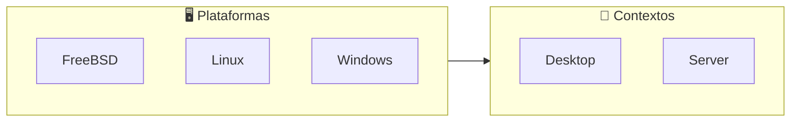
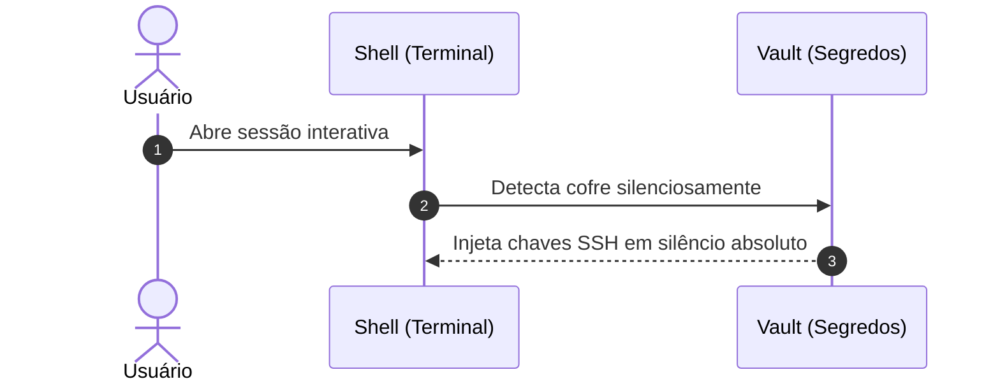

# 🎨 Padrões Canônicos para Criação de READMEs & Documentação Markdown

Esta habilidade orienta o desenvolvedor e o agente de IA na concepção, diagramação, estilização e manutenção de **READMEs institucionais e documentos Markdown de alta qualidade técnica** no ecossistema soberano.

---

## 🧭 O README como Portal de Engenharia

O `README.md` raiz de um repositório é seu cartão de visitas e sua especificação executiva. Ele deve cumprir o **Princípio da Clareza** e o **Princípio da Apresentação** (_The Art of UNIX Programming_):

- **Primeira Impressão Impecável:** Comunica instantaneamente o propósito, as plataformas suportadas, a arquitetura e como começar em menos de 10 segundos.
- **Hierarquia Visual Estrita:** Título e emoji representativo, blockquote de missão conciso, badges de estado e navegação, diagramas Mermaid de fluxo/sequência e catálogo tabular.
- **Zero Informação Obsoleta:** Links sempre canônicos e formatados com rigor.

---

## 💎 1. Engenharia de Badges (Shields.io + Simple Icons)

Badges fornecem status visual instantâneo (CI/CD, plataformas, versões, licença). O padrão canônico do ecossistema adota **duas modalidades harmonizadas**:

### 1.1. Logos Vetoriais (Simple Icons)

Para plataformas, ferramentas e linguagens, prefira **logos vetoriais em SVG puro** fornecidos pelo ecossistema [Simple Icons](https://simpleicons.org/) através da API do [Shields.io](https://shields.io/).

**Sintaxe Canônica:**

```markdown

```

**Exemplos Reais do Ecossistema:**

```markdown


-Supported-purple?logo=gitforwindows&logoColor=white>)


```

### 1.2. Regra da Improvisação Canônica para Slugs Inexistentes

Nem todas as tecnologias de nicho ou sistemas clássicos possuem slugs diretos no Simple Icons. Quando um slug não existir oficialmente, **aplique uma associação técnica correlata e simétrica**:

| Tecnologia / Alvo      | Slug Simple Icons | Rationale de Engenharia                                               |
| :--------------------- | :---------------: | :-------------------------------------------------------------------- |
| **Windows / MSYS2**    |  `gitforwindows`  | Logotipo oficial do Git sobre a marca Windows                         |
| **illumos / Solaris**  |     `openzfs`     | OpenZFS é a espinha dorsal e tecnologia nativa do ecossistema illumos |
| **FreeBSD `/bin/sh`**  |     `freebsd`     | Enfatiza que o alvo `sh` é exclusivo do sistema operacional FreeBSD   |
| **OpenBSD `/bin/ksh`** |     `openbsd`     | Enfatiza que o alvo `ksh` é exclusivo do sistema operacional OpenBSD  |
| **Dash**               |      `dash`       | Ícone de velocímetro/dashboard que traduz velocidade e brevidade      |
| **Fish Shell**         |    `fishshell`    | Peixe estilizado oficial do interpretador                             |

> [!TIP]
> **Quando usar Emojis nos Badges?**
> Reserve emojis gráficos dentro do badge (`📦_Setup`, `🐚_Shell`, `🔐_Vault`, `🎨_Profile`) para marcas registradas próprias e repositórios da sua federação, onde os emojis atuam como selo institucional de identidade.

---

## 📊 2. Diagramação Visual com Mermaid

O Markdown moderno deve utilizar diagramas Mermaid em cercaduras de código (`mermaid`) em vez de imagens estáticas PNG/JPG que envelhecem e não podem ser versionadas via `git diff`:

### 2.1. Fluxogramas Horizontais (`flowchart LR`)

Ideais para mostrar relacionamentos entre plataformas, contextos e ferramentas:



### 2.2. Diagramas de Sequência (`sequenceDiagram`)

Ideais para ilustrar ciclos de boot, sourcing e injeção de credenciais:



---

## 📋 3. Tabelas Markdown Padronizadas

Tabelas devem ser limpas, legíveis em modo texto puro e alinhadas:

```markdown
| Componente  |  Status  | Papel Central                                        |
| :---------- | :------: | :--------------------------------------------------- |
| **Setup**   | 🟢 Ativo | Provisionamento de pacotes e base do SO (`root`)     |
| **Shell**   | 🟢 Ativo | Runtime interativo de terminal com latência < 20ms   |
| **Vault**   | 🔒 Cofre | Chaves criptográficas e variáveis de ambiente `.env` |
| **Profile** | 🟢 Ativo | Dotfiles declarativos, editores e skills de IA       |
```

- Use `:---` para alinhamento à esquerda (texto longo, nomes).
- Use `:---:` para colunas curtas ou de status (emojis, badges).
- Use `---:` para números, latências e tamanhos em bytes.

---

## 🚨 4. Alertas do GitHub (Admonitions)

Destaque informações críticas, dicas e notas de segurança usando os alertas nativos do GitHub Flavored Markdown:

```markdown
> [!NOTE]
> Informações contextuais e notas explicativas de arquitetura.

> [!TIP]
> Dicas de produtividade, atalhos úteis e melhores práticas.

> [!IMPORTANT]
> Regras obrigatórias, diretrizes canônicas e invariantes que não podem ser violadas.

> [!WARNING]
> Avisos sobre comportamentos depreciados ou pré-requisitos essenciais.

> [!CAUTION]
> Ações de risco elevado, operações que afetam segredos ou alterações destrutivas.
```

---

## 🧪 5. Quality Gates & Formatação Estrita com Prettier

Documentações Markdown devem ser formatadas com o mesmo rigor de código compilado:

1. **Prettier Obrigatório:**
    ```sh
    npx prettier --write README.md
    ```
2. **Prevenção de Blank Lines no EOF (`git diff --check`):**
   O Git proíbe quebras de linha duplicadas ou em branco no final do arquivo (_new blank line at EOF_). Todo documento deve terminar com **exatamente uma única newline**.
3. **Escapes em URLs com Parênteses:**
   Quando uma URL de badge contiver parênteses (ex: `Windows_(MSYS2)`), envolva o link em `<...>` para evitar truncamento no parser Markdown do GitHub:
    ```markdown
    -Supported-purple?logo=gitforwindows&logoColor=white>)
    ```

---

## 🔗 Links Oficiais de Referência & Obras Recomendadas

- **Simple Icons (SVG Icons for Brands):** <https://simpleicons.org/> | Repositório: <https://github.com/simple-icons/simple-icons>
- **Shields.io (Quality Metadata Badges):** <https://shields.io/> | Documentação: <https://shields.io/badges>
- **GitHub Flavored Markdown (GFM) Specification:** <https://github.github.com/gfm/>
- **Mermaid-JS Documentation:** <https://mermaid.js.org/>
- **Prettier Code Formatter:** <https://prettier.io/>
- **Literatura Técnica:**
    - _The Art of UNIX Programming_ (Eric S. Raymond, 2003, Addison-Wesley) — Capítulo 11: _Rule of Presentation_ & _Rule of Transparency_.
    - _Clean Code: A Handbook of Agile Software Craftsmanship_ (Robert C. Martin, 2008, Prentice Hall).
