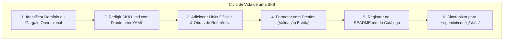

# 🧠 Padrões Canônicos para Criação de Portable AI Skills

Esta habilidade orienta o desenvolvedor e o agente de IA na concepção, estruturação, auditoria e publicação de **Portable AI Skills** (Habilidades e Runbooks Cognitivos) no ecossistema soberano.

---

## 🏛️ O Que é uma Portable AI Skill?

Uma **AI Skill** é um runbook especializado e modular que encapsula conhecimento procedimental, padrões de arquitetura, restrições defensivas e diretrizes operacionais para assistentes autônomos de inteligência artificial (Google Antigravity/Gemini, Claude, OpenAI).



### Hierarquia de Resolução & Precedência Unix (Local > Global):

Inspirado na filosofia UNIX onde o escopo mais local e específico sempre sobrepõe o global:

1. **Local do Repositório (`<repo>/.agents/skills/`):** Tem **prioridade máxima**. Sobrescreve ou especializa qualquer skill homônima de nível de usuário ou de sistema. Permite que um projeto defina contratos, runbooks e regras específicas para o agente de IA sem poluir o ambiente global.
2. **Global do Usuário (`~/.gemini/config/skills/` via `Profile/skills/`):** Habilidades perenes de engenharia, sistemas operacionais, padrões de linguagem e ferramentas de terminal, disponíveis para o agente em qualquer workspace do usuário.
3. **Built-in da IDE (`builtin/skills`):** Habilidades fundamentais fornecidas pelo ecossistema Antigravity, atuando como base e fallback de último nível.

### 🌐 Skills Globais vs. 🎯 Skills Locais: Dualidade Arquitetural

O ecossistema estabelece uma distinção rigorosa entre habilidades portáteis de engenharia e runbooks de repositório:

| Dimensão                 | Skills Globais (`Profile/skills/`)                      | Skills Locais (`<repo>/.agents/skills/`)          |
| :----------------------- | :------------------------------------------------------ | :------------------------------------------------ |
| **Localização Canônica** | `Profile/skills/` -> `~/.gemini/config/skills/`         | `<repo>/.agents/skills/`                          |
| **Escopo de Atuação**    | Universal para toda a estação de trabalho               | Restrito ao workspace do repositório              |
| **Conteúdo Principal**   | Padrões de engenharia (POSIX, C23, Go, XDG, Clean Code) | Orquestração local, Makefiles, regras do projeto  |
| **Acoplamento**          | Zero acoplamento a caminhos ou repositórios privados    | Acoplamento aceitável aos scripts e alvos do repo |
| **Precedência**          | Fallback geral de usuário                               | Prioridade máxima sobre skills globais            |

#### 1. Diretrizes para Skills Globais (`Profile/skills/`)

- **Universalidade Estrita:** Devem ser concebidas para funcionar em qualquer base de código ou projeto em que o usuário trabalhar.
- **Agnósticas de Implementação:** Proibido codificar caminhos absolutos, variáveis de ambiente ou ferramentas exclusivas de um único repositório privado.
- **Estudos de Caso Ilustrativos:** Se for necessário exemplificar como uma regra teórica funciona na prática (como o Quarteto de Produtividade em `xdg-fhs-standards`), faça-o estritamente como caso de estudo ilustrativo, mantendo a regra central abstrata e aplicável universalmente.

#### 2. Diretrizes para Skills Locais (`<repo>/.agents/skills/`)

- **Especialização do Projeto:** Devem codificar regras operacionais, flags de Makefile, alvos de compilação, scripts de teste e particularidades do fluxo daquele repositório.
- **Não Redundância:** Não devem duplicar manuais gerais de linguagem ou boas práticas universais já cobertos pelas skills globais.

### 🏛️ A Regra Áurea da Fonte Canônica (Grandes Repositórios vs. Clones de Runtime)

Quando o desenvolvedor ou o agente for criar, refatorar ou atualizar qualquer **Skill Global, arquivo de configuração ou dotfile**:

- **Regra Fundamental de Modificação:** A alteração **DEVE SEMPRE** ser realizada na raiz de desenvolvimento do **Grande Repositório Canônico / Super-Hub** (isto é, em `Environment/Profile/skills/...`, `Environment/Editor/...`, etc.), e **NUNCA** diretamente no clone de runtime do usuário (`~/.local/share/profile`) ou através dos links simbólicos ativos (`~/.gemini/config/skills/`).
- **Exceção Única (Ambiente Isolado):** A modificação direta em clones de runtime só é admitida se o ambiente atual for headless, efêmero ou remoto e **não contiver** os grandes repositórios clonados na estação.
- **Por que essa regra é inegociável?**
    1.  **Prevenção de Árvores de Trabalho Sujas:** Alterar arquivos apontados por links simbólicos (`~/.gemini/config/skills/`) altera o clone `~/.local/share/profile` sem commit, gerando arquivos modificados não rastreados (`unstaged changes`).
    2.  **Preservação dos Atualizadores Automáticos:** Uma árvore de runtime suja bloqueia imediatamente comandos de sincronização rápida do usuário (`uped`, `uprc`, `upall`, `git pull --ff-only`, `make update`).
    3.  **Fluxo Canônico de Propagação:**
        1. Modifique e teste no grande repositório (`Environment/Profile/skills/...`).
        2. Formate com Prettier (`npx prettier --write`).
        3. Commite e dê push no repositório de origem (`Profile`).
        4. Atualize o ponteiro do submódulo no repositório central (`Environment`).
        5. Atualize o clone de runtime via `git pull` limpo ou script de sync.

### ⚖️ A Invariante da Perenidade Cognitiva (Skills vs. TODO.md)

O ecossistema impõe uma **separação ontológica rigorosa** entre a memória procedimental perene e a governança de tarefas:

| Documento       | Natureza & Papel              | Volatilidade        | O Que Deve Conter                                                | O Que NUNCA Deve Conter                          |
| :-------------- | :---------------------------- | :------------------ | :--------------------------------------------------------------- | :----------------------------------------------- |
| **`README.md`** | Vitrine Pública & Onboarding  | Baixa               | Portais, badges, sistemas suportados, arquitetura e quickstart   | Backlog granular, runbooks cognitivos densos     |
| **`TODO.md`**   | Roadmap & Governança Dinâmica | **Alta (Dinâmico)** | Matriz de maturidade/status, épicos em andamento, sprints        | Invariantes teóricas, manuais procedimentais     |
| **`SKILL.md`**  | Runbooks Cognitivos & Métodos | **Nula (Perene)**   | _Como_ pensar, projetar e auditar; heurísticas e padrões eternos | **Tarefas de sprint, cópia de TODO.md, backlog** |
| **`AGENTS.md`** | Constituição Operacional      | Baixa               | Contratos invioláveis, regras de integridade e Boy Scout Rule    | Backlog de tarefas, código de implementação      |

#### Proibição Absoluta de Débito Cognitivo & Tarefas Efêmeras em Skills:

- **Proibição de Listas de Afazeres:** É expressamente proibido transformar skills em espelhos de tarefas pendentes do `TODO.md` ou checklists de sprint. O `TODO.md` é volátil; skills ensinam métodos invariantes.
- **O Teste dos 5 Anos:** _"Quando todas as tarefas pendentes forem concluídas e o `TODO.md` estiver limpo, o conteúdo desta skill continuará 100% verdadeiro, relevante e acionável daqui a 5 anos?"_ Se depender de tarefas em aberto, pertencia ao `TODO.md`.

---

## 🗂️ Estrutura Modular de uma Skill (Além do `SKILL.md`)

Uma Portable AI Skill no padrão canônico **não se limita a um único arquivo `SKILL.md`**. Ela pode e deve ser estruturada como um módulo completo de automação cognitiva quando a tarefa envolver ferramentas auxiliares, testes ou dados:

```text
skills/<nome-da-skill>/
├── SKILL.md
├── scripts/
├── references/
├── examples/
└── resources/
```

- `SKILL.md`: Runbook principal obrigatório com frontmatter YAML e instruções operacionais.
- `scripts/`: Utilitários executáveis opcionais (Python, Shell POSIX) invocados sob demanda pelo agente.
- `references/`: Manuais, especificações, tabelas de decisão e notas densas complementares.
- `examples/`: Implementações de referência, snippets e arquivos modelo.
- `resources/`: Templates estáticos, esquemas JSON/YAML ou dados canônicos.

> [!TIP]
> **Utilitários Executáveis em `scripts/`:**
> Sempre que uma validação for repetitiva, complexa ou exigir chamadas de rede/parsing estruturado (como inspecionar links, auditar sintaxe ou processar JSON), **forneça um script executável dentro da própria skill** (ex: `scripts/verify_links.py`). O agente de IA pode invocar o script diretamente via terminal.

> [!CAUTION]
> **Regra da Soberania & Hermetismo de Produção: Código de Produção NUNCA Consome Skills!**
> É **estritamente proibido** fazer com que scripts de produção, Makefiles, carregadores de shell (`*.sh`, `*.rc`), aliases, dotfiles ou scripts de `.githooks/` chamem ou dependam de utilitários e arquivos contidos dentro de pastas de skills (seja em `~/.gemini/config/skills/` ou `.agents/skills/`).
>
> **Por que isso é um erro arquitetural grave?**
>
> 1. **Invariante do Teste de Fogo (`rm -rf .agents`):** O repositório Git DEVE ser 100% autônomo e autossuficiente. Se outro desenvolvedor clonar o repositório, executar `rm -rf .agents` ou rodar em uma pipeline limpa de CI/CD (GitHub Actions, bare-metal), nenhum script ou build pode quebrar por ausência de arquivos de IA.
> 2. **Separação Ontológica Rígida:**
>     - **Código de Produção & `.githooks/`:** Quality gates e rotinas determinísticas e autônomas do próprio repositório, sem acoplamento a IA.
>     - **Scripts de Skills:** Ferramentas e runbooks estritamente cognitivos sob demanda para a **mente do Agente de IA e operadores humanos**.

---

## 📋 Anatomia Obrigatória de um Arquivo `SKILL.md`

Todo arquivo `SKILL.md` DEVE seguir a anatomia canônica:

```markdown
---
name: nome-da-skill
description: Resumo conciso de uma a duas frases descrevendo o escopo e gatilhos de ativação.
---

# 🏷️ Título Descritivo com Emoji Canônico

Parágrafo de introdução delimitando o papel do agente de IA e o problema resolvido.

---

## 🎯 Seções Hierárquicas e Procedimentos Guiados

Conteúdo técnico, comandos canônicos e diretrizes.

---

## 🔗 Links Oficiais de Referência & Obras Recomendadas

Links oficiais para prevenir conhecimento estático ou desatualizado.
```

---

## 📐 Orçamento de Linhas & Limites Canônicos (17 – 128 – 256)

Para proteger a janela de contexto (_Context Window_) e forçar modularidade UNIX:

| Faixa de Linhas                 | Classificação             | Diretriz Operacional                                          |
| :------------------------------ | :------------------------ | :------------------------------------------------------------ |
| **$\ge 17$ linhas**             | Mínimo Substancial        | Previne micro-runbooks vazios ou sem valor procedimental.     |
| **$17 \text{ a } 128$ linhas**  | **Sweet Spot Executivo**  | Meta de design para fluxos diretos, acionáveis e rápidos.     |
| **$129 \text{ a } 256$ linhas** | Faixa de Densidade        | Permitido para matrizes multi-OS, tabelas e regras densas.    |
| **$> 256$ linhas**              | **Erro Fatal (Monólito)** | Proibido. Exige modularização em `references/` ou `scripts/`. |

- **Invariante do Hermetismo:** Toda skill local em `<repo>/.agents/skills/` deve respeitar o teste `rm -rf .agents`. O código do projeto NUNCA depende da skill para compilar ou rodar.
- **Curadoria do Ciclo de Vida:** A IA deve atuar ativamente via [`local-skills-curator`](../local-skills-curator/SKILL.md), atualizando ou expurgando skills para evitar acúmulo de regras mortas.

---

## 📚 A Regra das Fontes Canônicas, Links & Citação Bibliográfica

Para garantir rigor técnico, evitar premissas estáticas ou obsoletas e assegurar integridade de rede:

### 1. A Regra da Homepage Obrigatória

- **Paridade entre Raiz e Documentação Específica:** Sempre que uma documentação técnica aprofundada, manual, RFC, release note ou subpágina for linkada, **a Homepage oficial (portal raiz) da tecnologia DEVE acompanhar o link**:
    - Exemplo:
        ```markdown
        - **The FreeBSD Project:** <https://www.freebsd.org/> | Releases: <https://www.freebsd.org/releases/> | Shell (`sh`): <https://man.freebsd.org/sh>
        - **The Open Group (POSIX):** <https://www.opengroup.org/> | Especificações Base: <https://pubs.opengroup.org/onlinepubs/9699919799/>
        - **Proxmox Virtual Environment:** <https://proxmox.com/en/> | Documentação: <https://pve.proxmox.com/pve-docs/>
        - **Game of Trees (Got):** <https://gameoftrees.org/> | Manual: <https://gameoftrees.org/manual.html>
        ```
- Isso garante que tanto o leitor humano quanto o agente de IA tenham acesso imediato ao portal principal e à documentação técnica específica.

### 2. Proibição Absoluta de Links Fictícios, Quebrados ou Privados

- **Links Quebrados (404, DNS, Timeouts):** É terminantemente proibido incluir URLs inexistentes, domínios expirados ou rotas desatualizadas.
- **Repositórios Privados:** NUNCA crie links markdown para repositórios privados da organização (como o `Vault`), pois retornarão HTTP 404 para agentes e operadores não autenticados. Cite-os apenas em negrito formal (ex: `**Vault** (Privado)`).
- **Sem Falsos Placeholders:** Não use URLs inventadas (`example.com`, `meu-link-aqui.com`) em links clicáveis. Se uma tecnologia não tiver site oficial público, cite apenas seu nome formal em negrito.

### 3. Citação Formal de Obras de Literatura Técnica

Quando diretrizes da skill forem fundamentadas em livros clássicos ou tratados de engenharia, **o autor, o título da obra, ano e editora devem ser registrados com precisão**:

- _The Art of UNIX Programming_ (Eric S. Raymond, 2003, Addison-Wesley) — para filosofia UNIX, modularidade, simplicidade e transparência.
- _Clean Code: A Handbook of Agile Software Craftsmanship_ (Robert C. Martin, 2008, Prentice Hall) — para legibilidade, nomes descritivos e Boy Scout Rule.
- _The Practice of Programming_ (Brian W. Kernighan & Rob Pike, 1999, Addison-Wesley) — para simplicidade, depuração e portabilidade.
- _The UNIX Programming Environment_ (Brian W. Kernighan & Rob Pike, 1984, Prentice Hall) — para scripts de shell e composição de ferramentas.
- _Managing Projects with GNU Make_ (Robert Mecklenburg, 3ª ed., O'Reilly Media) — para regras de Makefiles.

---

## 🧪 Auditoria Automatizada com o Verificador Integrado

Esta skill fornece um utilitário oficial multithreaded para auditar links em massa em qualquer skill ou repositório:

- **Script Canônico:** [`scripts/verify_links.py`](scripts/verify_links.py)

### Como Executar:

Para verificar todas as skills do catálogo:

```sh
python3 "${PROFILE_DIR:-${HOME}/.local/share/profile}/skills/skill-authoring-standards/scripts/verify_links.py"
```

Para verificar uma skill específica ou arquivo isolado:

```sh
python3 "${PROFILE_DIR:-${HOME}/.local/share/profile}/skills/skill-authoring-standards/scripts/verify_links.py" skills/<nome-da-skill>/SKILL.md
```

- Testa status HTTP (200 OK, redirecionamentos, proteções WAF/anti-bot).
- Suporta codificação percentual de caracteres para badges (Shields.io).
- Retorna código de saída `1` se houver links quebrados ou inacessíveis, servindo perfeitamente para hooks de pré-commit ou pipelines de CI/CD.

---

## 🛡️ Padrões de Código e Shell em Skills

Ao incluir trechos de código executável ou automações em skills:

1. **Shebang Universal:** Utilize sempre `#!/usr/bin/env sh` (POSIX) ou `#!/usr/bin/env python3`. Nunca hardcode `/bin/bash`.
2. **Taxonomia de Emissão:** `echo "${msg}"` para texto simples; `[ -t 1 ] && echo -n $'\e...'` para ANSI; `printf` para tabelas.
3. **Quoting Defensivo:** Proteção rigorosa de variáveis `"${var}"` e redirecionamentos cotados `> "/dev/null" 2>&1`.
4. **Makefiles Universais:** Cabeçalho `.POSIX: .SILENT:`, `MAKEFLAGS += --no-print-directory -s` e atribuição `!=`.

---

## 🚀 Roteiro de Publicação e Registro no Catálogo

1. **Criação do Diretório:** Crie a pasta em `Environment/Profile/skills/<nome-da-skill>/`.
2. **Redação do `SKILL.md`:** Escreva o conteúdo seguindo os padrões desta diretriz.
3. **Registro no Catálogo:** Atualize a tabela em [skills/README.md](../README.md), incrementando o contador total de runbooks.
4. **Validação de Links e Formatação:**
    - Execute o verificador de links integrado:
        ```sh
        python3 "${PROFILE_DIR:-${HOME}/.local/share/profile}/skills/skill-authoring-standards/scripts/verify_links.py" skills/<nome-da-skill>/SKILL.md
        ```
    - Execute a formatação canônica com Prettier em todo o diretório `skills/`:
        ```sh
        npx prettier --write skills/
        ```
5. **Sincronização com o Runtime Global:** Execute o comando canônico:
    ```sh
    profile.sh sync
    ```
6. **Auditoria Git:** Valide com o hook de pre-commit (`.githooks/pre-commit`) e submeta as alterações via `git commit` e `git push`.
