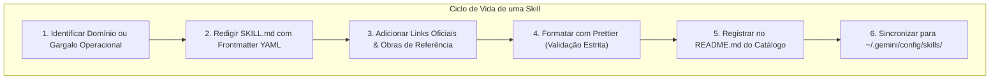

# 🧠 Padrões Canônicos para Criação de Portable AI Skills

Esta habilidade orienta o desenvolvedor e o agente de IA na concepção, estruturação, auditoria e publicação de **Portable AI Skills** (Habilidades e Runbooks Cognitivos) no ecossistema soberano.

---

## 🏛️ O Que é uma Portable AI Skill?

Uma **AI Skill** é um runbook especializado e modular que encapsula conhecimento procedimental, padrões de arquitetura, restrições defensivas e diretrizes operacionais para assistentes autônomos de inteligência artificial (Google Antigravity/Gemini, Claude, OpenAI).



### Escopos de Aplicação:

1. **Global da Estação (`Environment/Profile/skills/`):** Habilidades perenes de engenharia, sistemas operacionais, padrões de linguagem e ferramentas de terminal (disponíveis para o agente em qualquer pasta do computador via symlink em `~/.gemini/config/skills/`).
2. **Local do Repositório (`<repo>/.agents/skills/`):** Habilidades específicas do domínio de negócio daquele projeto, versionadas no Git com o repositório.

---

## 🗂️ Estrutura Modular de uma Skill (Além do `SKILL.md`)

Uma Portable AI Skill no padrão canônico **não se limita a um único arquivo `SKILL.md`**. Ela pode e deve ser estruturada como um módulo completo de automação cognitiva quando a tarefa envolver ferramentas auxiliares, testes ou dados:

```text
skills/<nome-da-skill>/
├── SKILL.md            # [Obrigatório] Runbook principal com frontmatter YAML e instruções
├── scripts/            # [Opcional] Utilitários executáveis (Python, Shell POSIX) invocados pela IA
├── references/         # [Opcional] Manuais, especificações, tabelas de decisão e notas densas
├── examples/           # [Opcional] Implementações de referência, snippets e arquivos modelo
└── resources/          # [Opcional] Templates estáticos, esquemas JSON/YAML ou dados canônicos
```

> [!TIP]
> **Utilitários Executáveis em `scripts/`:**
> Sempre que uma validação for repetitiva, complexa ou exigir chamadas de rede/parsing estruturado (como inspecionar links, auditar sintaxe ou processar JSON), **forneça um script executável dentro da própria skill** (ex: `scripts/verify_links.py`). O agente de IA pode invocar o script diretamente via terminal.

---

## 📋 Anatomia Obrigatória de um Arquivo `SKILL.md`

Todo arquivo `SKILL.md` DEVE seguir a anatomia canônica:

```markdown
---
name: nome-da-skill
description: Resumo conciso de uma a duas frases descrevendo o escopo e gatilhos de ativação.
---

# 🏷️ Título Descritivo com Emoji Canônico

Parágrafo de introdução delimitando o papel do agente de IA e o problema resolvido.

---

## 🎯 Seções Hierárquicas e Procedimentos Guiados

Conteúdo técnico, comandos canônicos e diretrizes.

---

## 🔗 Links Oficiais de Referência & Obras Recomendadas

Links oficiais para prevenir conhecimento estático ou desatualizado.
```

---

## 📚 A Regra das Fontes Canônicas, Links & Citação Bibliográfica

Para garantir rigor técnico, evitar premissas estáticas ou obsoletas e assegurar integridade de rede:

### 1. A Regra da Homepage Obrigatória

- **Paridade entre Raiz e Documentação Específica:** Sempre que uma documentação técnica aprofundada, manual, RFC, release note ou subpágina for linkada, **a Homepage oficial (portal raiz) da tecnologia DEVE acompanhar o link**:
    - Exemplo:
        ```markdown
        - **The FreeBSD Project:** <https://www.freebsd.org/> | Releases: <https://www.freebsd.org/releases/> | Shell (`sh`): <https://man.freebsd.org/sh>
        - **The Open Group (POSIX):** <https://www.opengroup.org/> | Especificações Base: <https://pubs.opengroup.org/onlinepubs/9699919799/>
        - **Proxmox Virtual Environment:** <https://proxmox.com/en/> | Documentação: <https://pve.proxmox.com/pve-docs/>
        - **Game of Trees (Got):** <https://gameoftrees.org/> | Manual: <https://gameoftrees.org/manual.html>
        ```
- Isso garante que tanto o leitor humano quanto o agente de IA tenham acesso imediato ao portal principal e à documentação técnica específica.

### 2. Proibição Absoluta de Links Fictícios, Quebrados ou Privados

- **Links Quebrados (404, DNS, Timeouts):** É terminantemente proibido incluir URLs inexistentes, domínios expirados ou rotas desatualizadas.
- **Repositórios Privados:** NUNCA crie links markdown para repositórios privados da organização (como o `Vault`), pois retornarão HTTP 404 para agentes e operadores não autenticados. Cite-os apenas em negrito formal (ex: `**Vault** (Privado)`).
- **Sem Falsos Placeholders:** Não use URLs inventadas (`example.com`, `meu-link-aqui.com`) em links clicáveis. Se uma tecnologia não tiver site oficial público, cite apenas seu nome formal em negrito.

### 3. Citação Formal de Obras de Literatura Técnica

Quando diretrizes da skill forem fundamentadas em livros clássicos ou tratados de engenharia, **o autor, o título da obra, ano e editora devem ser registrados com precisão**:

- _The Art of UNIX Programming_ (Eric S. Raymond, 2003, Addison-Wesley) — para filosofia UNIX, modularidade, simplicidade e transparência.
- _Clean Code: A Handbook of Agile Software Craftsmanship_ (Robert C. Martin, 2008, Prentice Hall) — para legibilidade, nomes descritivos e Boy Scout Rule.
- _The Practice of Programming_ (Brian W. Kernighan & Rob Pike, 1999, Addison-Wesley) — para simplicidade, depuração e portabilidade.
- _The UNIX Programming Environment_ (Brian W. Kernighan & Rob Pike, 1984, Prentice Hall) — para scripts de shell e composição de ferramentas.
- _Managing Projects with GNU Make_ (Robert Mecklenburg, 3ª ed., O'Reilly Media) — para regras de Makefiles.

---

## 🧪 Auditoria Automatizada com o Verificador Integrado

Esta skill fornece um utilitário oficial multithreaded para auditar links em massa em qualquer skill ou repositório:

- **Script Canônico:** [`scripts/verify_links.py`](scripts/verify_links.py)

### Como Executar:

```sh
# 1. Verificar todas as skills do ecossistema:
python3 /home/gabrielfrigo/Documentos/Environment/Profile/skills/skill-authoring-standards/scripts/verify_links.py

# 2. Verificar uma skill específica ou arquivo isolado:
python3 /home/gabrielfrigo/Documentos/Environment/Profile/skills/skill-authoring-standards/scripts/verify_links.py skills/nome-da-skill/SKILL.md
```

- Testa status HTTP (200 OK, redirecionamentos, proteções WAF/anti-bot).
- Suporta codificação percentual de caracteres para badges (Shields.io).
- Retorna código de saída `1` se houver links quebrados ou inacessíveis, servindo perfeitamente para hooks de pré-commit ou pipelines de CI/CD.

---

## 🛡️ Padrões de Código e Shell em Skills

Ao incluir trechos de código executável em qualquer skill:

1. **A Regra Absoluta do Shebang:**
    - Em todo script de shell, utilize impreterivelmente:
        ```sh
        #!/usr/bin/env sh
        ```
    - NUNCA use caminhos hardcoded como `#!/bin/sh` ou `#!/bin/bash`.
2. **Taxonomia de Emissão:**
    - `echo "${msg}"` para texto simples.
    - `echo -n $'\e...'` sob `[ -t 1 ]` para sequências ANSI.
    - `printf` para tabulações e números.
3. **Quoting Defensivo:**
    - Redirecionamentos entre aspas: `> "/dev/null" 2>&1`.
    - Variáveis protegidas: `"${var}"`.
4. **Makefiles Universais:**
    - Cabeçalho canônico: `.POSIX: .SILENT:` e `MAKEFLAGS += --no-print-directory -s`.
    - Atribuição de subshell com `!=` e alinhamento canônico de colunas.

---

## 🚀 Roteiro de Publicação e Registro no Catálogo

1. **Criação do Diretório:** Crie a pasta em `Environment/Profile/skills/<nome-da-skill>/`.
2. **Redação do `SKILL.md`:** Escreva o conteúdo seguindo os padrões desta diretriz.
3. **Registro no Catálogo:** Atualize a tabela em [skills/README.md](../README.md), incrementando o contador total de runbooks.
4. **Validação de Links e Formatação:**
    - Execute o verificador de links integrado:
        ```sh
        python3 /home/gabrielfrigo/Documentos/Environment/Profile/skills/skill-authoring-standards/scripts/verify_links.py skills/<nome-da-skill>/SKILL.md
        ```
    - Execute a formatação canônica com Prettier em todo o diretório `skills/`:
        ```sh
        npx prettier --write skills/
        ```
5. **Sincronização com o Runtime Global:** Execute o script canônico:
    ```sh
    /home/gabrielfrigo/Documentos/Environment/Profile/scripts/sync/sync-skills.sh
    ```
6. **Auditoria Git:** Valide com o hook de pre-commit (`.githooks/pre-commit`) e submeta as alterações via `git commit` e `git push`.
