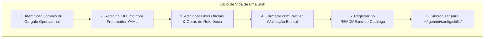

# 🧠 Padrões Canônicos para Criação de Portable AI Skills

Esta habilidade orienta o desenvolvedor e o agente de IA na concepção, estruturação, auditoria e publicação de **Portable AI Skills** (Habilidades e Runbooks Cognitivos) no ecossistema soberano.

---

## 🏛️ O Que é uma Portable AI Skill?

Uma **AI Skill** é um runbook especializado e modular que encapsula conhecimento procedimental, padrões de arquitetura, restrições defensivas e diretrizes operacionais para assistentes autônomos de inteligência artificial (Google Antigravity/Gemini, Claude, OpenAI).



### Escopos de Aplicação:

1. **Global da Estação (`Environment/Profile/skills/`):** Habilidades perenes de engenharia, sistemas operacionais, padrões de linguagem e ferramentas de terminal (disponíveis para o agente em qualquer pasta do computador via symlink em `~/.gemini/config/skills/`).
2. **Local do Repositório (`<repo>/.agents/skills/`):** Habilidades específicas do domínio de negócio daquele projeto, versionadas no Git com o repositório.

---

## 📋 Anatomia Obrigatória de um Arquivo `SKILL.md`

Todo arquivo `SKILL.md` DEVE seguir a anatomia canônica:

```markdown
---
name: nome-da-skill
description: Resumo conciso de uma a duas frases descrevendo o escopo e gatilhos de ativação.
---

# 🏷️ Título Descritivo com Emoji Canônico

Parágrafo de introdução delimitando o papel do agente de IA e o problema resolvido.

---

## 🎯 Seções Hierárquicas e Procedimentos Guiados

Conteúdo técnico, comandos canônicos e diretrizes.

---

## 🔗 Links Oficiais de Referência & Obras Recomendadas

Links oficiais para prevenir conhecimento estático ou desatualizado.
```

---

## 📚 A Regra das Fontes Canônicas & Citação Bibliográfica

Para garantir rigor técnico e evitar que modelos de IA trabalhem com premissas estáticas ou obsoletas, adote as seguintes regras:

### 1. Links Oficiais para Tecnologias Citadas

- Sempre que uma ferramenta, sistema operacional, framework ou utilitário for citado no texto (ex: FreeBSD, Sylve, Proxmox, PocketBase, Svelte, Incus, Oxide), inclua **links simples e oficiais**:
    - Site oficial do projeto (`https://...`)
    - Repositório oficial no GitHub ou cgit
    - Página de documentação oficial
- **Equilíbrio Pragmático:** Mantenha de 1 a 2 links concisos por tecnologia para evitar poluição visual.
- **Recomendação Explícita de Leitura:** O texto da skill DEVE instruir explicitamente o agente de IA a consultar essas páginas para checar novas versões, recursos contemporâneos e _breaking changes_.

### 2. Citação Formal de Obras de Literatura Técnica

Quando diretrizes da skill forem fundamentadas em livros clássicos ou tratados de engenharia, **o autor e o título da obra devem ser registrados com precisão**:

- _The Art of UNIX Programming_ (Eric S. Raymond) — para filosofia UNIX, modularidade, simplicidade e transparência.
- _Clean Code: A Handbook of Agile Software Craftsmanship_ (Robert C. Martin) — para legibilidade, nomes descritivos e Boy Scout Rule.
- _The Practice of Programming_ (Brian W. Kernighan & Rob Pike) — para simplicidade, depuração e portabilidade.
- _Operating Systems: Three Easy Pieces_ (Remzi H. Arpaci-Dusseau & Andrea C. Arpaci-Dusseau) — para virtualização e concorrência.

---

## 🛡️ Padrões de Código e Shell em Skills

Ao incluir trechos de código executável em qualquer skill:

1. **A Regra Absoluta do Shebang:**
    - Em todo script de shell, utilize impreterivelmente:
        ```sh
        #!/usr/bin/env sh
        ```
    - NUNCA use caminhos hardcoded como `#!/bin/sh` ou `#!/bin/bash`.
2. **Taxonomia de Emissão:**
    - `echo "${msg}"` para texto simples.
    - `echo -n $'\e...'` sob `[ -t 1 ]` para sequências ANSI.
    - `printf` para tabulações e números.
3. **Quoting Defensivo:**
    - Redirecionamentos entre aspas: `> "/dev/null" 2>&1`.
    - Variáveis protegidas: `"${var}"`.
4. **Makefiles Universais:**
    - Cabeçalho canônico: `.POSIX: .SILENT:` e `MAKEFLAGS += --no-print-directory -s`.
    - Atribuição de subshell com `!=` e alinhamento canônico de colunas.

---

## 🚀 Roteiro de Publicação e Registro no Catálogo

1. **Criação do Diretório:** Crie a pasta em `Environment/Profile/skills/<nome-da-skill>/`.
2. **Redação do `SKILL.md`:** Escreva o conteúdo seguindo os padrões desta diretriz.
3. **Registro no Catálogo:** Atualize a tabela em [skills/README.md](../README.md), incrementando o contador total de runbooks.
4. **Validação e Formatação:** Execute `npx prettier --write` em todo o diretório `skills/`.
5. **Sincronização:** Execute o script canônico:
    ```sh
    /home/gabrielfrigo/Documentos/Environment/Profile/scripts/sync/sync-skills.sh
    ```
6. **Auditoria Git:** Valide com o hook de pre-commit (`.githooks/pre-commit`) e submeta as alterações via `git commit` e `git push`.
