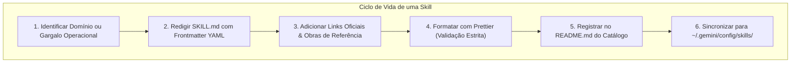

# 🧠 Padrões Canônicos para Criação de Portable AI Skills

Esta habilidade orienta o desenvolvedor e o agente de IA na concepção, estruturação, auditoria e publicação de **Portable AI Skills** (Habilidades e Runbooks Cognitivos) no ecossistema soberano.

---

## 🏛️ O Que é uma Portable AI Skill?

Uma **AI Skill** é um runbook especializado e modular que encapsula conhecimento procedimental, padrões de arquitetura, restrições defensivas e diretrizes operacionais para assistentes autônomos de inteligência artificial (Google Antigravity/Gemini, Claude, OpenAI).


```mermaid
flowchart TD
    subgraph CICLO ["Ciclo de Vida de uma Skill"]
        C1["1. Identificar Domínio ou Gargalo Operacional"]
        C2["2. Redigir SKILL.md com Frontmatter YAML"]
        C3["3. Adicionar Links Oficiais & Obras de Referência"]
        C4["4. Formatar com Prettier (Validação Estrita)"]
        C5["5. Registrar no README.md do Catálogo"]
        C6["6. Sincronizar para ~/.gemini/config/skills/"]
    end

    C1 --> C2 --> C3 --> C4 --> C5 --> C6
```

### Hierarquia de Resolução & Precedência Unix (Local > Global > Built-in):

1. **Local do Repositório (`<repo>/.agents/skills/`):** Prioridade máxima. Sobrescreve ou especializa skills globais para aquele projeto sem poluir o ambiente global.
2. **Global do Usuário (`~/.gemini/config/skills/` via `Profile/skills/`):** Padrões perenes de engenharia, sistemas operacionais e ferramentas de terminal.
3. **Built-in da IDE (`builtin/skills`):** Habilidades fundamentais fornecidas pelo ecossistema Antigravity, base e fallback de último nível.

### 🌐 Skills Globais vs. 🎯 Skills Locais: Dualidade Arquitetural

| Dimensão                 | Skills Globais (`Profile/skills/`)                      | Skills Locais (`<repo>/.agents/skills/`)          |
| :----------------------- | :------------------------------------------------------ | :------------------------------------------------ |
| **Localização Canônica** | `Profile/skills/` -> `~/.gemini/config/skills/`         | `<repo>/.agents/skills/`                          |
| **Escopo de Atuação**    | Universal para toda a estação de trabalho               | Restrito ao workspace do repositório              |
| **Conteúdo Principal**   | Padrões de engenharia (POSIX, C23, Go, XDG, Clean Code) | Orquestração local, Makefiles, regras do projeto  |
| **Acoplamento**          | Zero acoplamento a caminhos ou repositórios privados    | Acoplamento aceitável aos scripts e alvos do repo |
| **Precedência**          | Fallback geral de usuário                               | Prioridade máxima sobre skills globais            |

- **Diretrizes Globais:** Devem ser universais, agnósticas de caminhos absolutos e focadas em padrões atemporais.
- **Diretrizes Locais:** Devem codificar regras operacionais, alvos de build e particularidades do fluxo do repositório.

### 🏛️ A Regra Áurea da Fonte Canônica (Bancada vs. Clones de Runtime)

Toda e qualquer alteração de engenharia em qualquer componente (`Setup`, `Shell`, `Profile`, `Vault`, `Emacs`, `Helix`, `NeoVim`, `Vim`) ou skills globais **DEVE SER SEMPRE** realizada prioritariamente na raiz de desenvolvimento do **Grande Repositório / Super-Hub** no Environment (`~/Documents/Environment/`), e **NUNCA** diretamente nos clones locais de runtime (`~/.local/share/profile`, `~/.emacs.d`, `~/.config/nvim`) ou links ativos (`~/.gemini/config/skills/`).

- _Exceção:_ Apenas admitida se o super-hub no Environment NÃO existir E o agente NÃO estiver nele (ambas negadas simultaneamente).

### ⚖️ A Invariante da Perenidade Cognitiva (Skills vs. TODO.md)

| Documento       | Natureza & Papel             | Volatilidade        | O Que Deve Conter                              | O Que NUNCA Deve Conter                          |
| :-------------- | :--------------------------- | :------------------ | :--------------------------------------------- | :----------------------------------------------- |
| **`README.md`** | Vitrine Pública & Onboarding | Baixa               | Portais, badges, arquitetura e quickstart      | Backlog granular, runbooks cognitivos densos     |
| **`TODO.md`**   | Roadmap & Governança         | **Alta (Dinâmico)** | Matriz de status, épicos em andamento, sprints | Invariantes teóricas, manuais procedimentais     |
| **`SKILL.md`**  | Runbooks Cognitivos          | **Nula (Perene)**   | Heurísticas, métodos e padrões atemporais      | **Tarefas de sprint, cópia de TODO.md, backlog** |
| **`AGENTS.md`** | Constituição Operacional     | Baixa               | Contratos invioláveis e Boy Scout Rule         | Backlog de tarefas, código de implementação      |

- **O Teste dos 5 Anos:** _"Quando o `TODO.md` for zerado, o conteúdo desta skill continuará 100% verdadeiro e acionável daqui a 5 anos?"_ Se depender de tarefas em aberto, pertencia ao `TODO.md`.

---

## 🗂️ Estrutura Modular de uma Skill (Além do `SKILL.md`)

```text
skills/<nome-da-skill>/
├── SKILL.md          # Runbook principal com frontmatter YAML (obrigatório)
├── scripts/          # Utilitários executáveis invocados pelo agente
├── references/       # Manuais, tabelas de decisão e especificações densas
├── examples/         # Implementações de referência e snippets
└── resources/        # Templates estáticos, esquemas e modelos
```

> [!CAUTION]
> **Hermetismo de Produção (`rm -rf .agents`):** Código de produção (Makefiles, scripts de shell, CI/CD, hooks) **NUNCA** consome ou referencia arquivos de skills. Se `.agents/` for sumariamente deletado, 100% do projeto continua compilando, testando e operando perfeitamente.

---

## 📐 Orçamento de Linhas & Limites Canônicos (17 – 128 – 256)

| Faixa de Linhas                 | Classificação             | Diretriz Operacional                                                         |
| :------------------------------ | :------------------------ | :--------------------------------------------------------------------------- |
| **$\ge 17$ linhas**             | Mínimo Substancial        | Previne micro-runbooks sem valor procedimental.                              |
| **$17 \text{ a } 128$ linhas**  | **Sweet Spot Executivo**  | Meta de design para fluxos diretos, acionáveis e rápidos.                    |
| **$129 \text{ a } 256$ linhas** | Faixa de Densidade        | Permitido para matrizes multi-OS, tabelas e regras densas.                   |
| **$> 256$ linhas**              | **Erro Fatal (Monólito)** | Proibido. Exige modularização em `references/`, `examples/` ou `resources/`. |

---

## 📚 A Regra das Fontes Canônicas, Links & Citação Bibliográfica

1. **A Regra da Homepage Obrigatória:** Sempre que uma documentação técnica ou subpágina for linkada, a Homepage oficial da tecnologia DEVE acompanhar o link.
2. **Proibição de Links Fictícios ou Privados:** Proibido incluir URLs inexistentes, rotas quebradas ou repositórios privados (cite o `**Vault**` em negrito puro, sem hyperlink).
3. **Citação Formal de Obras:** Registrar autor, título, ano e editora com precisão (_The Art of UNIX Programming_, _Clean Code_, _The Practice of Programming_, _Managing Projects with GNU Make_).

---

## 🧪 Auditoria Automatizada de Links & Qualidade

Utilize o utilitário oficial multithreaded para auditar links em massa:

```sh
# Verificar todo o catálogo de skills
python3 Profile/skills/skill-authoring-standards/scripts/verify_links.py Profile/skills

# Verificar uma skill isolada
python3 Profile/skills/skill-authoring-standards/scripts/verify_links.py Profile/skills/<skill>/SKILL.md
```

---

## 🛡️ Padrões de Código e Shell em Skills

1. **Shebang Universal:** Sempre `#!/usr/bin/env sh` (POSIX) ou `#!/usr/bin/env python3`.
2. **Taxonomia de Emissão:** `echo "${msg}"` para texto simples; `[ -t 1 ] && echo -n $'\e...'` para ANSI; `printf` para tabelas.
3. **Quoting Defensivo:** Proteção rigorosa de `"${var}"` e redirecionamentos cotados `> "/dev/null" 2>&1`.
4. **Makefiles Universais:** Cabeçalho `.POSIX: .SILENT:`, `MAKEFLAGS += --no-print-directory -s` e atribuição `!=`.

---

## 🚀 Roteiro de Publicação e Registro no Catálogo

1. **Criação do Diretório:** Crie a pasta em `Environment/Profile/skills/<nome-da-skill>/`.
2. **Redação do `SKILL.md`:** Escreva o conteúdo seguindo os limites orçamentários ($\le 256$ linhas).
3. **Registro no Catálogo:** Atualize a tabela em [skills/README.md](../README.md).
4. **Validação de Links e Formatação:** Execute `verify_links.py` e formate com `prettier --write`.
5. **Quality Gates:** Valide com `.githooks/pre-commit` e submeta via git commit.
