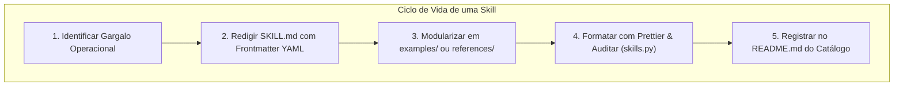

# 🧠 Padrões Canônicos para Criação de Portable AI Skills

Esta habilidade orienta o desenvolvedor e o agente de IA na concepção, estruturação, auditoria e publicação de **Portable AI Skills** (Habilidades e Runbooks Cognitivos) e artefatos de governança no ecossistema.

---

## 🏛️ O Que é uma Portable AI Skill?

Uma **AI Skill** é um runbook especializado e modular que encapsula conhecimento procedimental, padrões de arquitetura e diretrizes operacionais para assistentes de IA (Google Antigravity/Gemini, Claude, OpenAI).


```mermaid
flowchart TD
    subgraph CICLO ["Ciclo de Vida de uma Skill"]
        C1["1. Identificar Gargalo Operacional"]
        C2["2. Redigir SKILL.md com Frontmatter YAML"]
        C3["3. Modularizar em examples/ ou references/"]
        C4["4. Formatar com Prettier & Auditar (skills.py)"]
        C5["5. Registrar no README.md do Catálogo"]
    end

    C1 --> C2 --> C3 --> C4 --> C5
```

### Precedência UNIX (Local > Global > Built-in):

1. **Local do Repositório (`<repo>/.agents/skills/`):** Prioridade máxima. Sobrescreve ou especializa skills globais para aquele projeto sem poluir o ambiente global.
2. **Global do Usuário (`~/.gemini/config/skills/` via `Profile/skills/`):** Padrões perenes de engenharia, sistemas operacionais e ferramentas de terminal.
3. **Built-in da IDE (`builtin/skills`):** Habilidades fundamentais fornecidas pelo ecossistema Antigravity, base e fallback de último nível.

---

## 🎯 Engenharia de Trigger & Frontmatter YAML

A `description` no frontmatter YAML é o **único metadado lido pelo modelo em repouso**. Se a descrição for falha, a skill sofrerá de ativação errática (_missed triggers_) ou desperdício de tokens (_unwanted loads_):

1. **Voz e Perspectiva:** Redigir invariavelmente em terceira pessoa com verbos de ação (_"Runbook cognitivo para...", "Ativar ao...", "Usar quando o usuário solicitar..."_).
2. **Orçamento de Vocábulos:** Manter a descrição entre **25 e 45 palavras**. Evitar resumos telegráficos (_"Ajuda com testes"_) ou parágrafos prolixos que encarecem a descoberta passiva.
3. **Mapeamento de Palavras-Chave:** Incluir explicitamente termos técnicos que o desenvolvedor costuma citar no prompt (ex: nomes de funções, flags, comandos, normas RFC/POSIX).
4. **Prevenção de Colisão de Gatilhos (_Trigger Collision_):** Duas skills nunca devem disputar os mesmos gatilhos exatos. Se houver sobreposição temática, delimite o critério de desempate diretamente na descrição.

---

## 🌐 A Regra do Escopo: Globals Passivas vs. Locals Imperativas

Para evitar **Contaminação de Contexto (_Context Poisoning_)**:

```text
┌────────────────────────────────────────────────────────────────────────┐
│                        A REGRA DE OURO DO ESCOPO                       │
├────────────────────────────────────────────────────────────────────────┤
│ • GLOBALS (~/.gemini/config/)  ➔ Exclusivamente SKILLS (Passivas)      │
│   "Aqui está como eu opero, SE você precisar do assunto."              │
│                                                                        │
│ • LOCALS  (<repo>/AGENTS.md)   ➔ RULES e LEIS (Imperativas)            │
│   "Neste repositório específico, estas restrições são inegociáveis."   │
└────────────────────────────────────────────────────────────────────────┘
```

- **Por que Rules Globais são um Anti-Padrão?** Uma regra colocada globalmente infecta qualquer diretório na máquina do desenvolvedor (ex: tentar aplicar regras de C23 e Makefiles ao editar um app web TypeScript). Rules devem ser estritamente locais (`AGENTS.md` ou `.agents/rules/`).

---

## 📐 Orçamento Unificado de Linhas (Regra 17 – 128 – 256)

Tanto arquivos de runbook (**`SKILL.md`**) quanto arquivos constitucionais (**`AGENTS.md`**) compartilham a mesma disciplina orçamentária para preservar a janela de contexto (_Context Window_):

| Faixa de Linhas                 | Classificação             | Diretriz Operacional                                        |
| :------------------------------ | :------------------------ | :---------------------------------------------------------- |
| **$\ge 17$ linhas**             | Mínimo Substancial        | Previne micro-runbooks vazios ou sem valor prático.         |
| **$17 \text{ a } 128$ linhas**  | **Sweet Spot Executivo**  | Meta áurea de design para leitura rápida e baixo custo.     |
| **$129 \text{ a } 256$ linhas** | Faixa de Densidade        | Permitido para matrizes multi-OS, tabelas e regras densas.  |
| **$> 256$ linhas**              | **Erro Fatal (Monólito)** | **Terminantemente proibido.** Exige modularização imediata. |

- **O Teste dos 5 Anos:** _"Quando o `TODO.md` for zerado, o conteúdo desta skill continuará 100% verdadeiro e acionável daqui a 5 anos?"_ Se depender de tarefas em aberto ou bugs pontuais, pertence ao `TODO.md`.

---

## 🗂️ Estrutura Modular de uma Skill

```text
skills/<nome-da-skill>/
├── SKILL.md          # Runbook principal com frontmatter YAML (obrigatório, <= 256 linhas)
├── scripts/          # Utilitários executáveis invocados pelo agente
├── references/       # Manuais, tabelas de decisão e especificações densas
├── examples/         # Implementações de referência e snippets de código
└── resources/        # Templates estáticos, esquemas e modelos
```

> [!CAUTION]
> **Hermetismo de Produção (`rm -rf .agents`):** Código de produção (Makefiles, scripts, CI/CD, hooks) **NUNCA** consome ou referencia arquivos de skills. Se `.agents/` for sumariamente deletado, 100% do projeto continua operando com perfeição.

---

## 🏛️ A Regra Áurea da Fonte Canônica (Bancada vs. Clones de Runtime)

Toda e qualquer alteração de engenharia em componentes (`Setup`, `Shell`, `Profile`, `Vault`, `Emacs`, `Helix`, `NeoVim`, `Vim`) ou skills globais **DEVE SER SEMPRE** realizada prioritariamente na raiz de desenvolvimento do **Grande Repositório / Super-Hub** no Environment (`~/Documents/Environment/`), e **NUNCA** diretamente nos clones locais de runtime (`~/.local/share/profile`, `~/.emacs.d`, `~/.config/nvim`) ou links ativos (`~/.gemini/config/skills/`).

---

## 🧪 Auditoria Automatizada & Quality Gates

Todo o catálogo de skills é validado continuamente por ferramentas dedicadas:

1. **Auditoria Estática Contínua:** [`Profile/audit/skills.py`](../../audit/skills.py) integrado ao [`Profile/audit/all.py`](../../audit/all.py).
    - Valida correspondência de nomes (`kebab-case`).
    - Bloqueia monólitos (> 256 linhas) e micro-skills (< 17 linhas).
    - Impede escapes octais (`\033`) em blocos de código.
2. **Auditoria de Links Externos:** [`scripts/verify_links.py`](scripts/verify_links.py) valida status HTTP de todas as URLs do ecossistema.
3. **Formatação Mandatória:** `npx prettier --write "skills/**/*.md"`.

---

## 📚 A Regra das Fontes Canônicas & Citação Bibliográfica

1. **A Regra da Homepage Obrigatória:** Ao citar documentação técnica ou subpágina, a Homepage oficial da tecnologia DEVE acompanhar o link.
2. **Proibição de Links Fictícios ou Privados:** Proibido incluir URLs inexistentes (cite o `**Vault**` em negrito puro, sem hyperlink).
3. **Citação Formal de Obras:** Registrar autor, título, ano e editora com precisão (_The Art of UNIX Programming_, _Clean Code_, _The Practice of Programming_, _Managing Projects with GNU Make_).
