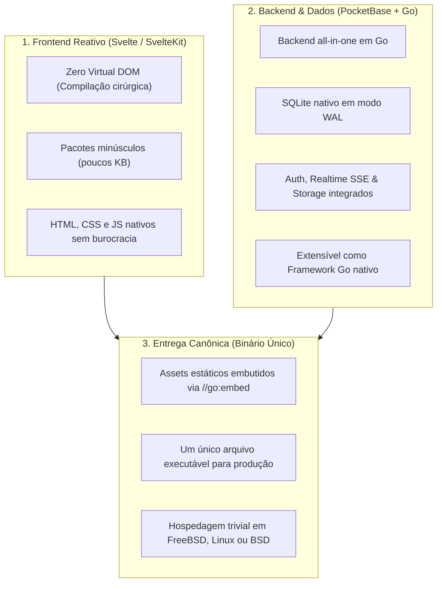

# ⚡ Svelte + PocketBase + Go: A Pilha Minimalista Anti-Inchaço

Esta habilidade orienta o agente de IA no design, desenvolvimento, integração e implantação de aplicações web e microsserviços modernos sob a filosofia da **simplicidade radical**, máxima eficiência de recursos e **custo de operação virtualmente nulo**.

---

## 🏛️ A Filosofia Anti-Inchaço (Radical Simplicity & Anti-Bloat)

A engenharia web contemporânea sofre frequentemente de sobre-engenharia (_overengineering_): clusters Kubernetes para projetos simples, dezenas de microsserviços desnecessários, pilhas de dependências de centenas de megabytes em `node_modules` e custos de computação desproporcionais.

Esta pilha recupera os **17 Princípios UNIX (Eric S. Raymond)** e o **Clean Code**:



1. **Regra da Simplicidade:** Faça coisas simples; a complexidade só deve ser admitida quando comprovadamente inevitável.
2. **Regra da Economia:** O tempo do programador e os ciclos de máquina são caros. Uma aplicação nesta pilha roda suavemente em instâncias com 512 MB ou 1 GB de RAM custando $4 a $5 por mês.
3. **Regra da Composição:** O backend se comunica com o cliente através de interfaces limpas: JSON via REST e eventos em tempo real via Server-Sent Events (SSE).

---

## 🔗 O Eixo Comum: Por que Svelte + Go?

O casamento entre Svelte e Go é a base de projetos renomados do ecossistema de software livre moderno:

- **O Painel Admin do PocketBase:** A interface administrativa do [PocketBase](https://pocketbase.io/) foi inteiramente construída em **Svelte**!
- **A Plataforma Sylve do FreeBSD:** O [Sylve](https://sylve.io/) (moderna plataforma web de orquestração de infraestrutura para FreeBSD) adota rigorosamente esta mesma arquitetura: backend robusto em **Go** e interface reativa e veloz em **SvelteKit**!

Ambas as tecnologias compartilham o mesmo DNA: **desempenho sem cerimônia, ausência de abstrações desnecessárias e foco absoluto na experiência do desenvolvedor e do usuário final**.

---

## 🛠️ Os Três Pilares da Stack

### 1. Go (A Base Concorrente e Compilada)

- **Binário Estático:** Compilação para um único executável independente sem necessidade de runtime, JVM ou interpretador no host de destino.
- **Compilação Cruzada Trivial:**
    ```sh
    # Compilar no Linux para FreeBSD:
    GOOS=freebsd GOARCH=amd64 go build -o app-freebsd main.go

    # Compilar no FreeBSD para Linux:
    GOOS=linux GOARCH=amd64 go build -o app-linux main.go
    ```
- **Concorrência Segura:** Goroutines e channels que consomem frações de kilobytes de memória, manipulando dezenas de milhares de conexões simultâneas com extrema leveza.

### 2. PocketBase (<https://pocketbase.io/>)

O **PocketBase** é um backend all-in-one escrito em Go, utilizando **SQLite** com Write-Ahead Logging (WAL) como motor de banco de dados:

- **Recursos Nativos sem Dependências Externas:**
    - **Autenticação:** Gerenciamento de usuários, tokens JWT, OAuth2 (Google, GitHub, GitLab, etc.) e verificação de email.
    - **Tempo Real (Realtime):** Inscrições reativas nativas via Server-Sent Events (SSE), dispensando WebSockets complexos ou servidores Redis intermediários.
    - **Storage de Arquivos:** Upload, miniaturas automáticas e armazenamento local ou em buckets compatíveis com S3.
    - **Controle de Acesso Baseado em Regras:** Regras declarativas de segurança definidas diretamente nas coleções (`@request.auth.id != ""`, `@request.data.role = "admin"`).
- **Abordagem Dual de Uso:**
    1. **Modo Standalone (Zero Código Backend):** Basta baixar o executável pré-compilado e executar `./pocketbase serve`.
    2. **Modo Framework Go (Extensibilidade Total):** Importe `github.com/pocketbase/pocketbase` dentro do seu próprio código Go para registrar rotas customizadas, middlewares, eventos de ciclo de vida (`OnRecordBeforeCreateRequest`) e rotinas agendadas (_cron jobs_).

### 3. Svelte & SvelteKit (<https://svelte.dev/>)

- **Compilador, Não Runtime:** Enquanto frameworks tradicionais (React/Vue) enviam um Virtual DOM pesado para o navegador do cliente interpretar, o Svelte compila componentes em JavaScript baunilha cirúrgico.
- **Tamanhos de Pacote Reduzidos:** Bundles tipicamente inferiores a 30 KB, garantindo carregamento instantâneo em conexões móveis ou lentas.
- **Reatividade Nativa:** Sem `useState`, sem burocracia de hooks: uma simples atribuição (`count += 1`) dispara a reatividade visual.
- **CSS com Escopo Automático:** O CSS declarado no componente afeta apenas aquele componente, prevenindo vazamentos de estilo sem necessidade de bibliotecas utilitárias infladas.

---

## 📦 Padrão Canônico: Entrega em Binário Único (Single Binary)

O ápice da elegância e simplicidade operacional nesta stack é o padrão de **Binário Único**, onde os arquivos do frontend Svelte compilado são embutidos diretamente no executável Go através do pacote padrão `embed`:

```go
package main

import (
	"embed"
	"io/fs"
	"log"
	"net/http"

	"github.com/pocketbase/pocketbase"
	"github.com/pocketbase/pocketbase/apis"
	"github.com/pocketbase/pocketbase/core"
)

//go:embed all:frontend/dist
var distDir embed.FS

func main() {
	app := pocketbase.New()

	// Servir o frontend Svelte compilado como fallback
	app.OnBeforeServe().Add(func(e *core.ServeEvent) error {
		subFS, err := fs.Sub(distDir, "frontend/dist")
		if err != nil {
			return err
		}

		e.Router.GET("/*", apis.StaticDirectoryHandler(subFS, true))
		return nil
	})

	if err := app.Start(); err != nil {
		log.Fatal(err)
	}
}
```

### Vantagens Operacionais:

- **Zero `node_modules` em Produção:** Node.js e NPM são usados apenas na máquina de desenvolvimento ou no pipeline de CI/CD para compilar o Svelte (`npm run build`). O servidor final não requer Node.js instalado.
- **Atualizações Atômicas:** Para atualizar o sistema, basta substituir um único arquivo binário e reiniciar o serviço (`service app restart` no FreeBSD ou `systemctl restart app` no Linux).
- **Backups Simples:** Todo o estado da aplicação reside no diretório de dados (`pb_data/data.db`), permitindo backups atômicos copiando o SQLite ou usando snapshots de ZFS.

---

## 🎯 Diretrizes de Engenharia para o Agente de IA

Ao projetar ou implementar soluções nesta stack:

1. **Privilegie o SQLite com WAL:** Não adicione bancos de dados em contêineres separados (PostgreSQL/MySQL) a menos que a escala concorrente de escrita realmente exija múltiplos nós de escrita. O SQLite em modo WAL atende facilmente dezenas de milhares de requisições por segundo.
2. **Mantenha o Frontend Leve:** Evite instalar dezenas de bibliotecas NPM para componentes visuais. Use os recursos nativos do Svelte, CSS puro e bibliotecas minimalistas.
3. **Use o SDK Oficial do PocketBase:** No frontend Svelte, utilize a biblioteca oficial `pocketbase` (JavaScript SDK), aproveitando a sincronização automática de autenticação e as subscrições SSE com uma única linha de código.
4. **Respeite o Shebang Universal nos Scripts de Build:**
    ```sh
    #!/usr/bin/env sh
    # build.sh - Compilação integrada do frontend e backend
    set -eu
    (cd frontend && npm run build)
    go build -trimpath -ldflags="-s -w" -o bin/app main.go
    ```

---

## 🔗 Links Oficiais de Referência e Documentação Contínua

Para prevenir desatualizações de sintaxe ou APIs, consulte sempre as fontes oficiais:

- **Svelte Official:** <https://svelte.dev/>
- **SvelteKit Documentation:** <https://svelte.dev/docs/kit/introduction>
- **PocketBase Official:** <https://pocketbase.io/>
- **PocketBase Go Overview & Extensibility:** <https://pocketbase.io/docs/go-overview/>
- **PocketBase JavaScript SDK:** <https://github.com/pocketbase/js-sdk>
- **Sylve Infrastructure Platform:** <https://sylve.io/>
- **The Go Programming Language:** <https://go.dev/>
