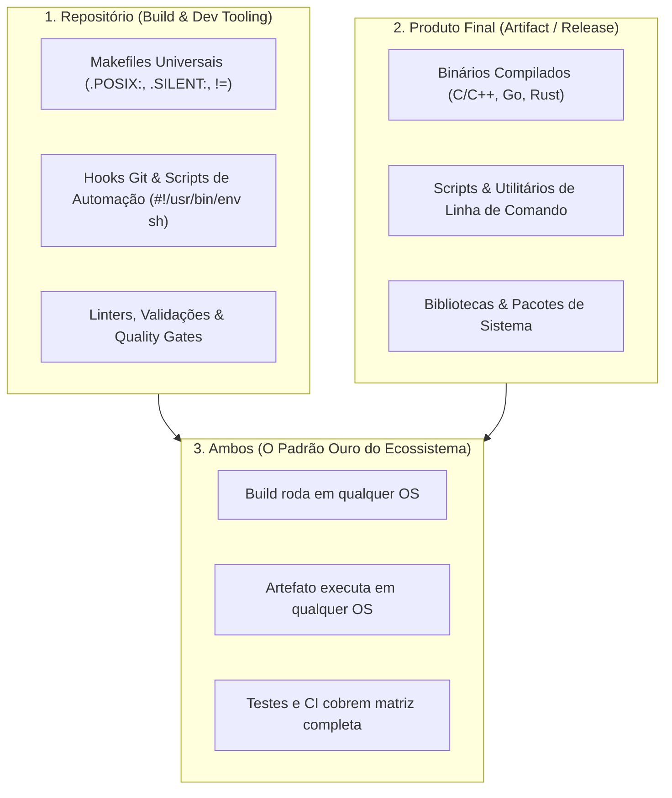

# 🌐 System Cross-Platforms & Multi-OS Repository Architecture

Esta habilidade orienta o agente de IA no design, construção, automação e auditoria de **repositórios e softwares estritamente multiplataforma**.

---

## 🎯 As Três Dimensões da Portabilidade

Ao arquitetar ou auditar projetos multiplataforma, o agente deve distinguir claramente o escopo de portabilidade necessário:



1. **Repositório Multiplataforma (Build & Dev Tooling):**
    - O ambiente onde o código é construído, testado e mantido.
    - Scripts de setup, hooks de pre-commit, Makefiles, tarefas de CI e ferramentas de linting devem executar de forma transparente e idêntica em qualquer sistema operacional suportado sem exigir ferramentas proprietárias de uma única plataforma.
2. **Produto Final Multiplataforma (Artifact / Release):**
    - O artefato gerado (binário executável, biblioteca `.a`/`.so`/`.dylib`/`.dll`, pacote ou script de aplicação) deve rodar de maneira performática e estável em múltiplos sistemas operacionais de destino.
3. **Ambos Multiplataforma (O Padrão Ouro do Ecossistema):**
    - A esmagadora maioria dos repositórios deste ecossistema adota esta modalidade: tanto o processo de desenvolvimento e compilação quanto o produto distribuído são estritamente universais e agnósticos de plataforma.

---

## 📜 A Regra Universal do Shebang (`#!/usr/bin/env sh`)

> [!CAUTION]
> **Proibição de Shebangs Hardcoded:**
> NUNCA escreva `#!/bin/sh`, `#!/bin/bash` ou `#!/usr/bin/sh` diretamente em scripts de shell.
>
> **O Padrão Absoluto do Ecossistema:**
> Todo script de shell no ecossistema DEVE iniciar estritamente com:
>
> ```sh
> #!/usr/bin/env sh
> ```
>
> O caminho absoluto de executáveis varia drasticamente entre sistemas: Linux (usrmerge para `/usr/bin`), FreeBSD (base system vs pacotes em `/usr/local/bin`), macOS (utilitários BSD), Solaris/illumos (`/usr/bin` vs `/usr/xpg4/bin`), OpenBSD e Windows (MSYS2 `sh.exe`). Invocar através de `env` garante a resolução correta via `PATH` em qualquer ambiente UNIX/POSIX soberano.

---

## 🏛️ Por que "FreeBSD como Maestro"?

Assistentes de inteligência artificial frequentemente sofrem de **forte viés pró-Linux** (_Linux-centric bias_), presumindo caminhos fixos (`/usr/bin`), serviços dependentes de `systemd`, extensões proprietárias do Bash e flags exclusivas do GNU coreutils.

### A Coesão da Base vs. A Fragmentação das Distribuições

> [!IMPORTANT]
> **A Regra da Coesão do Sistema Base:**
>
> - **No FreeBSD:** O Kernel e a Userland (_Base System_) formam um produto único, coeso e integrado, governado por um repositório centralizado de código-fonte. O que existe no sistema base do FreeBSD é garantido em **todas as instalações de FreeBSD** daquela versão no planeta.
> - **No Linux:** Há profunda fragmentação entre centenas de distribuições independentes. O que está disponível no Fedora pode não existir no Debian, Arch, Rocky ou Alpine (diferenças de caminhos, _usrmerge_, init systems como systemd vs OpenRC, bibliotecas C como glibc vs musl, gerenciadores de pacotes e ferramentas de empacotamento).
>
> Por essa razão, **o FreeBSD atua como a régua máxima de elegância e corte de portabilidade**. Se o código, Makefile ou script roda perfeitamente no FreeBSD, ele respeita os mais altos padrões de engenharia POSIX e BSD, tornando trivial sua adaptação para Linux, macOS, Windows e illumos. Evitar exagerar em idiossincrasias específicas de distribuições Linux é a abordagem mais saudável e profissional para o ecossistema.

---

## 🔄 O Ciclo Oficial de Lançamentos do FreeBSD (freebsd.org)

Conforme a documentação oficial e o processo de Engenharia de Lançamento (_Release Engineering_) do The FreeBSD Project (<https://www.freebsd.org/> e <https://www.freebsd.org/releng/>), o agente deve entender a taxonomia oficial de ramos:

| Ramo / Track | Descrição Técnica Oficial                                                                                                                                                       | Branch no Git                                                    | Versões em Atividade                                                         | Público-Alvo e Finalidade                                                                                                                                 |
| :----------- | :------------------------------------------------------------------------------------------------------------------------------------------------------------------------------ | :--------------------------------------------------------------- | :--------------------------------------------------------------------------- | :-------------------------------------------------------------------------------------------------------------------------------------------------------- |
| **CURRENT**  | _Bleeding-edge_ do desenvolvimento. Onde entram novas arquiteturas, mudanças no kernel e recursos experimentais.                                                                | `main`                                                           | **16.0-CURRENT**                                                             | Desenvolvedores do core, testadores ativos e quem acompanha o estado da arte do sistema operacional. Não recomendado para produção sem testes prévios.    |
| **STABLE**   | Ramo de desenvolvimento estabilizado a partir do qual as versões pontuais (_point releases_) são cortadas. Recebe alterações testadas no CURRENT (_Merged From CURRENT - MFC_). | `stable/15`<br>`stable/14`                                       | **15.1-STABLE**                                                              | Engenharia e consolidação contínua de recursos para a próxima versão de produção.                                                                         |
| **RELEASE**  | Versões oficiais de produção (_Production Releases_), testadas, seladas e mantidas pelo _FreeBSD Security Officer_.                                                             | `releng/15.1`<br>`releng/15.0`<br>`releng/14.5`<br>`releng/14.4` | **15.1-RELEASE**<br>**15.0-RELEASE**<br>**14.5-RELEASE**<br>**14.4-RELEASE** | Ambientes de produção corporativos, servidores de missão crítica, contêineres e estações de trabalho. Conta com _Security Advisories_ e _Errata Notices_. |

---

## ⚡ Recursos Modernos do FreeBSD Cruciais para o Agente

### 1. Separação Canônica: Base System vs. `/usr/local`

- **Base System:** Reside estritamente em `/bin`, `/sbin`, `/usr/bin`, `/usr/sbin` e `/etc`.
- **Softwares de Terceiros (`pkg` / Ports):** **Todos** os softwares instalados pelo usuário residem sob o prefixo `/usr/local` (`/usr/local/bin`, `/usr/local/etc`, `/usr/local/include`, `/usr/local/lib`).
- **Diretiva do Agente:** NUNCA force `#!/usr/bin/bash` ou `/usr/bin/python3`. Use invariavelmente `#!/usr/bin/env sh` ou `#!/usr/bin/env <interpretador>`.

### 2. O Shell Base e o Shebang Universal

- O shell `/bin/sh` do FreeBSD é veloz, leve e estritamente aderente ao padrão POSIX IEEE 1003.1.
- Suporta sequências ANSI com a sintaxe canônica `echo -n $'\e...'` e edição de linha interativa via `libedit`.
- Bashismos (`[[ ... ]]`, arrays indexados `arr=(...)`, herestrings `<<<`, redirects `&>`) provocam erro fatal no FreeBSD.

### 3. Utilitário `flua` Profundo no Base System (`/usr/libexec/flua`)

- Desde o FreeBSD 13+, o sistema base inclui `/usr/libexec/flua` (interpretador Lua leve e rápido embutido nativamente).
- Muito além de gerenciar o bootloader (`loader.lua`), o `flua` inclui módulos C essenciais embutidos no sistema base sem demandar instalação de portas ou interpretadores externos:
    - **`libucl`:** Parser e emissor de UCL (_Universal Configuration Language_), capaz de processar JSON estrito, JSON simplificado/relaxado (sem aspas e vírgulas supérfluas, com comentários `#` e `//`), e manifestos YAML nativamente.
    - **`libjail` (`jail(3lua)`):** Biblioteca completa para inspecionar, criar, gerenciar parâmetros e interagir com FreeBSD Jails diretamente em Lua.
    - **`lfs` (LuaFileSystem):** Operações avançadas de atributos de arquivos, permissões e travessia de diretórios.
    - **`lposix`:** Chamadas de sistema POSIX fundamentais (`fork`, `exec`, `wait`, controle de sinais e descritores).
    - **`libfreebsd`:** Consulta de variáveis de ambiente do kernel via `freebsd.kenv(3lua)` e manipulação de módulos do kernel via `freebsd.sys.linker(3lua)`.
    - **`libhash`:** Cálculos de soma de verificação e hashing de integridade.

### 4. Containers e OCI: Docker Hub Oficial (`https://hub.docker.com/u/freebsd`)

- O FreeBSD possui suporte pleno e nativo a **Podman** (`pkg install podman`).
- Utiliza **`runj`** como runtime OCI (_Open Container Initiative_), mapeando contêineres OCI diretamente para **FreeBSD Jails** nativas e utilizando Netavark para redes virtuais.
- **Imagens Oficiais do FreeBSD no Docker Hub:** Mantidas oficialmente pelo The FreeBSD Project sob o namespace `freebsd` (<https://hub.docker.com/u/freebsd>):
    - `freebsd/freebsd-runtime`: imagem base mínima para rodar aplicações.
    - `freebsd/freebsd-static`: imagem minimalista para binários estáticos.
    - `freebsd/freebsd-dynamic`: imagem base dinâmica com bibliotecas da base.
    - `freebsd/freebsd-toolchain`: ambiente completo de compilação com Clang, headers e ferramentas de desenvolvimento.
    - `freebsd/freebsd-notoolchain`: ambiente de sistema sem a cadeia de compiladores.
    - Tags oficiais ativas: `15.1`, `14.5`, `16.snap` (CURRENT), `15.snap`, `14.snap`.
- **Invocação Canônica:**
    ```sh
    podman pull freebsd/freebsd-runtime:15.1
    podman run --rm -it freebsd/freebsd-runtime:15.1 uname -a
    ```

### 5. Firewall `pf` Moderno com Paridade de Sintaxe OpenBSD

- O Packet Filter (`pf`) no FreeBSD moderno suporta a sintaxe unificada contemporânea do OpenBSD:
    - Tradução inline: `nat-to` e `rdr-to` aplicados diretamente em regras de filtro (`pass in on $ext_if proto tcp to any port 80 rdr-to $web_jail` e `pass out on $ext_if from !($ext_if) to any nat-to ($ext_if)`), dispensando as seções isoladas legadas de `nat` e `rdr`.
    - Tabelas dinâmicas e persistentes (`table <spammers> persist`).
    - Execução multithread (SMP) no kernel do FreeBSD para vazão máxima em redes de 100GbE+.

### 6. Orquestração e Infraestrutura Moderna: `Sylve`

- **Sylve** (<https://sylve.io/> / `AlchemillaHQ/Sylve`): plataforma moderna open-source de gerenciamento de infraestrutura para FreeBSD 15.0+ (`pkg install sylve` / `sysutils/sylve`).
- Unifica em uma interface web moderna (SvelteKit + Go) o gerenciamento de **Bhyve VMs**, **FreeBSD Jails**, **ZFS Storage** (pools, datasets, replicação remota), redes virtuais e firewall PF/NAT.

### 7. O Ecossistema de Pacotes: pkg & Ports vs. A Fragmentação do Linux

- **No FreeBSD (Previsibilidade de 100%):**
    - Se um software está disponível no `pkg` binário ou na árvore de ports (`/usr/ports`), ele **funciona 100% de primeira**.
    - A equipe de mantenedores do FreeBSD Ports inspeciona cada aplicação e adiciona patches cirúrgicos (`files/patch-*`) para que o código compile perfeitamente com Clang, enlace contra a libc do FreeBSD e instale todos os binários, configs e dados rigorosamente sob o prefixo `/usr/local`.
    - Baixou via `pkg install <pacote>`, funcionou sem surpresas e sem poluir o sistema base.
- **No Linux (A Realidade de Ajustes e Gambiarras):**
    - No ecossistema Linux, há fragmentação entre dezenas de gerenciadores de pacotes (`dnf`, `apt`, `pacman`, `zypper`, `apk`).
    - Frequentemente, ferramentas contemporâneas ou versões recentes **não existem nos repositórios oficiais** da distribuição. O desenvolvedor é forçado a adicionar PPAs não oficiais, repositórios Copr/AUR, ou recorrer a baixar arquivos `.tar.gz`/AppImage diretamente de releases do GitHub.
    - Isso exige pequenos ajustes de permissões, links manuais no `$PATH` e, por vezes, contornos e gambiarras complexas para conciliar bibliotecas `.so` com versões de glibc incompatíveis. Enquanto ~80% das ferramentas triviais funcionam direto no Linux, a certeza de integração no FreeBSD quando presente no `pkg` é absoluta (100%).
- **A Outra Face da Moeda:**
    - Há tecnologias que a equipe do FreeBSD mantém deliberadamente longe ou que dependem de subsistemas exclusivos do kernel Linux (como `systemd`, `cgroups v2` profundos, interfaces de namespaces do Linux e certas pilhas de virtualização). Nesses casos específicos, o Linux oferece suporte nativo e impecável.

---

## 🔗 Links Oficiais de Referência e Atualizações Contínuas

Para prevenir conhecimento estático ou desatualizado, o agente deve consultar as fontes oficiais canônicas:

- **The FreeBSD Project:** <https://www.freebsd.org/>
- **FreeBSD Releases & Downloads:** <https://www.freebsd.org/where/>
- **FreeBSD Release Engineering:** <https://www.freebsd.org/releng/>
- **FreeBSD OCI no Docker Hub:** <https://hub.docker.com/u/freebsd>
- **Sylve Infrastructure Platform:** <https://sylve.io/>
- **OpenBSD Project:** <https://www.openbsd.org/>
- **illumos Project:** <https://illumos.org/>
- **Proxmox Virtual Environment:** <https://proxmox.com/en/>
- **Podman Container Tools:** <https://podman.io/>

---

## 🌍 Visão Holística dos Demais Sistemas Operacionais

### 🐧 1. Linux (Distribuições e Abstração Limpa)

- **Foco em Padrões Universais:** Em vez de codificar para uma distribuição específica (como Fedora, Debian, Arch ou Rocky), privilegie interfaces padronizadas: POSIX `#!/usr/bin/env sh`, compiladores padrão (`cc`/`gcc`), Makefiles neutros e dependências portáteis.
- **Cuidado com usrmerge:** No Linux moderno, `/bin` é frequentemente um link simbólico para `/usr/bin`. Em sistemas BSD isso não ocorre. Sempre use `env` para localizar binários no `PATH`.
- **Diversidade de Bibliotecas C:** Ambientes Linux podem utilizar `glibc` ou `musl` (Alpine Linux). Evite extensões GNU proprietárias da glibc quando funções POSIX padrão bastam.

### 🍎 2. macOS (Darwin / Mach / BSD Userland)

- **Compilação e Toolchain:** Utiliza Apple Clang como compilador padrão. GCC não é padrão de fábrica.
- **Shells e Userland:** O shell interativo padrão é o `zsh` desde o macOS Catalina. Scripts de automação usam `#!/usr/bin/env sh`.
- **BSD Coreutils Antigos:** Os utilitários de linha de comando (`sed`, `grep`, `tar`) derivam do BSD histórico e **não** suportam flags GNU (exemplo: `sed -i` exige string de backup obrigatória no macOS ou sintaxe compatível).
- **Prefixos do Gerenciador de Pacotes:**
    - Apple Silicon (M1/M2/M3/M4): `/opt/homebrew`
    - Intel x86_64: `/usr/local`
    - MacPorts: `/opt/local`

### 🪟 3. Windows & MSYS2 (Ambientes de Compatibilidade e Nativos)

- **Subsistema MSYS2:**
    - Oferece toolchains `UCRT64` (moderno, biblioteca C UCRT da Microsoft), `MINGW64` e `MSYS`. Prefira sempre compilar alvos nativos com `UCRT64`.
- **Tratamento de Caminhos e Quebras de Linha:**
    - Conversão entre caminhos POSIX e Windows via utilitário `cygpath` (ex: `/c/Users/...` vs `C:\Users\...`).
    - **Finais de Linha:** O ecossistema exige rigorosamente quebras de linha no formato UNIX (`LF`). O arquivo `.gitattributes` deve impor `* text eol=lf`.
- **Compatibilidade de Scripts:** Para repositórios onde o produto deve rodar no Windows, providencie wrappers limpos em PowerShell (`.ps1`) ou chamadas via `sh.exe` do MSYS2/Git for Windows.

### 🐡 4. OpenBSD (Segurança Pragmática e Minimalismo)

- **Mecanismos de Confinamento:** Suporte a `pledge(2)` (restringe chamadas de sistema por processo) e `unveil(2)` (restringe visibilidade da árvore de arquivos).
- **Shell Nativo da Base (`/bin/ksh`):** Derivado do PD-KSH. Não possui expansão ANSI-C `$''` (interpreta literalmente). Cores ANSI exigem captura dinâmica do byte escape `_esc="$(printf '\033')"`, e caracteres invisíveis de prompt no `PS1` exigem obrigatoriamente delimitação por `\001` para não desalinhar o editor de linha.
- **Userland & Pacotes:** Ausência absoluta de GNUismos nos utilitários da base. Gerenciamento de pacotes via `pkg_add` / `pkg_delete` com repositórios declarados em `/etc/installurl`.
- **Comportamento em CI/CD:** Em runners automatizados (ex: `vmactions/openbsd-vm`), o sistema parte de uma instalação limpa onde `zsh` não existe por padrão. Scripts de teste e benchmarks devem ser 100% defensivos, checando `command -v "${sh}"` antes de qualquer execução.
- **Elevação de Privilégios:** O utilitário canônico é o `doas` nativo com `/etc/doas.conf`.

### ☀️ 5. illumos (SmartOS, OmniOS, OpenIndiana & Solaris Zones)

- **Origem System V:** Baseado no código aberto do OpenSolaris/SVR4, mantendo a mais alta referência de engenharia de sistemas corporativos UNIX.
- **Solaris Zones:** Virtualização leve e segura a nível de kernel:
    - _Native Zones:_ Instâncias com userland e ferramentas nativas illumos.
    - _lx-brand Zones:_ Emulação transparente da interface de chamadas de sistema do kernel Linux, executando contêineres e binários Linux sem overhead de hypervisor.
- **Crossbow Network Virtualization:** Criação de VNICs (_Virtual Network Interfaces_) e switches virtuais (_etherstubs_) diretamente sobre interfaces físicas, com controles de largura de banda e afinidade de CPU por fluxo sem necessidade de bridges pesadas.
- **SMF (Service Management Facility):** Gerenciamento determinístico de serviços com árvores de dependência (`svcs`, `svcadm`), substituindo scripts de inicialização legados.
- **DTrace & ZFS:** Berço original de ambas as tecnologias fundamentais, nativamente integradas ao kernel.
- **Separação de Userland:** `/usr/bin` para utilitários padrão System V e `/usr/gnu/bin` para utilitários GNU.
- **Realidade em CI/CD:** O GitHub Actions não disponibiliza runners nativos nem imagens oficiais de VM para illumos (diferente dos BSDs que possuem `vmactions`). Portanto, pipelines de CI para illumos operam por meio de **validação estática rigorosa de sintaxe** (`bash -n`, `zsh -n`) e **simulação de boot/mock** sob Linux, justificando o descritor `(Syntax & Simulation)`. Como não há dotfiles instalados no host (que é Ubuntu), o teste avalia os alvos em memória via `zsh -c` e `bash -c`.

### 🚩 6. NetBSD (Portabilidade Extrema, Almquist Shell e Berço do EditLine)

- **O Berço da `libedit`:** Criada originalmente no NetBSD por Christos Zoulas nos anos 1990 como alternativa BSD limpa à GNU Readline. É a base importada hoje pelo FreeBSD (`contrib/libedit`) e pelo macOS.
- **Shell do Sistema Base (`/bin/sh`):** Almquist Shell (ash) extensivamente modernizado, portado para dezenas de arquiteturas de hardware (x86_64, ARM, VAX, SPARC, m68k). Por não aceitar hífens em nomes de funções (`goodname()` em `bin/sh/parser.c`), o ecossistema elege `bash` e `zsh` como alvos interativos no NetBSD.
- **Gerenciamento de Pacotes (`pkgsrc`):** O mais portável sistema de build de pacotes do mundo UNIX.
    - Utilitários binários: `pkg_add` (nativo do sistema base, sempre disponível em imagens mínimas) e `pkgin` (gerenciador de alto nível).
    - Convenção de nomes: pacotes de linguagens são estritamente versionados no `pkgsrc` (`python312`, `python311`, `python313`). O padrão estável distribuído em binários para NetBSD 10.x/11.x é `python312`, requerendo symlink `/usr/pkg/bin/python3.12 -> /usr/pkg/bin/python3`.
- **Busca de Ports & Pacotes:** <https://pkgsrc.se/> e <https://cdn.netbsd.org/pub/pkgsrc/current/pkgsrc/>.

---

## 🚦 Armadilhas de Kernel TTY & O Padrão PTY (`script -q /dev/null`) em CI Headless

Ao executar testes e automações que envolvem inicialização de shells interativos (`-i`) em pipelines headless de CI/CD (GitHub Actions, SSH sem PTY alocado, VMs QEMU):

1. **A Divergência Fundamental de Kernels na Chamada `tcsetpgrp()`:**
    - Shells interativos iniciados com a flag `-i` tentam habilitar _Job Control_ notificando o kernel via `tcsetpgrp(fd, pgrp)` de que são os donos do terminal.
    - **Linux & macOS:** Detectam a ausência de terminal controlador e a syscall simplesmente falha retornando `ENOTTY` ou `EPERM`. O shell emite um aviso inofensivo no stderr (`no job control in background`) e prossegue com a execução normalmente, lendo os arquivos RC.
    - **OpenBSD & NetBSD:** Tratam a ausência de terminal com retorno de erro sem interrupção de sinal.
    - **FreeBSD (`kern/kern_tty.c`):** O kernel do FreeBSD segue estritamente a especificação clássica BSD: qualquer processo em background que tente invocar `tcsetpgrp()` sem PTY controlador recebe **imediatamente o sinal `SIGTTIN` (sinal 21)**.
    - Como a ação padrão de `SIGTTIN` é **suspender a execução (`SIGSTOP`)**, o processo entra no estado `T` (stopped) e a VM de CI congela em loop infinito.
2. **O Padrão Canônico de Solução: Alocação de PTY sob Demanda com `script(1)`:**
    - Em vez de rebaixar os testes para shells não-interativos (o que ignoraria o `~/.bashrc` e travaria na _Interactive Guard_), deve-se alocar um pseudo-terminal (PTY) sob demanda via utilitário nativo `script`:
    ```sh
    # FreeBSD: Aloca PTY real (/dev/pts), satisfaz o kernel e evita SIGTTIN
    script -q /dev/null bash -i -c 'echo "Prompt OK: ${PS1}"'
    ENV="${HOME}/.shrc" script -q /dev/null sh -i -c 'echo "Prompt OK: ${PS1}"'
    ```
    - O `script` do FreeBSD base aloca `/dev/pts`, torna o processo líder de terminal e garante que `tcsetpgrp()` seja executado com sucesso.
3. **Alternativa em GNU Bash (`+m`):**
    - `bash +m -i -c '...'`: A flag `+m` desativa o _monitor mode_ (job control), impedindo o Bash de chamar `tcsetpgrp()`, enquanto `-i` preserva o modo interativo e carrega o `.bashrc`.
4. **Por que a flag `-i` é insubstituível em testes reais de dotfiles:**
    - Arquivos RC canônicos protegem-se com uma `Interactive Guard` no cabeçalho (`case "$-" in *i*) ;; *) return ;; esac`).
    - Sem a flag `-i`, o shell não é interativo, o arquivo RC é ignorado ou sofre `return` na 5ª linha, gerando falsos positivos nos testes. O `-i` é o único modo que valida aliases, prompts, temas e detecção de contexto de ponta a ponta.

---

## 🛠️ Regras de Ouro para Repositórios Multiplataforma

Ao criar, inspecionar ou refatorar qualquer repositório no ecossistema:

1. **Makefiles Universais (Paridade bmake & gmake):**

    ```makefile
    .POSIX:
    .SILENT:

    MAKEFLAGS += --no-print-directory -s
    ```
    - Declare `CC ?= cc` e `CXX ?= c++`.
    - Adote a exceção pragmática `$(MAKE) -C subdir target` (reconhecida por `bmake` e `gmake`).
    - Use `VAR != comando` para subshells compatíveis com `bmake` e `gmake 4.0+`.
    - Mantenha o alinhamento canônico de colunas nas definições de variáveis.

2. **Shebangs Portáveis em Absolutamente Tudo:**
    - Scripts de Shell: **`#!/usr/bin/env sh`** (sempre!)
    - Scripts Python: `#!/usr/bin/env python3`
    - Scripts Perl / Lua / Ruby: `#!/usr/bin/env <interpretador>`

3. **Programação Defensiva em Scripts de Automação:**
    - Detecção de utilitários: `command -v <ferramenta> > "/dev/null" 2>&1`.
    - Detecção de privilégios: testar primeiro `doas`, seguido por `sudo`.
    - Redirecionamentos sempre entre aspas: `> "/dev/null" 2>&1`.
    - Emissão no terminal: `echo "${msg}"` para texto simples; `echo -n $'\e...'` sob `[ -t 1 ]` para cores ANSI; `printf` para formatação com padding ou dados variáveis.

4. **Permissões em 4 Dígitos Octais:**
    - `chmod 0755` para scripts e diretórios executáveis.
    - `chmod 0644` para arquivos de documentação, fontes, dados e configurações.
    - `chmod 0700` e `chmod 0600` para chaves, credenciais e diretórios de segurança restritos.
