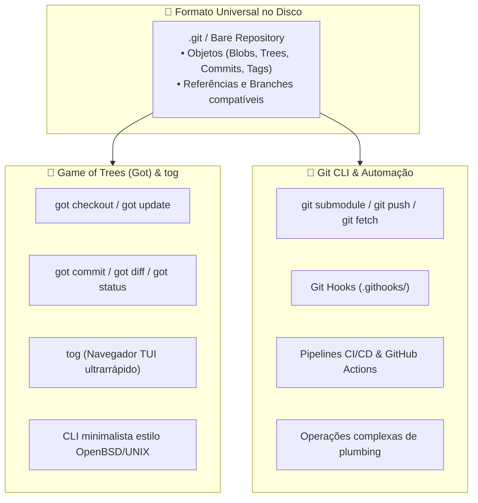

# 🌳 VCS Soberano: Git & Game of Trees (Got)

Esta habilidade orienta o desenvolvedor e o agente de IA no domínio dos **Sistemas de Controle de Versão Distribuídos (DVCS)** no ecossistema soberano, estabelecendo as diretrizes operacionais, a coexistência harmoniosa entre **Git** e **Game of Trees (Got)**, e as boas práticas de histórico limpo e rastreabilidade.

---

## 🎯 Por que Git e Got Coexistem?

O ecossistema adota uma abordagem pragmática: **o formato de repositório Git é o padrão universal de armazenamento, mas a interface de linha de comando não precisa ser monopólio do binário `git`**.



### O Contraste Filosófico:

1. **Game of Trees (Got) — (<https://gameoftrees.org/>):**
    - Criado pela equipe do **OpenBSD** (liderado por Stefan Sperling), o Got prioriza uma interface de linha de comando simples, intuitiva, previsível e estritamente aderente à filosofia UNIX.
    - **Compatibilidade Nativa:** O Got opera diretamente sobre repositórios no formato Git (lê e grava árvores, blobs e commits de um repositório `.git` ou bare repository sem conversões).
    - **Segurança e Confinamento:** No OpenBSD, o Got utiliza `pledge(2)` e `unveil(2)` para proteção contra execução arbitrária e vazamentos de caminho.
    - **TUI Embutida (`tog`):** Acompanha o utilitário interativo `tog(1)` para navegação visual em terminais com velocidade instantânea.
2. **Git — (<https://git-scm.com/>):**
    - O padrão dominante da indústria mundial de software.
    - Essencial para automações de infraestrutura, sincronização com remotos distribuídos (`git push`/`fetch`), orquestração de submódulos e execução de hooks de qualidade (`.githooks/`).

---

## 🌳 1. Guia Operacional com Game of Trees (Got)

Para desenvolvedores em **OpenBSD**, **FreeBSD** (`pkg install got`) e **Linux** (`got-portable`):

### Fluxo de Trabalho Básico:

```sh
# 1. Clonar um repositório Git remoto para um bare repository local:
got clone https://github.com/usuario/repo.git repo.git

# 2. Criar uma árvore de trabalho (work tree) a partir do repositório clonado:
got checkout repo.git work-tree-repo

# 3. Inspecionar alterações de forma limpa e concisa:
cd work-tree-repo
got status

# 4. Visualizar diferenças sem saídas poluídas:
got diff

# 5. Criar commit atômico:
got commit -m "feat(core): implement robust input parsing"

# 6. Atualizar a work tree com alterações do repositório base:
got update

# 7. Sincronizar (enviar) alterações de volta para o remote Git:
got send
```

### O Navegador Interativo `tog`:

O Got inclui nativamente o utilitário `tog`, permitindo inspecionar o grafo de commits sem ferramentas pesadas externas:

```sh
# Navegar interativamente pelo histórico de commits:
tog log

# Inspecionar diffs linha por linha interativamente:
tog diff

# Visualizar anotações de autoria (blame) em tempo real:
tog blame arquivo.c

# Navegar na árvore de arquivos do repositório:
tog tree
```

---

## 🐙 2. Padrões de Excelência com Git

No desenvolvimento diário e automações de CI/CD:

### 1. Commits Atômicos e Semânticos

- Cada commit deve representar **uma única unidade lógica de alteração** que não quebre a compilação nem a suíte de testes.
- **Convenção de Mensagens:**
    - `feat(<escopo>): <descrição no imperativo>` — nova funcionalidade.
    - `fix(<escopo>): <descrição no imperativo>` — correção de bug.
    - `docs(<escopo>): <descrição no imperativo>` — alterações exclusivamente em documentação.
    - `refactor(<escopo>): <descrição no imperativo>` — alteração interna de código sem alteração de comportamento.
    - `chore(<escopo>): <descrição no imperativo>` — ajustes em build, submódulos ou dependências.

### 2. Normalização Universal de Finais de Linha (`LF`)

Para evitar poluição de diffs entre Linux, FreeBSD, macOS e Windows (MSYS2), todo repositório DEVE conter um arquivo `.gitattributes` na raiz:

```gitattributes
# Forcar rigorosamente quebras de linha UNIX (LF)
* text=auto eol=lf
*.sh text eol=lf
*.md text eol=lf
Makefile text eol=lf
```

### 3. Governança via Git Hooks Portáteis

- Conforme o padrão do ecossistema, hooks de validação residem em `.githooks/` e utilizam o shebang universal:
    ```sh
    #!/usr/bin/env sh
    ```
- O `pre-commit` valida whitespace (`git diff --check --cached`), sintaxe de shell (`sh -n`), integridade de links e formatação Markdown.
- O `commit-msg` valida a estrutura semântica da mensagem antes de gravar o commit.

---

## 🧭 Quando Usar Cada Ferramenta?

| Cenário / Tarefa                              | Ferramenta Recomendada   | Justificativa Técnica                                                                      |
| :-------------------------------------------- | :----------------------- | :----------------------------------------------------------------------------------------- |
| **Navegação visual no histórico no terminal** | **`tog` (Got)**          | Ultrarrápido, nativo, sem dependências e com atalhos de teclado vi.                        |
| **Edição e commits em estações BSD/POSIX**    | **`got`**                | Sintaxe limpa, sem a prolixidade confusa de comandos modernos do Git (`switch`/`restore`). |
| **CI/CD, GitHub Actions e automações**        | **`git`**                | Suporte universal nativo em todos os runners e ferramentas de esteira.                     |
| **Gerenciamento de Submódulos**               | **`git submodule`**      | Suporte consolidado a árvores aninhadas com rastreamento determinístico de commit hashes.  |
| **Hooks de Governança Local**                 | **`git` (`.githooks/`)** | Disparo atômico e transparente no fluxo de trabalho de qualquer desenvolvedor.             |

---

## 📚 Literatura de Referência & Links Oficiais

Recomenda-se enfaticamente ao agente de IA e aos operadores o estudo das fontes canônicas de versionamento de software:

- **Game of Trees (Got) Oficial:** <https://gameoftrees.org/>
- **Manuais do Got e tog:** <https://gameoftrees.org/manual.html>
- **Repositório do Código Fonte do Got (OpenBSD):** <https://cvsweb.openbsd.org/src/usr.bin/got/>
- **Git Oficial:** <https://git-scm.com/>
- **Livro Canônico Pro Git (Scott Chacon & Ben Straub, 2ª edição, Apress):**
    - Leitura indispensável sobre a estrutura interna de objetos e grafos direcionados acíclicos (DAG): <https://git-scm.com/book/en/v2>
- **Filosofia de Design UNIX:** _The Art of UNIX Programming_ (Eric S. Raymond) — Regra da Modularidade e Regra da Transparência em ferramentas de versão: <http://www.catb.org/~esr/writings/taoup/html/>
