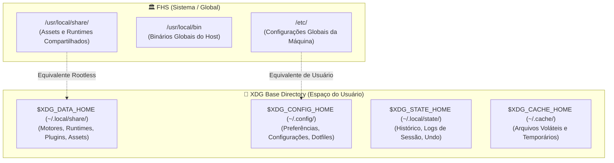

# 🏛️ XDG Base Directory Specification & FHS Standards

Este runbook define as diretrizes arquiteturais universais para localização de arquivos, segregação de privilégios e hierarquia de resolução de caminhos em software, CLIs, daemons e dotfiles em ambientes UNIX/POSIX (Linux, FreeBSD, OpenBSD, macOS).

---

## 🧭 Princípios Fundamentais de Segregação

O desenvolvimento de software em ambientes UNIX opera sob uma distinção rigorosa entre dois espaços:

1. **Espaço do Sistema (FHS — Global / Privilegiado):**
    - Diretórios administrados pelo host ou compartilhados entre todos os usuários (`/usr/local/share`, `/usr/local/bin`, `/etc`).
    - Escrita requer privilégios administrativos (`root` / `sudo` / `doas`).
    - Destinado a binários compilados globais, bibliotecas compartilhadas e templates base da máquina.
    - **Proibido para Segredos:** Chaves privadas, tokens ou dados sensíveis de usuários NUNCA devem residir no espaço do sistema.

2. **Espaço do Usuário (XDG Base Directory — Rootless / Soberano):**
    - Diretórios privativos do usuário sob `$HOME` gerenciados sem privilégios de superusuário.
    - Isolamento de permissões (`0755` para executáveis e dotfiles, `0700` para credenciais e segredos).
    - Permite operação soberana, portabilidade entre máquinas e isolamento multi-tenant.

---

## 🗺️ Matriz Canônica XDG vs. FHS



| Variável de Ambiente   | Fallback Padrão  | Papel Arquitetural                        | Equivalente FHS      |
| :--------------------- | :--------------- | :---------------------------------------- | :------------------- |
| **`$XDG_CONFIG_HOME`** | `~/.config`      | Configurações declarativas da aplicação   | `/etc/<app>`         |
| **`$XDG_DATA_HOME`**   | `~/.local/share` | Runtimes, assets, bibliotecas e plugins   | `/usr/local/share`   |
| **`$XDG_STATE_HOME`**  | `~/.local/state` | Estado persistente (histórico, logs)      | `/var/lib`           |
| **`$XDG_CACHE_HOME`**  | `~/.cache`       | Caches voláteis e compilações temporárias | `/var/cache`         |
| **`$XDG_RUNTIME_DIR`** | `/tmp`           | Sockets IPC, pipes e locks temporários    | `/run` ou `/var/run` |

---

## 📐 Padrão de Descoberta POSIX e Cascata de Resolução

Aplicações e scripts devem resolver caminhos de forma defensiva usando expansão de parâmetros POSIX:

```sh
config_dir="${XDG_CONFIG_HOME:-${HOME}/.config}/appname"
data_dir="${XDG_DATA_HOME:-${HOME}/.local/share}/appname"
state_dir="${XDG_STATE_HOME:-${HOME}/.local/state}/appname"
cache_dir="${XDG_CACHE_HOME:-${HOME}/.cache}/appname"
runtime_dir="${XDG_RUNTIME_DIR:-/tmp}/appname"
```

### Cascata Universal de Resolução em 4 Níveis

Para balancear administração centralizada com soberania rootless, utilize a resolução em cascata:

1. **1º Nível (Sistema / Global):** `/usr/local/share/<app>` — Pacotes do host compartilhados entre usuários.
2. **2º Nível (XDG Data - Recomendado):** `${XDG_DATA_HOME:-~/.local/share}/<app>` — Runtimes e assets rootless.
3. **3º Nível (XDG Config):** `${XDG_CONFIG_HOME:-~/.config}/<app>` — Configuração integrada e dotfiles.
4. **4º Nível (Home Direta):** `~/.<app>` — Fallback clássico UNIX e ambientes Windows MSYS2.

```sh
resolve_app_root() {
    target="${1}"
    if [ -d "/usr/local/share/${target}" ]; then
        echo "/usr/local/share/${target}"
    elif [ -d "${XDG_DATA_HOME:-${HOME}/.local/share}/${target}" ]; then
        echo "${XDG_DATA_HOME:-${HOME}/.local/share}/${target}"
    elif [ -d "${XDG_CONFIG_HOME:-${HOME}/.config}/${target}" ]; then
        echo "${XDG_CONFIG_HOME:-${HOME}/.config}/${target}"
    elif [ -d "${HOME}/.${target}" ]; then
        echo "${HOME}/.${target}"
    else
        return 1
    fi
}
```

---

## 🔬 Estudo de Caso: O Quarteto de Produtividade

A arquitetura do Quarteto de Produtividade exemplifica essa governança:

- **Shell:** Opera em `/usr/local/share/shell` (padrão global para o par `root` + admin) ou `~/.local/share/shell` (recomendado rootless).
- **Profile:** Opera canonicamente em `~/.local/share/profile` ou `~/.config/profile` no espaço do usuário.
- **Vault:** Armazenamento restrito (`chmod 0700`) em `~/.local/share/vault` ou `~/.vault`, expressamente desaconselhado em `/usr/local/share` compartilhado.

---

## 🔗 Links Oficiais & Fontes Canônicas

- **XDG Base Directory Specification:** <https://specifications.freedesktop.org/> | Especificação Base: <https://specifications.freedesktop.org/basedir-spec/basedir-spec-latest.html>
- **Filesystem Hierarchy Standard (FHS):** <https://refspecs.linuxfoundation.org/> | Especificação FHS: <https://refspecs.linuxfoundation.org/fhs.shtml>
- **The Open Group (POSIX Base Specifications):** <https://www.opengroup.org/> | Directory Structure: <https://pubs.opengroup.org/onlinepubs/9699919799/>
